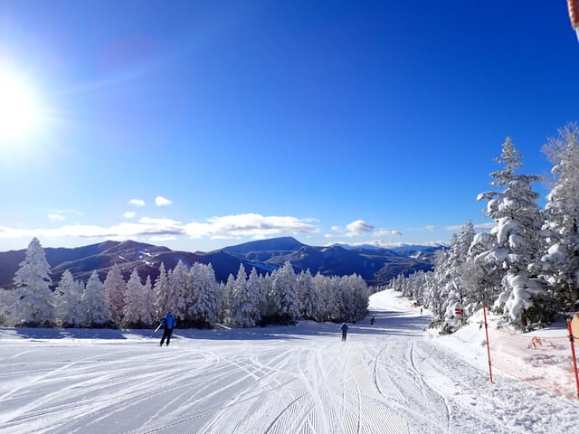
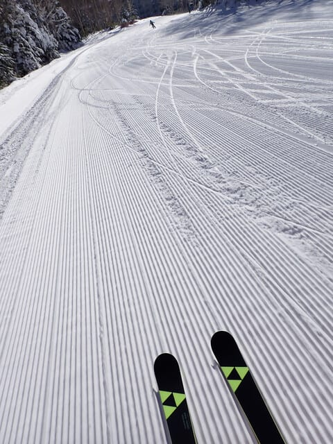
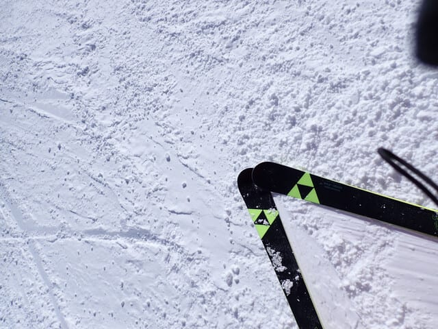
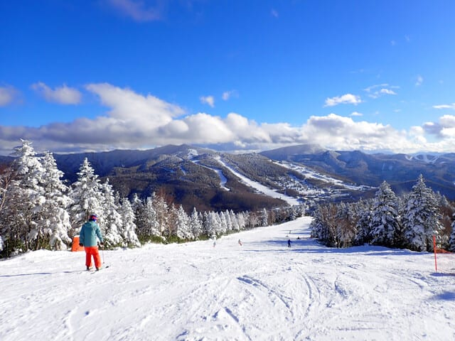
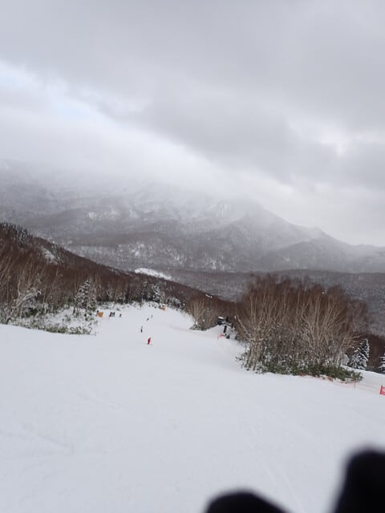
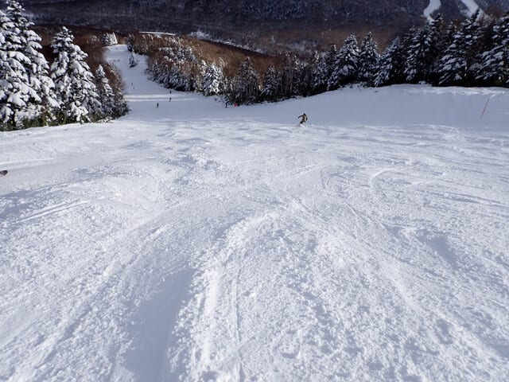
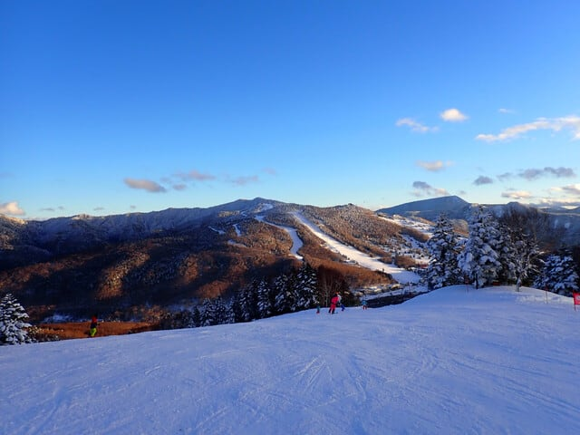

# 2024/12/15(日)の志賀高原焼額山スキー場速報レポート！…終日ほぼ晴れ，ゴンドラ待ち午前1-2分，昼から飛び乗り．気温は冷えて雪は終日良かったよ！

📅 投稿日時: 2024-12-16 01:06:04

ということで．

今日も志賀高原でしっかりラストまで

滑って帰ってきました～！

帰宅すると23時．

片付けその他をしているとあっという間に

深夜0時を過ぎてしまう…(泣)

明日も仕事なので，帰宅日恒例の

速報モードにて，本日の焼額山スキー場の

レポートです！！

えー．

まず．

今日はあさイチから，すっきり晴天！！

昨日からの積雪はないものの，気温は

-10℃まで冷え込み，昨日のモフモフ雪が

冷えたのがしっかり踏み固められた，

激烈快楽バーンでのスタートです…！！

…ぐほぅ！！

シマシマ…っ！！！

今シーズン初の，晴天シマシマ最高バーンを

ゴンドラでかっ飛ばせる，このシアワセ…！

ただ．

人工雪を着けた部分，パノラマコースの

壁付近のごく一部だけ，朝のうちは

ちょっとコロコロがあったけど…

それ以外は，朝の1本目を滑っただけで

今日ここに来た価値があるというくらいの

快楽に悶絶するバーンでした…！！

午前中は某都道府県連の指導員研修会の

団体さんがいて，ゴンドラ待ちがちょっと

あったけど…

それでも最大でゲートの外のちょっと

はみ出たくらいまで待つ程度で…

ゴンドラは1-2分待ちくらいだったかな？

コース上は比較的すいてましたよ～！

天気は，昼間にちょっと一瞬曇って，

雪もぱらついた時もあったけど…

それ以外はおおむね晴れの一日で，

晴れてるけど最高気温は-5℃程度と

冷えていたので，終日雪質も良く．

午後になったらさすがに急斜面の

一部だけは凸凹してきたけど．

それでも急斜面以外はいい雪質の

降らとバーンで，晴天の中終日大回り

板で滑り続けられる，幸せな一日だったの

でした…

いやーー．

この12月はいい感じに冷えてますよ～！

またこれから1週間もいい感じで冷えて，

そこそこ雪が積もってくれそうなので．

今週は焼額も第2ゴンドラと第4ロマンス

だけでしたが，来週は第1ゴンドラと

第2高速も動くと思うし．

一ノ瀬や高天ヶ原もクワッドが動き出すと

思うので…

次の週末は，滑れるコースがかなり広がり，

いい雪で滑れると思いますよ～！！

また明日，元気があれば←最近元気がないことが多いけど…

詳細レポート書きます～！！

## 💬 コメント一覧

### 💬 コメント by (tomorrow)
**タイトル**: Unknown
**投稿日**: 2024-12-16 08:15:38

いつも楽しく拝見しています。

当方も志賀高原出没していました。

１４日は一の瀬、高天原で修業し、１５日は残念ながらクワッドが動かなかったので、焼額へと思いましたが、駐車場に入れず奥志賀へ向かいました。

奥志賀もコンディション良く、すいていて楽しく過ごせました。

今シーズンも天気予報楽しみにしています。

よろしくお願いします。

### 💬 コメント by (レインボー77)
**タイトル**: Unknown
**投稿日**: 2024-12-16 13:11:35

月曜日の志賀高原情報

まずまずの冷え込みでヤケビは好条件。楽しくて楽しくて、12時までニゴン14本、休憩なしで遊べました。

パノラマの壁は、すぐにコロコロになったけど、四ロマ降り場の辺りがずっと最高。

お店閉鎖間近の湯田中のラーメン屋通いのため終了しましたが、終日好条件が続きそうな感じです。

### 💬 コメント by (Skier_S)
**タイトル**: コメント回答遅れました
**投稿日**: 2024-12-17 11:42:22

＞tomorrowさま

奥志賀よかったみたいですね～！

次はいつ志賀高原ですか？今度は焼額にお越しください！

＞レインボー77さま

なかよしラーメン，すごい列だったみたいですね…

火曜朝は雪がちょっと硬いかもしれないけど，水曜はちょっと降りそうなので，

これからしばらくはいいコンディションが続くと思いますよ～！！

