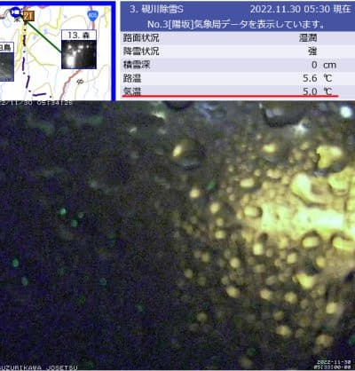

# 今シーズンも開催！物欲選手権・第3回長岡編その2…Skier_Sは物欲を抑えることができたのか？

📅 投稿日時: 2022-11-30 05:47:41

ってなことで．

今日も朝のとんでもない時間まで

仕事してますが…（涙）

本日，30日の朝5:30の段階で，志賀高原の

横手山そば，硯川では気温5℃という

超高温の雨が降ってます…（涙）

でも．

あと数時間で気温がぐっと下がります！

おそらく，30日の昼近くには気温が下がり始め．

夕方には人工降雪機が動かせるように

なるはず！！

…そして，12月1，2日は雪になるはずだけど…

12月1日は西風なので，志賀高原は雪が

積もらないかも…（涙）

でも．冷え冷えなので人工降雪機はフル稼働

できるはず！

そして，2日はおそらく雪になるはず！

志賀も雪が降るはず！！

…そのあと．3日は降らないんだよな…

さぁ．

焼額は12月3日にオープンしてくれるのか？？

ってなことで，本題へ．

物欲選手権，[昨日](e107181925fb3cf130e75fb7a164207e7.md)の続きです！！

ーーーー

アナウンサー　「さて．

　『第3回 スキーヤーの物欲を刺激する

　危険なスキー専門店に来て，物欲に

　まみれたスキーヤーが買い物を

　せずに我慢できるか選手権』

　が続いていますが…

　エキップの社長さんから

　ブーツを勧められているSkier_S選手．

　まさか3シーズン連続でブーツを

　買ってしまうんでしょうか…！？

　最大の危機がSkier_S選手に

　迫ってます！」

解説　「いや…

　物欲大魔王のSkier_S選手にとっては，

　この店にいること自体が最大の危機

　だと思うんですが…」

アナウンサー　「おすすめされているのは，

　FISCHERのRANGER 130という

　ブーツのようです」

解説　「型落ちでかなりの激安価格を

　言われているみたいですね…

　フレックス130なので，REXXAMの

　代わりに使えそうなブーツだし…

　これは危険ですよ…」

アナウンサー　「REXXAMのインナーが

　ヘタるのが予想以上に早かったので，

　今回，シェルの当たり出しなくちゃ

　ならなくなってここに来たわけですから…

　ここで同じフレックス130のブーツは

　極めて危険です…！」

解説　「やはり硬いHEADブーツは

　シーズンイン・春スキーでは

　硬すぎるので，今回REXXAMを直しに

　来たわけですが．

　このシーズンインや春スキーなどに

　気楽に履ける最適なブーツを見事に

　おススメするという，エキップ社長さんの

　素晴らしい戦略ですよ！！

　これは危ない！」

アナウンサー　「それも，ソールがゴムの

　グリップウォークで，シーズン最後の

　月山とかでも便利そうとか……」

解説　「それだけじゃなく．

　このブーツは山スキー用のテック

　ビンディングに対応してますしね」

アナウンサー　「え？Skier_S選手，

　山スキーはやりませんよね？」

解説　「それがですね．

　どうやらSkier_S選手，

　なぜか昨シーズン，エキップの常連さんに

　山スキーに誘われて，道具を一通り借りて

　一緒に滑ったりしたらしく．

　今後も山スキーのテックビンディング

　対応ブーツを買えば，板は貸すから…

　とか誘われてるようなんですよね」

アナウンサー　「なるほど…．

　そして，さらにこのブーツは型落ち

　なので定価の半額以下，

　REXXAMブーツの1/3くらいの

　お値段が出ているようです！

　…エキップ社長，これはもう見事に

　Skier_S選手の物欲を刺激しに

　来ました！」

解説　「…この勝負．

　Skier_S選手の物欲と理性の戦い

　というより．

　エキップの社長さんによる物欲刺激と

　Skier_S選手の理性の争い

　という様相を呈してきましたね…」

アナウンサー　「フレックスも適度，

　シーズン終了の月山にも使えて．

　それでいてテックビンディング対応…

　と．

　Skier_S選手が欲しかった要求が全て

　揃ったブーツ．

　それが激安とは…．

　エキップ社長による物欲の刺激に，

　Skier_S選手は耐えられるのか…！？？」

解説　「…ダメですね．たぶん」

アナウンサー　「ダメでしょうね…」

解説　「やっぱり…

　ダメっぽいですね」

アナウンサー　「ああ～

　やはりダメです！

　ダメのようです！！！！

　エキップ社長さんの物欲刺激に，

　見事にやられました！！

　Skier_S選手，まさか，まさかの

　3シーズン連続でエキップさんで

　ブーツ購入ですっ！！」

解説　「エキップの社長さん，

　見事にSkier_S選手の物欲を

　ピンポイントで適切に突きましたね…

　Skier_S選手の長いスキー生活の

　中でも，3シーズン連続でブーツ購入は

　記録ですよ…！」

アナウンサー　「いやーー．見事に

　Skier_S選手の物欲を巧みに突きました！

　この勝負，エキップ社長さんの

　勝利です！！」

解説　（戦いの趣旨がいつの間にか

　エキップ社長さん vs Skier_S

 　になってる…）

（[なぜか続く](ece68838b53dfc37b212fc4ba5af4733c.md)）

## 💬 コメント一覧

### 💬 コメント by (さち)
**タイトル**: Unknown
**投稿日**: 2022-11-30 17:18:06

笑いすぎて傷口が痛いんですけどどうしてくれるんですかw

これは買っちゃいますねー！

### 💬 コメント by (ダウンヒル)
**タイトル**: Unknown
**投稿日**: 2022-11-30 23:46:37

いやぁぁぁ...仕事の休憩時間ごとに読み返して、ニヤニヤ笑ってしまいました...あはは。

知り合いの某氏が買った、フィッシャーのレンジャー？太板にそそられて後追いの形で買ったとか...シーズン後半に太板乗り比べてたなぁって...

勝手な予想ですみません...

でも、選手権ネタは面白くて大好きです！

尽きない更新、ありがとうございます！

### 💬 コメント by (Skier_S)
**タイトル**: 今回も負けた
**投稿日**: 2022-12-01 01:10:34

＞さちさま

傷口に悪かったですか（笑）

いやーーー．物欲ピンポイント刺激，あまりにも巧みすぎました…

もう，ピンポイントで打ち抜かれた感じです．

＞ダウンヒルさま

そんなに楽しんでもらえたなら良かったです…

私も全く知らないブーツだったんですがあまりにも巧みに私の物欲を

刺激するブーツだったので…

まだ続きますよ！

### 💬 コメント by (Noname)
**タイトル**: Unknown
**投稿日**: 2022-12-02 00:07:34

山用のブーツ買ったら当然山用のスキーも必要ですよね？？

### 💬 コメント by (Skier_S)
**タイトル**: ＞Nonameさま
**投稿日**: 2022-12-02 01:56:57

いや…

山スキーは貸してくれるはずだから，買いません．

買いませんよ！！！（すぐ崩れる強い決意）

