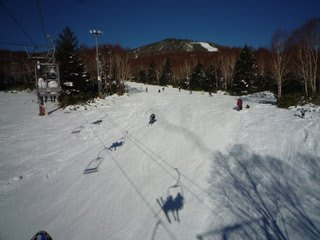
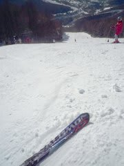
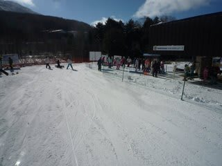
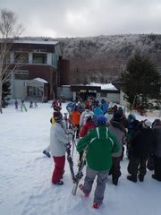
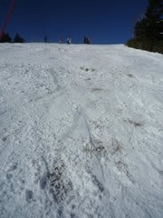

# 12月11，12日　志賀高原焼額山　速報

📅 投稿日時: 2010-12-12 22:16:06

🏷️ カテゴリ: [2011スキー滑走日記](ca488c98cfb9169941c3e73770dcefb56.md)

この週末．

志賀高原に行ってきました．

焼額のゴンドラが動く，ということだったので．

わがホームゲレンデ，焼額へGo!

基本的に…

うれしいのか悲しいのか微妙ですが．

私の天気の予想が外れ，土日ともほぼ晴れ．

危惧された土曜の夜の雨もなく，晴天の2日間でした．

ただ，「土曜は荒れるよ！」

との予告だけは当たってしまい，

土曜は強風でゴンドラが運休（涙）．

第2高速と第4ロマンスのみの営業．

第4ロマンスのコースは，コース幅いっぱいに人工雪が

ついていて，快適．

リフト待ちは，5分から10分．

ちょっと混んでますね…

第2高速は…コース幅半分ですかね．雪がついているのは．

ちょっと硬くて荒れ気味．第4ロマンス側のコースのほうが

快適ですね～．

後は白くなってるけど，雪が薄くすべるのはちょっと無理．

リフト待ちはほぼ0．

日曜は晴天の中，ゴンドラが営業開始！

しかし…9時半にはゴンドラ最大15分待ち．

10時半ごろに，当初予定になかった第4ロマンスを運転し，

これ以降はゴンドラ待ち5分程度でしょうか．

昼には，ゴンドラ待ちほぼ0になりました．

ゴンドラ以外のリフトは待ち0です．

ゴンドラコースの雪は…

上半分は，まったく人工雪をつけてないので，結構薄いです…

昼ごろには，かなりの地雷原と化してました．

でも，まぁこの時期にゴンドラが滑れるだけ満足ですね．

…もう少しすいてるかと思ったんだけどな～．
