# ってなわけで，長岡のエキップさんへ行ってきたわけだが…物欲に敗れFISCHER RANGER 130をGetしちゃったよ…

📅 投稿日時: 2023-01-27 03:51:37

えー．

本日の志賀高原ですが．

いつもの特派員レポートによると…

あさイチの気温は-14℃！

…まぁ，私の-13℃という予想が

だいたい当たりですね．

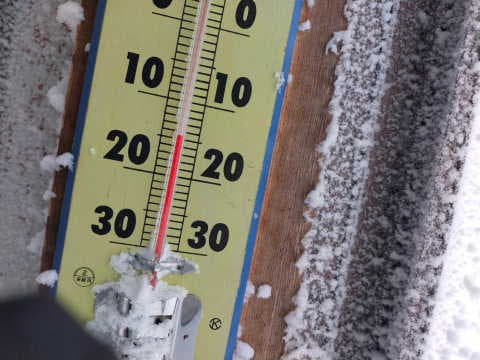

そして，朝は曇り空で，前日からの

積雪は10cm程度と，ここも予想通り！

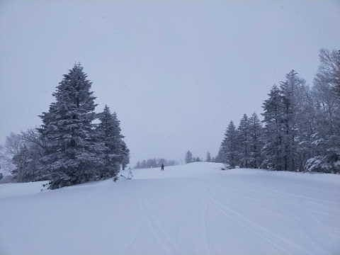

あさイチの圧雪バーンは，圧雪の上に

数cmの冷え冷え新雪が乗っていい感じ

だったみたいで．

で，午前中から日が射してきたようです！！

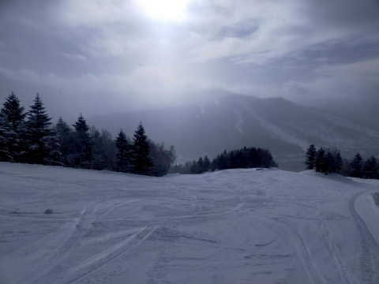

10時ごろから昼ごろまでは，

時折日が射すほどの天気で．

　昼に向かって晴れていくかも？？

という予想が概ね当たったのかな，

…と思ったら．

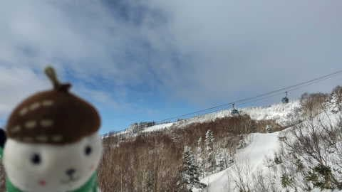

午後1時半ごろには雪降りの天気になり．

　夕方あたりに天気が崩れ，

　また雪がぱらつき始める．

というのが，数時間早く崩れ始めたみたいです…

予想，ちょっと外したか…

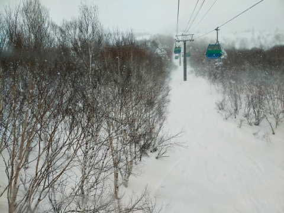

でも，雪の降り始めを数時間外しただけ

だよね…

概ね当たりだよね…

と，自分を慰める．

ちなみに，ここ数日の積雪で，雪が薄い

ところはほぼなくなったかと思ったら．

一の瀬パーフェクターコースの入口だけ，

まだ雪が薄くてコースが開いてない

ようです…(涙)

まだ，例年より雪は少な目のままですね（泣）

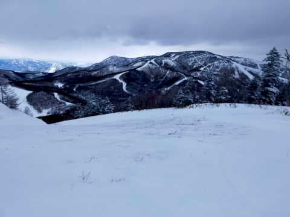

で．

今晩はちょっと雪が積もりますが…

明け方までには雪が止むので，

明日の金曜日は予想通り，

朝は雪が降ってなくて，もしかしたら

晴れ間もあるかもしれない天気．

あさイチはいい感じの柔らかシマシマ

バーン！！

でも，徐々に天気が崩れ，夜に向かって

雪になっていきます…

そして，明後日土曜ですが．

昨日の予想では

　非圧雪バーンは30～50cm

と書きましたが．

うーん．20cm，多くて40cmかな…

まぁ，土曜朝は膝パフくらいだと

思います．

高速道路も，横川あたりからチェーン

規制って程は降らなさそう．

坂城ICから更埴付近からチェーン

規制かな…

あ，西日本はヤバそうです！！

土曜の関西方面は，滋賀県付近から

チェーン規制が入るかも…

…ってなことで，本題へ．

今回も[長岡のエキップさん](http://www.equipe.jp/)に行ってきて，

[見事に物欲選手権に負けてきた](e107181925fb3cf130e75fb7a164207e7.md)

わけですが…

今さらながらに，その時に買った

ブーツの詳細をレポートします…

今回Getしたのは，

新しいブーツ，

FISCHER RANGER 130.

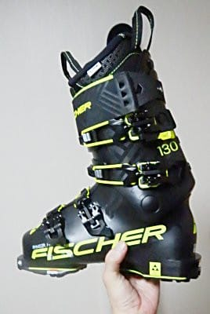

一応現地でフレックス120と130を

履き比べましたが．

やっぱり私には130くらいがちょうどかな…

と，130をチョイス．

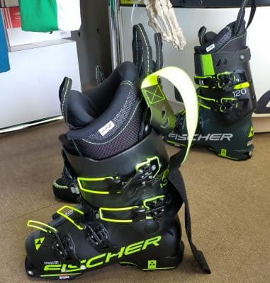

なんでこのブーツを買ったのか…

というのは．

物欲選手権の中でも書いたけど．

最近，山スキーに誘われてて．

テックビンディング対応の

山用のブーツを買えば…？

と勧められてたけど．

さすが山用だけのブーツを買うのは

ちょっとどうかな…

と思っていたところ．

ちょうどテックビンディング対応で…

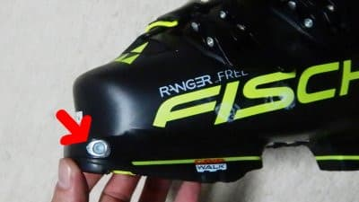

さらに，ウォークモード対応で．

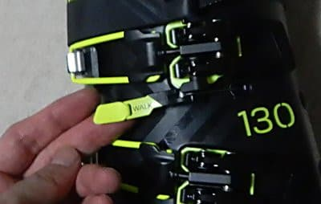

レバーを倒すことで，

足首固定のスキーモードと

足首が自由に動かせるウォーク

モードを切り替えできて．

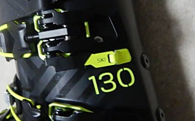

そのうえグリップウォーク対応で．

月山とかの藪漕ぎとか岩場を歩く

ところでも歩きやすそうなソールだし…

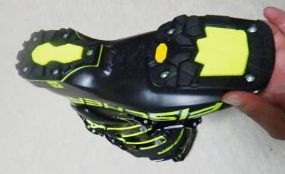

それも，ソールは登山靴で圧倒的な

信頼を誇る，ビブラムじゃない

ですか！！

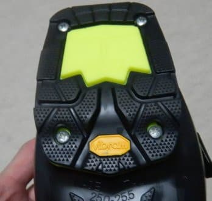

それでいて，フレックス130で

スキーモードでは結構しっかりした，

普通のブーツとして使えそうなのに，

山用として考えられているので，

異常に軽いという…

…もう，これは．

REXXAMもヘタってきたし．

雪が緩んだ春スキーとかに

お気楽に履くにはちょうど

いいんじゃない？？

と．

2シーズン落ちで信じられないほどの

激安だったというのもあり，

ついついやられてしまったのでした…

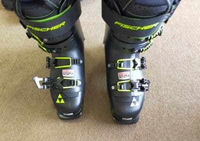

当然今回も，[私の足型に合わせた型](e9c80a3bfa9f9ad2b66be10e7371a331b.md)

を使っての，エキップさんならではの

ぴったりフィットの当たりだしと，

完璧な調整をやってもらえました…

今回，カントやソール角度の調整に，

新兵器（？）のレーザー水準器を使って

膝の位置出しをしてましたね～．

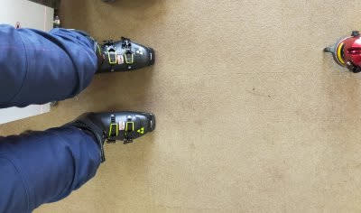

何もしないと，ちょっとX脚気味に

膝が内に入ってしまうので．

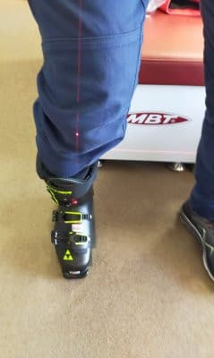

ソール角度をどのくらいつければ

まっすぐ踏めるか．

ソールの下に薄い板を挟んでいって，

角度を調整して…

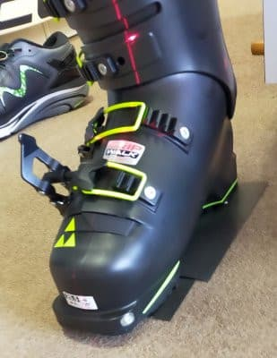

膝がちょうどまっすぐ入るソールの

角度を探し出します．

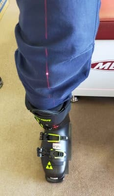

左足も同じようにレーザ水準器で

見てみると…

こっちの足は，何もしないとすごい

膝が内側に入ってますね…

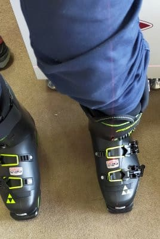

ってなことで．

このブーツ，カント調整がないんですが．

ソール角やフットベッドやらを

調整して，板をまっすぐ踏める位置に

したうえで，

さらに足型にピッタリのシェル成型を

してもらえました…

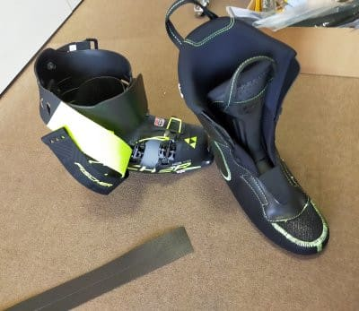

シェルの熱加工も入ったので，

仕上がりまで3時間以上かかりましたが．

カント調整がないブーツなのに，

しっかり時間をかけて，ちゃんとしっかり

まっすぐ膝が入るように調整してもらえ

ました…

さすがエキップさん…

ただ．

私はまだGripWalk対応ビンディングつきの

板をまだ1セットしか持ってないし．

（それもこの物欲選手権で買った板）

ましてやテックビンディング付きの板も

もって無いので．

まだ，このブーツはゲレンデでは試せて

ません…

また，このブーツで滑ってみたら

どんなだったかレポートします～！

## 💬 コメント一覧

### 💬 コメント by (レインボー75)
**タイトル**: Unknown
**投稿日**: 2023-01-27 15:08:12

金曜日の志賀高原情報

今日も冷え込んでます。朝の蓮池-8℃、小雪がぱらついてます。

オリンピックも含めて全面朝圧雪みたいで、どこも新雪が8cm位、それがよく滑る雪で最高。

スピード凶で膝痛の要介護隊員に追い抜き禁止令を出して、これまた膝痛の私の後ろを滑らすという、まさに老人クラブ！

膝に悪い急斜面は避けてのスキーリハビリを敢行しました。効果あり！

昼は今日も二高の中華「獅子」。いつものあんかけ焼きそばを美味しく頂きました。

午前中はシーズンベストかと思いましたが、午後になるとGSは荒れてきて快感はゼロに。それでもレインボー(２時)少し前までやけびでお仕事(？)に励みましたよ。

明日は新雪が、それもさらさらのふんわふわが期待できそうかと。

### 💬 コメント by (Skier_S)
**タイトル**: ＞レインボー75さま
**投稿日**: 2023-01-28 00:22:34

明日はそこそこ積もりますよ～！！

パウダー狙いなら，朝の雪搔きで出遅れないように早起きしないといけない予感です．

明日はお会いできないかもですが，気を付けて滑ってください！

