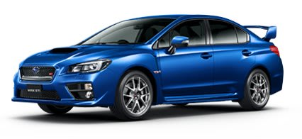

# スバルWRX STIに乗ってみた…試乗インプレッション

📅 投稿日時: 2015-06-23 03:07:14

ということで．

この間，車の点検のためにスバルに行ったんですが．

なんと．そこで，スバルのWRX STI．

試乗車が出ていたので．

のってきました…

（スバルHPより）

WRX S4は[以前試乗してた](e536dc4b7d07417e83b51800be296ad9f.md)んですが．

今回は，STI.

まさか，STIが試乗できるとは…

ということで．

喜び勇んで乗ってきました．

新型のFA20エンジン＆リニアトロニック＆電動パワステ＆Eyesightという，

洗練されたS4に比べ，

旧型のEJ20エンジン＆マニュアルミッション＆油圧パワステという，

なんともワイルドなSTI.

さて，違いや如何に…？

…

まず．

運転席に座った感じは．

…シフトレバー回りが，スパルタンな感じ．

S4ではステアリングについているSI-Driveのセレクタも，

STIでは旧型レガシィと同じ，シフトレバー手前に

堂々と鎮座しています．

そして．

久しぶりの，マニュアルのサイドブレーキ．

あー．

でも．

それ以外の，ステアリングやらメーターはS4と一緒だなぁ…

シートも赤いアクセントはあるけど，S4とほぼ同じ感じ．

そこそこホールドが強いシートです．

んで．

ブレーキを踏み込み，ボタンでエンジン始動！

…マニュアルミッションだと，無意識にキーをひねりたく

なってしまったんだけど．

自分が古い人間だからかな…

アイドリングでのエンジンサウンドは…

思ったより静かかな．

とりあえず，クラッチをミート．

低速トルク感十分，クラッチも割と優しくつながるので，

ほとんどアクセルを踏むことなくミートすれば，

それだけでするすると進みだします．

…久しぶりのマニュアルミッションなので，

他の比較対象があんまりないんだけど．

シフトは心持ち渋めとはいえ，ゲートが分かりやすく，

節度感のあるフィール．

ふむ．

いい感じ．

そこから踏み込むと…

あれ？S4より重いかな…

と，思った後に．

回転数とブーストが上がると，ドカンと来るっ！

うひょー！

さすが，STI．

EJエンジンはFAにくらべ高回転型なのか．

S4は下からのトルクがそのまま回転数を上げても

継続していく感じだけど．

EJは，回転数が上がっていくと，どどどどっと

トルクが荒々しく出てくる感じ．

…いや，低回転でも十分なトルクは

でてるんですけど，やっぱり回していった方が

楽しめる感じ．

エンジン回転数を上げると，エンジン音も

結構ワイルドになってきます．

そして，S4との一番大きな違いを感じるのが．

コーナーでステアリングを切った瞬間．

「をを…っ！油圧だ，油圧パワステのフィーリングだ！」

ほとんどすべての車がEPS（電動パワステ）になっている今日この頃．

超久しぶりの，油圧パワステ．

…どうやら，長いこと油圧パワステに乗っていないうちに，

油圧パワステを頭の中で美化しすぎていたのか．

それとも，最近のEPSがすごく良すぎるのか．

「あれ？油圧パワステって，こんなだったっけ？」

って感じ．

ステアリングシャフトがねじれて，油圧が立ち上がってから

アシストが効くという，わずかなアシストの遅れ感があり．

また，路面からの反力の変動による，アシスト量の微妙な

変化がすべてステアリングに伝わってきます．

いや，これは，裏返せばフロントタイヤのインフォメーションが

しっかりステアリングに伝わってくるってことで，

ミューの高い路面で，限界のグリップを探りながら走る…という

にはいいんでしょうけど．

普通にそこそこの郊外路を走るには

「す，ステアリングにいろんな振動が伝わる…」

って感じですか．

とりあえず，高回転型のエンジンにしろ，しっかりインフォメーションが

伝わるステアリングにしろ．

本格的に攻めることを目的に作られた車…

というのが良くわかります．

決して，高速道路をひたすらまっすぐ楽に走る…という

車ではなく，ガシガシ攻めて走るために作られた車です．

街乗りや長距離高速ドライブに使うのは，

ちょいと勿体ない感じ．

ってことで．

高速道路を長距離走って，スキー場に行く…とかの

目的には．

低速から滑らかな新型FAエンジン＆リニアトロニック

＆アイサイトで楽に走れるS4の方がいいな～，

…というのが，当たり前の結論．

しかし…

WRXのS4とSTI．

見た目はほとんど差がないのに．

乗ってみると，全く別の車という．

こんなふうに，エンジンからステアリングまで，

何から何まで作り変えてくるってのは．

…スバルのこだわりを，すごく感じるな～．

## 💬 コメント一覧

### 💬 コメント by (ひろりん)
**タイトル**: Unknown
**投稿日**: 2015-06-25 13:15:23

インプかぁ・・・

レーシングカー（N1とS耐）しか運転したことないのです(爆）

どアンダーにセットしないとバリバリ後ろが出てきちゃうのでタイムが出づらい。。。向きがほいほい変わるので運転してて楽しいんだけど、オイシイとこの懐が狭くてセットアップ難しかった（TT)というか舗装路向けじゃないような（笑）

あと、高負荷高回転を続けるとエンジン様が（TT)

もうひとつ、足元がタービンで加熱されてクソ熱かった（汗）

### 💬 コメント by (Skier_S)
**タイトル**: ひろりんさま
**投稿日**: 2015-06-26 00:42:52

ふつーはレーシングカー運転することないですから（汗）．

私は公道しか走らないので（笑）．

そこそこの山道が気持ちよく走れて，

高速の長距離運転で疲れなくて．

雪道でそこそこ飛ばせる，

というのが私の車の判断基準です（＾＾;

