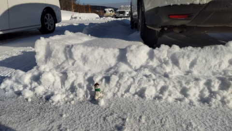
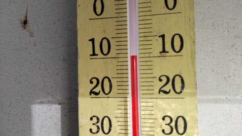
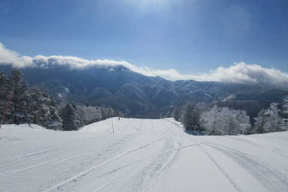
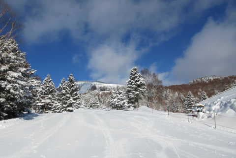
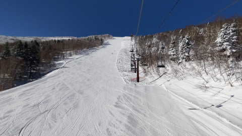

# この週末も志賀高原に行くけど…3月3日(金)の志賀高原は，特派員によると朝は20cmの積雪！土曜は午後曇るかも

📅 投稿日時: 2023-03-04 00:21:29

🏷️ カテゴリ: [日記](cc4b5682fb7b8b144980957a978653fb0.md)

えー．

本日の志賀高原特派員によると…

今朝は予想以上に積雪があったようで．

一晩で20cmほど積もったみたいです…！

で．

新雪が積もったのに，朝からすっきり

晴れて…

朝の気温も-10℃と冷え冷え！

そして…

冷え冷えの晴れ晴れのシマシマという

激烈ゼイタク！！！

今日は昨日とうって変わって，

どこに行っても冷え冷えの柔らか

トップシーズン雪で…

人も少なくて，最高の一日だった

みたいです！！

明日もこんなだったらいいなぁ…

で．

この週末の志賀高原の天気は，

すっきり晴天から，土曜はちょっと

雲が多そうな感じになってきました…

4日(土)：朝は冷え冷え晴れ！

　あさイチの気温は-6℃くらいかな？

　朝は最高にいい感じのシマシマバーン！

　昼間はギリギリ0℃を越えるかどうか．

　午前中は晴れているけど，昼に向かい

　雲が多くなり，午後は曇りそう．

　すっきり晴れよりは雪が緩まないので

　いいかな？

　もしかすると午後遅くは雪もぱらつく

　かも…

　すっきり晴れではないけど，終日

　雪も良く，楽しめる一日

5日(日)：朝から晴れ！

　あさイチの気温は-5℃くらい？

　あさイチは締まり気味のシマシマ

　バーン！

　日当たりの良いところはわずかに

　コロコロが出るかも…

　昼間は0℃をちょっと上回り，

　日差しが良い南斜面はちょっと

　雪がしっとりするかも．

　でも，南斜面以外はそれほど緩まず，

　晴れていい感じの一日になりそう！

って感じでしょうか…

ってなことで，今週末も志賀高原に行きますが，

あと3時間後に出発です～！

これから準備してお風呂入って…

2時間しか寝られない(涙)

平日も睡眠不足なのに大丈夫か…？？
