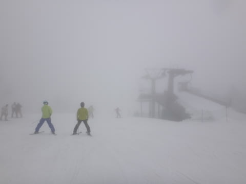
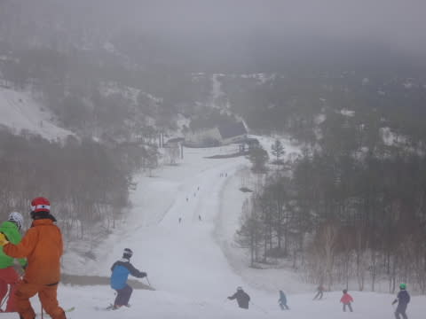

# 5月9日のかぐらは…あれ？天気予想外した？？終日雨の一日

📅 投稿日時: 2015-05-09 21:55:42

🏷️ カテゴリ: [2015スキー滑走日記](c09ea645cfc085f86dfcd80f49599dd89.md)

ってことで．

今日はかぐらに来てますが．

…昨日の天気予想で．

ヘタすると，ぽつ，ぽつくらい雨が降る可能性も…

おそらく，降らないとは思いますが．

と，書きましたが．

…

…天気予想，外しました（涙）

（ゴメンナサイ）

あー．

昨日の段階では「雨が降るかも」というのは，

結構アグレッシブな予想だったんですが．

…「降らないとは思いますが」と書いたのがちと残念なところ…

結局，今日は．

朝の9時ごろからぽつぽつ降り始め．

リフトストップの4時まで，まったく止むことなく，

終日ぱらぱら降り続けました…（涙）

とりあえず．

7時半のロープウェー営業開始からちょっと遅れて，

7時40分くらいにロープウェーに並ぶと…

あら？

意外と並んでおらず．

ロープウェーにすぐ乗れて，みつまたエリアへ…

うむ．

みつまたゲレンデは，もうかなり雪が消えてますな．

去年より，2週間くらい早い感じかな～．

でも．

まだ，みつまたリフト乗り場付近はしっかり雪がついてるし．

みつまたからかぐらゴンドラへ向かうコースも，

しっかり硫安で固めてあって，まだ十分滑っていけますな．

…という感じで．

ゴンドラに乗ってやってきた，かぐらメインバーン．

ほう！！

まだメインバーンは，全面真っ白ですな！

雪がもっとも最初になくなる，和田小屋からかぐら高速リフトへ

降りるコースも，まだまだ大丈夫！

ただ，メインバーン上部．

コース脇はもう土が出始めているので．

うーん．

やっぱり去年よりは雪解けが早いかな～

でも，朝イチはそこそこの整地で，「をを，結構滑れるかも？？」

と，思ったのもつかの間．

滑り始めて1時間も経たない，9時半前には…

あれ？これなに？

…雨だよ…っ！！（涙）

そして，この日は結局，

終日ガスがかかったり，雨が強くなったりで…

とてもじゃないけど，レインウェアなしですごせない

一日でした（涙）．

ただ．

雨が降ったおかげか．

リフト待ちは最大でもこの程度で，5分待たなかったのが救いかな～

もう，午後は雨が強まったりするタイミングによっては，

リフト待ち0でした．

例年のこの時期なら，リフト待ち15分から20分覚悟しなくてはならないので．

雨が降ってくれたおかげで，板も滑るし，リフト待ちもなかったし．

意外と良かったかも？？？

とはいえ．

やはり，ゲレンデの人も多く…

かぐらメインバーンも，午後にはかなりのコブに…

そして．

メインバーンも雪が薄いのか．

コースのところどころ，コブ溝にはかなりの土が出てきてました…（涙）

うーむ．

コース全面雪がついてるように見えるけど．

メインバーン，意外と雪は薄いですね～．

そのほかのコースは．

テクニカルコースは，まだ真っ白に見えますが…

コブ溝に，土が出始めてます…（涙）

うーむ．

テクニカルコースも，滑れて来週までかも…

ジャイアントコースも，まだまだ雪が幅いっぱいに

あるように見えましたが．

意外とコブ溝に，一部土が出始めてます…

ううーーーん．

かぐら全域，結構雪があるように見えるけど．

残っている雪は，去年に比べると結構薄いな～．

ってことで．

コブ溝に一部土が出てきたのは残念だったものの．

雨が降ってくれたおかげで，雨のおかげで混まずなかったし．

板が滑ってくれたし．

結構いっぱい滑れて，良かったなぁ…

と，意外と楽しんだ今日一日でした…

で．

下山コースですが．

ゴンドラコースはまだまだ問題なく滑れます．

みつまたコースも，硫安攻撃された廊下一本ですが，

まだ滑って降りられます．

…ただ．

気温が高いと，来週がぎりぎりかな～．

再来週まで，みつまた滑って降りられるかな～，

って感じです…

とりあえず．

去年よりは1-2週間早い雪解けですが．

まぁ，来週くらいまでは，問題なく楽しめるかな．

明日の天気は，曇りのち晴れ，くらいの感じかな～．

また明日一日，かぐら滑ってます！

## 💬 コメント一覧

### 💬 コメント by (mae)
**タイトル**: かぐらかですか。
**投稿日**: 2015-05-10 00:09:37

随分昔、ロープウエイ山頂からだったか、バスでメインゲレンデまで移動し、バス待ちで行列、ゲレンデも混雑、リスト待ちも長く。それ以降以来遠のいてしまいました。

今でも天気が良い日は混雑するんでしょうね。

sさんは月山まではまだまだシーズンですよね。自分は5/5の一ノ瀬でシーズン終了しました。レポート楽しみに拝見しています。

### 💬 コメント by (Skier_S)
**タイトル**: maeさま
**投稿日**: 2015-05-11 00:26:19

そうなんですよね～．

リフトで移動できているうちはいいんですが，

雪がなくなってバス移動になると

辛いんですよ…

バス移動じゃなくても，リフト待ち自体は長いので．

「滑らないと死んじゃう」とか，なにかそういう人じゃ

ないと耐えられないかと…

でも，maeさまはシーズン終わりなんですね．

禁断症状は出ないんでしょうか（笑）．

私のシーズンは6月末の月山まで続くので，

また読んでやってください～！

### 💬 コメント by (のび太)
**タイトル**: Unknown
**投稿日**: 2015-05-12 12:50:52

あら、ニアミスでしたか。

9日、カッパを忘れ、ずぶ濡れになりながらフキノトウを採り、その後、火が付いて昼過ぎまで滑ってました(笑)

釣り公園ではカタクチイワシ祭りが開催されてるみたいですね。

祭りに参加しようか検討中です。

### 💬 コメント by (Skier_S)
**タイトル**: のび太さま
**投稿日**: 2015-05-13 00:54:39

お久しぶりです～！！

ニアミスだったようですね～．

こちらは，雨の中，朝からリフトストップまで，

ひたすらコブ三昧でした！

今週末も当然出撃予定です…

のび太さんはこれから先は，もう完全に

釣りのシーズンですか？

釣りに疎い私は，釣り公園が

カタクチイワシ祭り状態になっていることすら

知りませんでした…

釣りに興味がないのに，意味もなく

海のそばに住んでいるのはもったいなく

感じられますね（笑）．

