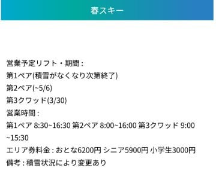

# 志賀高原の春スキー営業情報…山の神は3/31終了，ダイヤも4/13で終わり．そして気象庁の4月の1か月予報は，平年よりちょい気温高め

📅 投稿日時: 2025-04-04 04:11:10

🏷️ カテゴリ: [日記](cc4b5682fb7b8b144980957a978653fb0.md)

4月の年度切換でただでさえくそ忙しいのに，

4月の人事異動で歓送迎会が続出して，

睡眠時間が削られているSkier_Sです…

そして，そのせいで今日も昼間の会議中に

意識を失うこと2回…

夜はちゃんと寝たいのに，今日も気づくと

深夜4時過ぎ（泣）

早く寝ないと…←だからこんな長いBlog記事書いてないで寝ようよ

ってなことで．

本日も，志賀高原の特派員からゲレンデ写真が

送られてきましたが．

4/2の水曜は，天気は曇ったり雪がぱらついたり，

山頂付近はガスが出たり…という天気だった

ようですが．

朝はうっすら2-3cmほどの積雪が

あったようです！

下地はカリカリだったものの，

この積雪のおかげでバーンは結構滑り

やすかったようで…

山頂の気温は昼間でも0℃前後とそこまで

上がらず，さらに午後はうっすら雪も積もり，

板が良く滑るいい感じの雪になっていった

ようです…

明日もちょっと雪が降りそうなので，

土曜の朝は天気もよさそうで，結構いい

コンディションになっているかも…？？

ってな感じで．

4月に入ったので，志賀高原も東舘・西舘・ブナや

丸池・蓮池・サンバレーも営業終了し，春スキー

期間に突入してきましたが．

志賀高原の春スキー＆早朝スキー営業案内に

ついて，シーズン初めの情報と変わったところが

あるので改めてまとめてみましょう…

まず，中央エリア．

4月以降営業するのは例年通りで，

一ノ瀬ファミリー，一ノ瀬ダイヤ，

高天ヶ原，寺小屋なんですが…

当初予定と変わったのは，

・タンネが4月4日まで営業4日延長！

・ダイヤがGWまで営業予定が4月13日までに短縮

・山の神は，しれっと3月31日で営業終了

（[志賀高原中央エリアホームページ](https://shigakogen.co.jp/winter/wp-content/uploads/2025/03/2024-25%E5%B9%B4%E6%98%A5%E3%82%B9%E3%82%AD%E3%83%BC%E3%83%AA%E3%83%95%E3%83%88%E5%96%B6%E6%A5%AD%E4%BA%88%E5%AE%9A%E8%A1%A8-1.pdf)より）

…ということで．山の神が止まったので，

もう焼額と一ノ瀬方面はスキーで滑って

行き来できません（涙）

車かバスで移動になります…

巨大エリアの志賀高原の魅力が失われるん

だけどなぁ…

そして，一ノ瀬エリアは，4/26～29と5/3～6の

GW期間中，6:00~8:00の2時間，2500円で

早朝営業やります！

早朝営業のリフトは，

・高天ヶ原クワッド

・一ノ瀬ファミリーペアB線

の2本．

　

（[志賀高原索道協会春スキー情報ページ](https://shigakogen-ski.or.jp/spring-skiing/)より）

続いて我がホームゲレンデの焼額．

すでに第3高速リフトの営業は終了していて，

第2高速リフトは今週末の4月6日で営業終了．

…つまり，白樺，唐松，ブナコースも

今週末がラストです～！！（涙）

そのあとは，第1，第2ゴンドラのゴンドラ

2本のみで営業が続きますが…

雪がある限り，5/6までこの2本のゴンドラを

動かします！！

ただ，4月9日（水）、16日（水）、23日（水）の

水曜は定休日になります．

そして，早朝営業ですが…

今週末の5，6日と，12日以降は平日も

朝6時から早朝営業！

…営業終了時間も平日2時，土日は3時半と

早くなるけど…

でも，今週末は第2高速も早朝から滑れて，

唐松・白樺・ブナコースも朝6時から

行けますよ～！！！！

早朝2時間で4000円なのは高いけど…

焼額エリア限定券なら，1日券や2日券，

4時間券やシーズン券でも早朝から滑れます！

続いて，奥志賀高原．

第1リフトが今週末で終わり，

第4リフトは4月6日以降は4月25日のGW前

まで金・土・日のみの営業になりますが…

それ以外は，GWの5/6まで営業！

（[志賀高原索道協会春スキー情報ページ](https://shigakogen-ski.or.jp/spring-skiing/)より，以下同）

そして，奥志賀の早朝営業ですが．

今週末から(4/6を除く)，週末と祭日，

第2高速ペアが6時半から営業開始です！

…GWの谷間の平日は営業しないので

ご注意を．

早朝券以外は，Mt.3のシーズン券のみ有効．

奥志賀限定1日券や時間券では滑れないです．

続いて熊の湯ですが…

第3クワッドは終わっていて，

第1ペアが雪がある限り．

第2ペアが5/6までの営業．

まぁ，例年通りですね．

熊の湯の早朝は，第１・第2ペアの

2本で営業．

GW前の週の4/19,20と，4/26～5/6の

GW期間中の営業で，朝6時からです！

最後に横手・渋ですが…

分かりやすいですね．いつも通りで，

第5，第6の2本を除くすべてのリフトが，

雪がある限りひたすら営業です．

そして，横手・渋の早朝営業は…

第2と渋で営業予定ですが．

第2はすでに先週末から早朝営業していて，

４/20までの毎週末と，4/26-5/6のGW期間で

営業予定．

渋峠は，志賀草津道路がオープンする4/25以降に，

第2と同じ日程で早朝営業予定です！

ってな感じの志賀高原の春スキー営業ですが．

志賀高原はまだまだ雪がたっぷりありますよ～！

今週末は，リフト券がお得な春スキー料金だし．

それでいて焼額は第2高速が早朝から営業していたり，

まだ滑れるエリアも広いし…

特に天気がいい土曜はねらい目かも…！！

…日曜が雨じゃなければもっといいんだけど…
