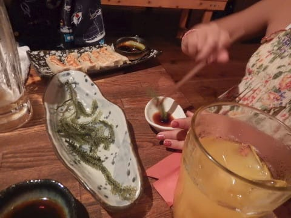

# 2018年8月，子連れ座間味で小5の娘とファンダイビング！その2…午後は那覇をぶらぶらと．そして，翌日は座間味に渡れるのか？？

📅 投稿日時: 2019-08-29 02:26:42

えー．

本日，記事を書いている時間が無くて．

書きためておいたダイビング日記を

お送りします…

なるべく3日続けてダイビング日記が

続かないようにしているのですが．

そんなわけで，今日は3日連続での

ダイビング日記です～！！

…しかし．

今日は一体何時に寝られるだろうか…（涙）

明日更新が無かったら．

Skier_SはBlogも更新できない状態で死んでいる

と思って，暖かい目で見守ってください…

---

ってな感じで．

沖縄へ到着しましたが．

…座間味への移動は明日なので．

今日の午後は那覇でのんびり過ごすわけで…

まずやってきたのは那覇の壺屋やちむん通り．

ここには，琉球王朝時代に作られて，

1996年ごろまで使われていた「南窯」

があったり…

焼き物を売っているおしゃれな

店がたくさん並んでますが．

…20年前は，こんなにこじゃれた

感じの街じゃなかった気が…

そして．

この街は猫がいっぱいいましたね…

狙ってるのか，シーサーと

同じポーズで並ぶ猫．

で．

壺屋街に寄ったついでに．

そのそばに，ガラス体験工房が

あったので，

娘はガラスコップづくりを体験．

あっためたガラスを…

吹いて膨らませて，

形を整えて，コップを作ってました．

そして．

最後は，ちらっと牧志公設市場にも

立ち寄ってみましたが．

なんだか今日は，沖縄の

旧盆に当たるようで．

ほとんどのお店が休みで，

すごく寂しい公設市場でした…（涙）

さらに…なんてこった！！！

夕食を食べようと思っていたお店も

お休み（泣）

うーん．

熱帯低気圧といい．

旧盆にあたるところといい．

今回も，いろいろ不幸に

巻き込まれそうな予感…

とりあえず，夕食は飛び込みで

入ったお店で済ませましたが．

意外とこのお店，おいしくて

当たりだったので．

ちょっとは不幸を穴埋め

出来たかな…

…娘はいつも通り，

「沖縄に行ったら海ぶどう食べる！」

と，かねてより楽しみにしていた

大好物の海ぶどうを，大量にバクバク

食べてました(笑)

…これって，小学生が喜んで

食べるモノじゃないと思うぞ…

で．

なぜかこのお店．

壁一面に絵馬がかけられていて…

店員さんが，娘にも1枚書くよう

勧めてくれました…

わが娘．

どんな願い事を書くのかな…

…

…

…

それかい！！！！

まぁ，

今のわが家族の願いではあるけど．

それを絵馬に書くか…！？？？

ってなことで．

夕食を食べた後は，ホテルに戻ったのですが．

そこで座間味行きの船の最新情報を調べると…

なぬ．

今日より明日の方が，波が高くなりそう！？？？

な…なーんてこったっ！！！（激涙）

電話で問い合わせたところ．

本日は，高速船が欠航でも，波につよいフェリーは出港

したようですが…

「明日は海がもっと荒れる予報なので，高速船は

　ほぼ100％ダメでしょう．フェリーも

　出せない可能性があります」

とのこと（涙）

「どちらにしろ，明日のフェリーはもう満席です」

な…な…な…なーーーーんてこったっ！！！！！！！（超涙）

今日の高速船に乗りそびれた人が明日の

フェリーに流れたようで．

明日のフェリーが満席となると…

明日，座間味に行くことは無理か…？？（泣）

「キャンセル待ちの列に，早くから並んだら

乗れるかもしれませんが…」

…そうですか．

となると．

明日は，キャンセル待ちに賭ける

しかないですね．

とりあえず，

明日の朝イチ，泊港のオープン時間に

窓口に並んで，キャンセル待ちの

いい順位をGetするしかないか…

ということで．

徹夜明けというのもあり．

朝が早い翌日に備え，

夜は早々に就寝したのでした…
