# 2023/12/17(日)の志賀高原焼額山スキー場の詳細レポート…混雑，アイスバーン，冷凍人間製造リフトの修行モード＆下山の試練．シーズンにはこんな日もある

📅 投稿日時: 2023-12-19 03:48:39

えー．

本日18日（月）の志賀高原．

きっと朝までに雪がいっぱい積もって，

昼間も降り続けているに違いない…

と，期待していたんですが．

特派員からの情報によると．

今朝の焼額の積雪は，5cmもなく．

せいぜい2-3cmくらいだったようです（涙）

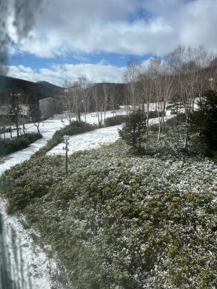

でも．

この数cmの積雪のおかげで，アイスバーンは

隠れてくれて．

そして，天気も雪にならず晴れてくれたのもあって…

今日はコンディションよかったようです！！！

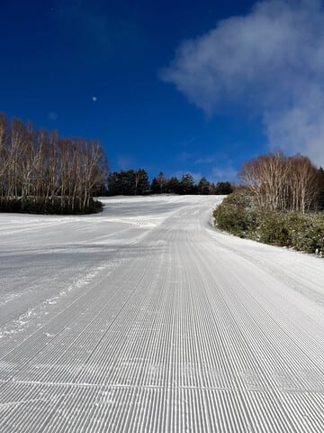

…う，うらやましいぃぃぃぃぃぃぃ～っ！！！！！

なぜ昨日は激冷えアイスバーン地獄だったのに．

週末が終わったらコンディションよくなるかな…（涙）

で．

積雪が足りないながらも，冷えてくれているので．

人工降雪機はフル稼働できているようで，

焼額は，何とか第2高速リフト（唐松コース）が

12月20日から再稼働するようです…！！

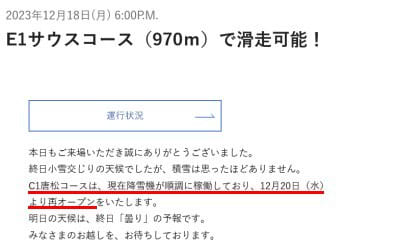

（[焼額山スキー場ホームページ](https://www.princehotels.co.jp/ski/shiga/winter/)より）

とりあえず．

これから20日まではかなり冷えるけど．

西風だったりして，志賀高原は雪がそんなに

積もらなさそう（涙）

ただ，21日からは積もってくれそうな予感…

うーん．

でも，今の予想だと，21，22日は西風ベースで

志賀はそこまで積もらず．

北風に回るのは23日からっぽいので…

本格的に積もるのは，23日になりそう．

23日の週末までに，ゴンドラが動かせるだけ

積もることに期待…！

ってなことで，本題へ．

昨日速報レポートした，日曜日の悲惨な志賀高原の

詳細レポートです…！

まず．

いつも通り，この日も朝8:30のリフト営業開始を

狙って志賀高原の上り坂を走りますが…

朝は普通の積雪路で，スタックしている車もなく，

その後の帰り道で待っている悪夢の

気配も見せず，あっさりと志賀高原へ

登ることができたのですが…

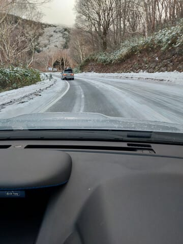

営業開始前の朝8:20の時点で，すでに

かなりのリフト待ちがあり…

今日は混みそう…(涙)

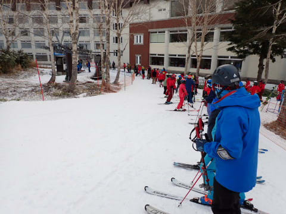

オープン待ちの列が長かったからか，

第4ロマンスリフトは予定より10分早い

8:20から営業開始しましたが，

言うまでもなく，今日も動くのは第4ロマンス

のみ（涙）

昨晩からの積雪はほぼ0で，とても第2高速が

動かせる積雪量じゃないですね…

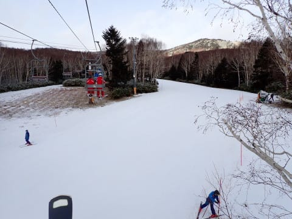

あさイチは薄日も差して，

コンディションはよさそうに見えますが…

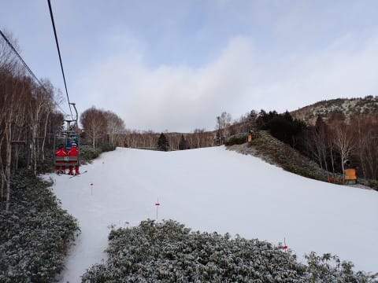

そして．

きれいなシマシマで，すごい滑りやすそうに

見えますが…

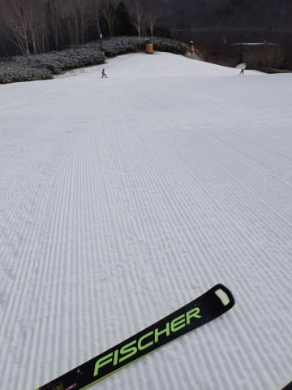

実態は昨日の+10℃近い気温でいじめられて

融けた雪が，今日の-5℃以下の激冷えで

硬めに固まった圧雪で．

ところどころエッジが流されたり，

表面が崩れてコロコロになっていく

悲しい雪でした…(涙)

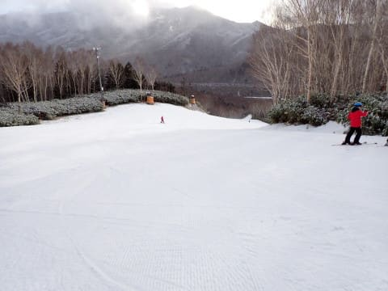

ただ．

それでも，あさイチの1本目は人が少なく

快適に滑れたのだ！！

…けど…

1本目を降りたら，リフト待ちがこの状況（涙）

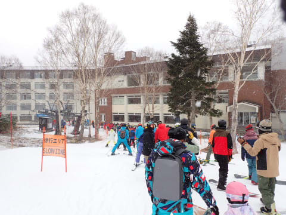

その後，この日は午前中はリフトがすくことは

なく．

午前中は平均5-10分，最大15分待ち以上という

状況が続きました…(泣)

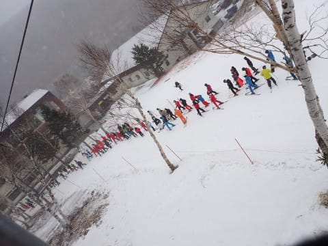

そのせいで，コース上は人口密度が高く．

それもトップシーズンのように，緩斜面と

中急斜面で初心者や講習・一般スキーヤーが

分かれることができないので．

スピードや滑りが全く異なる初心者から

上級者，講習までが全て1コースに集中

していて…

気持ちよく滑るのは難しく，

安全に滑り降りるのに徹する感じ…

うん．

あんまり気持ちよくない（涙)

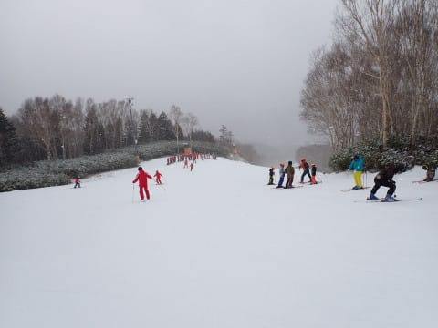

そして．

朝9時半ごろには，本格的に雪が

降りはじめ…

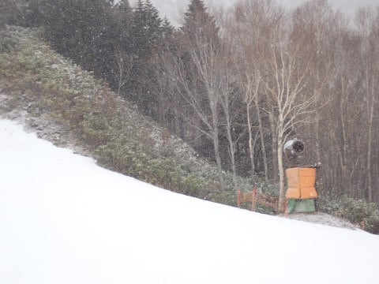

気温も激冷えになり，遅いペアリフトだと

身体が冷えまくって，かなり厳しい

感じに…(泣)

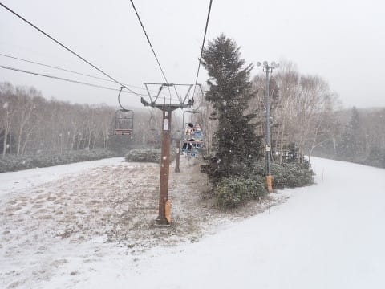

この雪で視界が悪い中，この人口密度なので…

気持ちよく飛ばすのは，ちょいと厳しい感じ（涙）

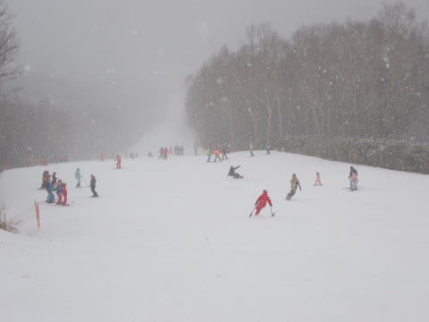

おそらく，この人口密度のコースをトップ

スピードで滑るには，周りで滑っている他人を

逆手で人間可倒式ポールとしてなぎ倒しつつ

滑ることになりますね…←ならないから

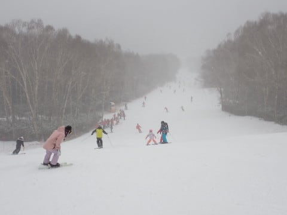

さらに．午前中はこのリフト待ちなので…

1時間3本くらいしか滑れないんですが（涙）

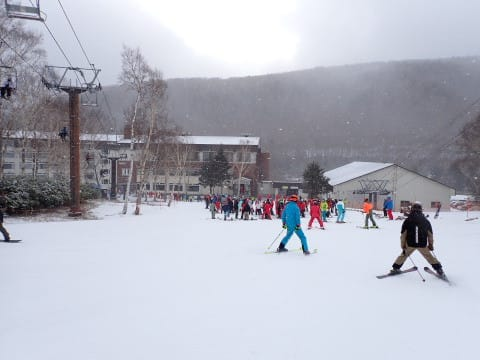

今日はお昼になっても，意外とリフトは

混雑したままで．

なぜか午後2時になっても，こんなに

リフトに人が並んでます…（激涙）

いつもならガラガラゴーストタウン状態になる

日曜の午後に，5分以上のリフト待ちを

することになろうとは…！！

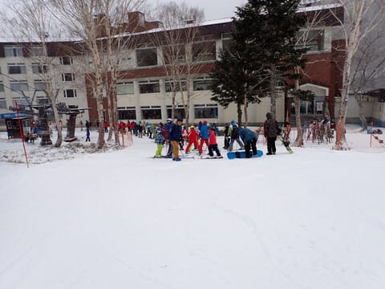

当然，コース上の人口密度も，午後になっても

減ることはなく．

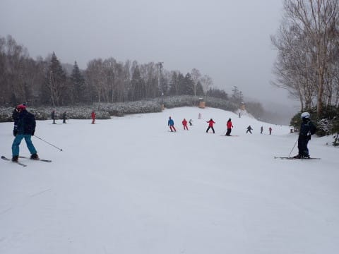

それどころか，朝からところどころアイスバーン

化していたゲレンデ．

数多くの人が滑って雪が削られた結果…

午後になると，かなりアイスバーンエリアが

拡大（涙）

気温は低くてリフトは寒いし．

リフト待ちは長いし．

コースはアイスバーンだし．

コース上の人口密度は高いし…

…

残念だ…

残念な感じだよ…（こぼれる涙）

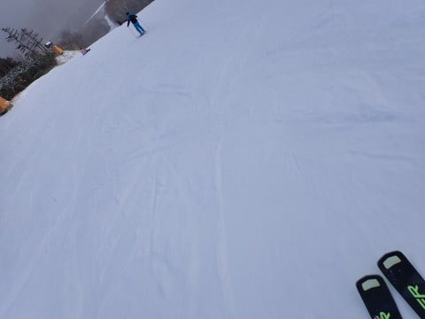

ただ，午後3時を過ぎると．

コースもリフトもようやく人が少なくなり．

うっすら青空ものぞき始めてきました…！

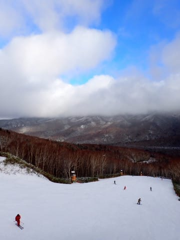

コースのかなりの部分が硬くなって

しまっていたけど．

それでも，リフトもがら空きになって，

コースもガラガラになった最後の１時間

だけは，思う存分飛ばして滑ることができ．

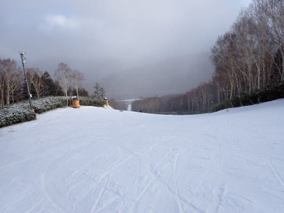

あぁ…

最後のガラガラで滑れたのは，最後まで

残った人が楽しめるご褒美だよね…

と，この時は楽観的に喜びながら，

いつも通りリフト営業終了の16時まで，

ひたすら遅いペアリフト1本をグルグル

し続けたのでした…

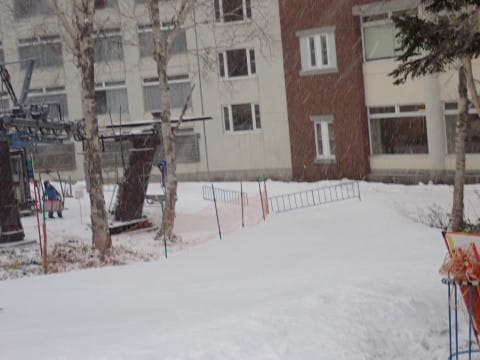

で．

コンディションがかなり残念な一日だったけど．

最後にガラガラのコースを滑れて，

まぁよかったとしておこう…

と，必死に今日という悲惨な一日をポジティブに

とらえようとしていた帰り道．

[昨日の記事](e666957e4c03728b12a1f6955b7ae2262.md)の後半に書いたように，

テュルンテュルン道路による多発事故により，

焼額から上林チェーンベースまで3時間半かかる

という，

悲惨な目にあって，最後にとどめを刺された

日曜日になったのでした…

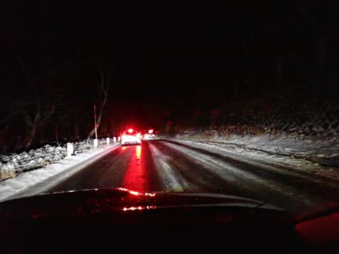

いや．3時間半あれば，家から信州中野

インターまで行けちゃうんですど…！？？？

と，嘆きながら．

焼額から出発して約9時間後の

深夜1時過ぎに，何とか帰宅したのでした…

いや．

ホントに踏んだり蹴ったりの一日だった…

日曜の志賀高原．

誰かすごい日ごろの行いが悪い人がいたに

違いない…

一体誰だ！！？？←自分だとは思わないのか？

## 💬 コメント一覧

### 💬 コメント by (アリス)
**タイトル**: Unknown
**投稿日**: 2023-12-19 09:46:30

Ｓkier_S様

日曜日はお疲れ様でした(^_^;)

私も日曜日の午後の志賀高原は、ゲレンデから人が居なくなる印象でしたが、違ったみたいですね。

それと蓮池交差点の多重事故、気の毒しかありません。

23日から一の瀬〜ダイヤクワッド〜ニ高でヤケビを想定していましたが、この分だと直接2ゴン前に車で移動になりそうですね☺

### 💬 コメント by (カンタロス)
**タイトル**: Unknown
**投稿日**: 2023-12-19 13:34:23

Sさま、こんにちは。

可倒式ポールのように人をなぎ倒す。マニアックな表現ですね(笑)

普通の人はなんのこっちゃ？な表現では？

（私を含め）このブログを読んでいる人の普通は

ほんとに普通の人から見たら、アタマが◯◯な人の普通なので問題ないのでしょうが…(笑)

早くゲレンデ全面オープンになって欲しいものです

### 💬 コメント by (Skier_S)
**タイトル**: 今週末こそ快楽の週末のはず…
**投稿日**: 2023-12-19 23:39:25

＞アリスさま

いや…日曜は悲惨でした．

混むは寒いはアイスバーンだわ，そして帰り道は…（泣）

23日は，ダイヤと山の神が動くといいんですが，まだ動くかどうかぎりぎりのところだと思ってます．

24日は大丈夫かも？？

＞カンタロスさま

どうでもいい話ですが，とあるスキークラブのトレーニングの時．

可倒式ポールのことを知らない人に「加藤さんが発明したから加藤式ポールっていうんだよ」という

ガセネタを吹き込んでみたけど，信じてもらえなかった思い出が…

とりあえず，このBlogを読んでいる人は加藤式ポールではないことくらいは知っているかなと（笑）．

