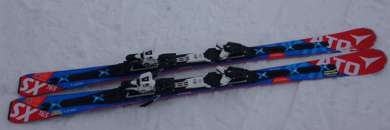
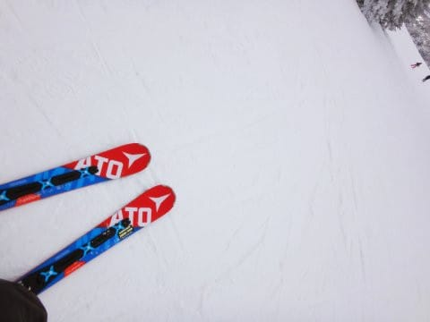
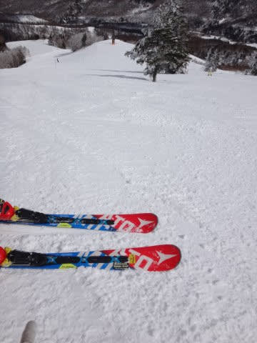

# ’17 ATOMIC Bluester SXを履いてみて…果たして'16SXはヘタっていたのか？？

📅 投稿日時: 2017-03-17 03:07:13

なんだか．

3連休の中日，19日．

すっきり晴天にならずに，雲が多い天気になる

可能性が出てきましたが…

まぁ．

この時期．

ピカピカ晴天より，日が陰ってくれた方が

雪が緩まずに済むので．

むしろ，曇りの方がありがたいかも…

…と，思っている，Skier_Sです．

えー．

昨日は天気予想を挟みましたが．

[一昨日の記事](e922ef4eede2bd4d2b900bd4bf1b03156.md)の続きです．

私が4か月履いた'16SXがヘタっているのか否か…？

これを確認したくて．

ついつい物欲選手権に敗れてしまった結果の

'17 ATOMIC Bluester DD3.0 SX．

こいつが届いたので，

ついにゲレンデデビューすることになったわけですが．

…果たして．

'16SXとの乗り味，全然違うのか？

'16SXは，ヘタっているのか，否か？

いざ，行かん！

…と．

滑ってみると．

…

…これは．

…曲がるっ！

曲がるよっ！！

驚くほど雪面に張り付くように曲がるっ！！

なんだこれはっ！！？？

10m滑っただけで，'16SXとの違いは明白…っ！

ガッツリしたグリップ．

トップからテールまできれいにたわんで．

板の長さのエッジがすべてしっかり効くし…

…そして．

ターン後半での元気な返り！

この返りで板がすっと抜けて，気持ちいいほど

オートマチックに切り替えられるし．

この反動としっかりしたエッジグリップのおかげで．

切りかえ後，谷回りで板を遠くまで離していける！

驚くべき傾きが出せるよっ！！

そうだ．

そうだよ．

SXって，こんな板だった…（感動）

急斜面のオリンピックコースでも．

何の問題もなくX-RACEと同じスピードで

落ちて行けるよ…

…なんだ．

ATOMIC Bluester SXって…

X-RACEと変わらないくらいの高速安定性が

あるんじゃないか…！

面白い．

やっぱりSXって，こんなに面白い板だったんだよ！！！！

…ということで．

結論．

4か月ちょいしか履いていない，'16SX．

むちゃくちゃヘタってました…（涙）．

この，'16SX．

'17SXで滑った後に履いてみたけど．

笑ってしまうくらいトップがグリップしないし，

返りはないし．

張りもないし．

…これ．

マイルド化…ってレベルじゃ，ない．

はっきり言って，この板．

かつてSXだった何か

というレベル．

これはもう，SXではないよ…

まさか，こんな状態になっていたとは…っ！！！

…ということで．

今回，物欲選手権に完敗してしまったものの．

新しいSXを買ってよかった

と心の底から思った，Skier_Sなのだった…

…しかし．

わずか4か月で板がダメになってしまうとは…

まさに消耗品（涙）．

スキー道具の中で，一番高い「スキー板」が，

一番寿命が短いとは…（泣）．

グローブやフェイスマスクより寿命が短いって，

どういうこと？？？

どうやら私が備えるらしい，

スキー板劣化加速能力．

こんな能力，要らんのだが…（涙）．

## 💬 コメント一覧

### 💬 コメント by (KENKEN)
**タイトル**: 確かに
**投稿日**: 2017-03-17 08:09:24

かつてSXだった何かをお借りしましたが、私でも"これは違うぞ"と分かるレベルでした(^o^)。

板の寿命が短いのか、Sさんの酷使度についてこれないのか？(多分後者)

次回の物欲選手権が確定しましたので、楽しみにしてます。

私は3連休家族サービス(T^T)してきます。

### 💬 コメント by (いか)
**タイトル**: Unknown
**投稿日**: 2017-03-17 08:09:32

やはりへたるの早いですね。でも私はまだ現実は直視せず、来期モデルを待ちたいと思います(笑)

4ヶ月でへたるとすると、来年の今頃にはまた選手権が開催されそうですね。。。

### 💬 コメント by (Kon Suke)
**タイトル**: 本当に
**投稿日**: 2017-03-17 09:25:31

Ｓさんのカーピングだと・・・。

しかし、ズラシの方がヘタリが早んじゃないかな。

毎年1～2本ヘタらしています。

### 💬 コメント by (れお)
**タイトル**: すさまじい能力ですね
**投稿日**: 2017-03-17 12:36:47

スキー板劣化加速能力凄すぎますね！ 笑

この感じだと、来年の今頃までには、SXの後継機も買わないといけなくなっちゃうかもですね...

### 💬 コメント by (しんちゃん)
**タイトル**: 特殊能力で稼げるかも(笑)
**投稿日**: 2017-03-17 23:16:33

スゴイ能力ですね。

世の中には、かっこよくて乗りたいけれども板が手ごわく自分の技術に合わなくて乗れない方もいるはず。そんな方のために、手ごわい板を短期間でマイルド化して引き渡すという、新しいビジネスで稼げるかもしれませんね(笑)

そろそろ来シーズンの試乗会の時期ですね。

試乗記楽しみにしております。。。

### 💬 コメント by (Skier_S)
**タイトル**: スキー劣化能力標準装備中
**投稿日**: 2017-03-17 23:40:43

＞KENKENさま

いやー．

すごいヘタってたでしょ（笑）

3連休，思いっきり家族サービスしてきてください．

次は4月に！

＞いかさま

いや…すごいヘタリ方でしたよ…

しかし，ホントにこの'17SXも，いつまでもつことか…

＞KonSukeさま

やっぱり，私の倍滑ってらっしゃいますから，

シーズンで2セットくらいヘタらせちゃうんですね…

すごい…

しかし，あまりにもSXが気に入りすぎたので，

またSX買っちゃいましたが．

ホントはもう少し安く買える板を買うべきなのかも…

＞れおさま

もう，私の特殊能力です（笑）

このSXも，来シーズンいっぱいは…

どう考えてももちませんよね…おそらく（涙）．

＞しんちゃんさま

うぉ！

今日の記事の書き出しのネタと見事に

被りましたね（笑）

ホントにそんなビジネスができれば

大儲けできそうです（＾＾；

3連休は志賀にはいらっしゃらないのですか？？

また志賀でお会いしましょう！

