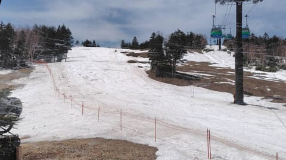

# GWの3連休とそのあとのGWの谷間の志賀高原スキー場の天気は？…そして，Skier_SはGWの3連休も志賀高原に行っているとお思いでしょうが．

📅 投稿日時: 2024-04-27 00:56:11

🏷️ カテゴリ: [日記](cc4b5682fb7b8b144980957a978653fb0.md)

本日の志賀高原も，特派員から情報が

送られてきましたが…

やっぱり焼額のGSコース，

幅が狭くなりましたね…(泣)

まぁでも，去年に比べれば，まだ

ずっとマシですが…

雪を寄せた分厚みが出てくれて，

少なくとも明日からの3連休は

もってくれそうな感じでしょうか．

とりあえず，焼額山は早朝から予想通りの

晴天だったようで，

あさイチはかなり締まったいい感じで

スタートだったようです…！！

でも，GSコースは幅が狭くなったけど…

パノラマコースはまだまだ幅いっぱい

滑れて，あさイチはきれいな締まった

シマシマが滑れたようです…！！

サウスコースも，まだ全く土が出てくる

気配がないので…

こちらはGW後半までもってくれるかも…

と，期待が持てるところ！！

でも，やはり予想通り気温が高く，

昼間は+14℃くらいまで上がったようで…

日差しもあり，半そででも過ごせるくらいの

陽気だったらしく．

午前10時にはバーンが緩み切っちゃって，

緩斜面は滑りも悪くなっていったようです(泣)

うーん．GSコースは3連休ぎりぎりくらいな

感じでちょっとヤバそうだけど，

パノラマ・サウスはGW前半は問題なく

楽しめそうな感じ…！！

で．

この3連休の天気ですが．

まぁ，おおむね水曜の予想通りで．

27日(土)：朝から曇り空．終日曇り．

　早朝から気温は+5℃．昼間も12℃

　くらいまで上がり，曇りでも

　ウェアのジャケットを着ると暑さを

　感じるほど．

　早朝最初の一瞬はちょっとだけ締まった

　雪かもしれないけど，朝から雪は

　緩み，昼間はかなりザブザブの

　残念な感じの雪になり，午後は荒れ荒れ．

28日(日)：この日は晴れそう！

　でもこの日も早朝から気温は高く，

　あさイチは雪が締まっているけど

　早朝のうちに雪は緩み切る．

　午前中に+10度を越え，Tシャツで

　滑れるくらいの暑さに．

　雪は昼にはかなりザブザブに緩み，

　滑りも悪くなっていく．

　午後はバーンはかなり荒れる．

29日(月・祝)：微妙…たぶん朝は晴れるかも．

　だんだん雲が増えて曇り空に．

　この日も早朝から+5℃以上と気温が高く，

　午前中に+10℃を越えてる．

　雪は早朝から緩くなり，通常営業の

　タイミングではもうユルユルの雪に．

　ウェアのジャケットを着ていると暑い．

　午後は滑りが悪めのザブザブ荒れ荒れ

　雪になっていく．

　運が悪いと，夕方液体が空から

　パラパラ降るかも

という感じでしょうか…

その後のGWの谷間の天気は，

まだ精度が悪いけど，

30日(火)：曇りのち雨．

　運が良ければリフト営業時間は降らずに

　もってくれるけど，運が悪いと昼前

　から雨．

　基本的にパラパラと降る程度だけど，

　時折強く降る．

　雪質に期待してはいけない

5/1(水)：曇り時々雨．

　朝から時折液体がパラパラと落ちてくる

　悲しい一日．

　ずーっと降り続けるわけではないけど，

　一日中降ったりやんだり．

　この日はやっと平年に近い温度まで

　落ちてくれるので，そこまで暑くない．

　でも+5℃以上まで上がるので

　雪は緩む．

　雨の量が多いと雪はザブザブに，

　そこまで降らなければ意外と

　滑りいい雪かも．

5/2(木)：もしかすると前日の夜に山頂付近は

　うっすら雪になっているかも．

　…楽観的すぎるかな…

　たぶん朝には晴れる．

　朝はかなり硬めのバーン．

　昼間は気温が上がるけど，+10℃超えまでは

　行かないので，意外と雪が締まったまま

　もってくれるかも．

　でも，日差しで昼前にはザブザブになり，

　午後は滑りの悪い雪に．

…という感じでしょうか．

うーん．

5月1日がぎりぎり平年並みの気温で，

あとは平年より冷える日がなさそう(涙)

このGW期間中，道路に雪が積もったり

凍ったりする気温にはならなさそうな感じかな．

やっぱり，雨と高温で雪がやられる

GWになりそうなので，後半4連休まで

雪がもってくれるのか，微妙…

ってなことで．

いつもならここで，明日から志賀高原です～！！

と，書くところですが．

今回，GWの谷間も無事（書類上は）休みが

とれたので．

さすがにそろそろ睡眠不足が溜まりまくっている

最近，

また今晩，2時間睡眠でスキーに行くのは止めて，

明日はゆっくり寝て，車のタイヤ交換と

オイル交換をする予定．

うん．

スキーシーズンが始まってからひたすら

睡眠不足が続いているので，

ホントにそろそろゆっくり睡眠をとる日を

作らないと死ぬ…

ってなことで．

志賀高原へは，GW3日目の4月29日から

参戦予定です～！！

## 💬 コメント一覧

### 💬 コメント by (アツシ)
**タイトル**: Unknown
**投稿日**: 2024-04-27 23:18:41

今シーズンは3月末までは週末は何とか休めてましたが、4月に入り休みがなくなり、26日中25日出勤というご無体勤務が続いてましたが、今日27日と明日28日は休めることになったので(29〜は出勤)、妻の呆れ顔を横目に志賀高原に来てます。

今日は曇り空だったのでストップ雪にならず、楽しめましたよ！GWなのにガラガラで、ゴンドラは最後まで1人乗車でした。

明日でシーズン終了なので、最後にお会いしたかったのですが、残念です。今季はSさんの影響で初のヤケビナイターに繰り出したり、エキップさんの試乗会に部外者ながら参加させてもらったり(そして見事にお買い上げ)と、いろいろとお世話になりありがとうございました。

あの日、ヤケビ1ゴン乗り場に私の新しい板を担いで現れたSさんを見て、表向きは関東で会社員をしていることになってるけど、ほんとは長岡のスキーショップ・エキップの店員さんなのではという疑惑が頭の中をよぎりましたが、とにかく購入から納品まで、何から何までお世話になり、お陰様で良い道具を手に入れることができました。次にお会いしたときには何かお礼の品を、大阪のお土産でも渡そうかなとその時思ってたことを今、思い出しました。

私は明日でシーズン終了しますが、Sさんの残りのシーズンが少しでも続くよう祈ってます。またブログも毎日チェックしてますので、無理のない範囲で(既にいろいろ無理されてますが)、これからも続けてください。応援してます！

### 💬 コメント by (Skier_S)
**タイトル**: ＞アツシさま
**投稿日**: 2024-04-28 01:45:04

ご無体勤務お疲れ様です．

今日は楽しめたようで良かったですね…

私も今日滑りに行けばよかった…（泣）

でも，寝ないと死にそうだったしタイヤも換えたかったので今日のスキーはあきらめました．

エキップさん購入の板，気に入ってもらえたようで良かったです．いろいろお得だったでしょ←店員モード（笑）

良くしてくれたのはエキップの鈴木社長なので，私にお礼は不要ですよ～！！お気遣いなく．

今シーズンラストにお会いできず残念ですが，また来シーズンお会いしましょう！！！

