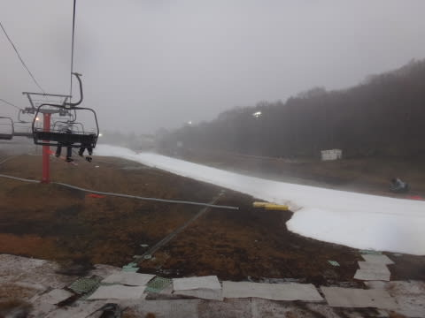
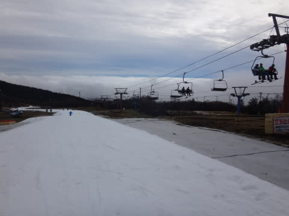
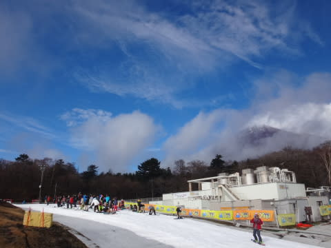
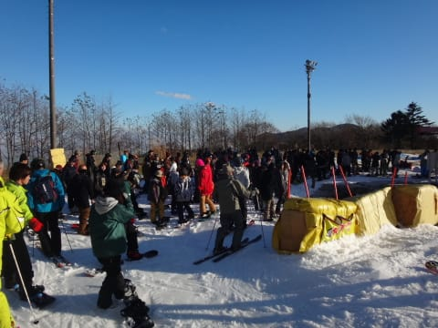
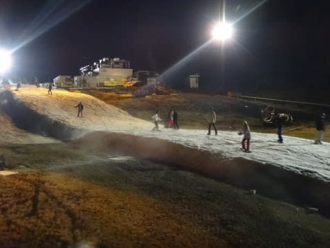
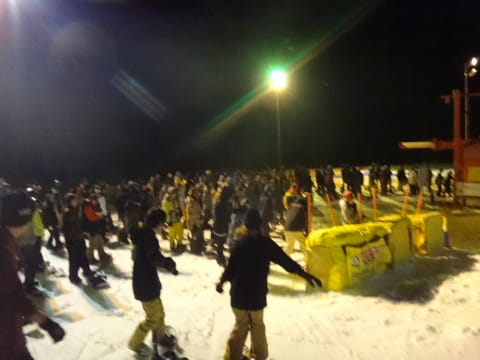

# 11月15日，日曜のイエティ速報モード…雨は朝だけだったよ！

📅 投稿日時: 2015-11-16 01:39:49

ということで．

今日もイエティに行ってきましたよ～！

…やはり，雨降りで始まった朝．

営業開始直後は，時折強く降り…（涙）．

…おかげで，ゲレンデはガラガラ．

しかし．

朝9時半には，雨が止んで…

眼下に雲海が見えましたよ～．

んで．

10時くらいからは日が射したり，時折ガスがかかったりでしたが…

日が射した時は，かなり暑い！

昼ごろまでは，ゲレンデはガラガラでリフト

待ちもなかったけど，

天気が回復したからか，午後からリフト待ちが

伸びて…

なぜか，午後3時を過ぎてから人がぐぐぐっと

増えて，リフト5分待ちくらいになっちゃいました…

…

そして．

そして．

やはり．

今日も行ってしまった…

ナイターです（爆）．

ナイターの方がリフト待ちが長く，最大7～8分ほど

待ったよ…（泣）．

でも．

まぁ，雨も朝のうちに上がって，

午前中はそんなに混まなかったので．

楽しめた一日だったかな～．

明日，また詳細レポートします…

## 💬 コメント一覧

### 💬 コメント by (komu)
**タイトル**: アサマは…
**投稿日**: 2015-11-16 21:29:28

あれ？ナイター？また生霊ですね。

今週末アサマはオープン無理そうなので今週もイエテイですか？

### 💬 コメント by (はなげ親分)
**タイトル**: すごい・・・
**投稿日**: 2015-11-16 22:47:43

写真のような激混み状態は経験がありません！

月、火のナイターは、MAXで３～５列ほどの待ちで済んでます。

日曜日のナイターは恐ろしい程の待ちなんですね。

（知らなかった・・・クワバラ、クワバラ）

### 💬 コメント by (Skier_S)
**タイトル**: ナイターです…
**投稿日**: 2015-11-17 01:24:35

＞komuさま

…たぶん，生霊でしょう（笑）．

今週もイエティになりそうですが…

7日目になるとそろそろ飽きてきます（涙）．

＞はなげ親分さま

いやー，びっくり．

土日は，昼間よりナイターの方が混みますよ！

1時間3-4本しか滑れず（TT

平日ナイターは，空いてるんですね…

