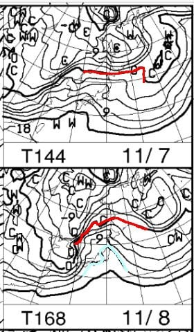

# 明日もYetiで滑ってるよ！…これから5日くらいまで冷えるけど，7，8日は壊滅的な雨かも？？

📅 投稿日時: 2021-11-03 01:36:06

ってなことで．

明日はなんと祭日！！

…今日，こんな時間にBlog更新

しているくらいなので，

ちょっと明日スキーに行ってる

どころじゃないんだけど…

でも，行く．

明日もYetiに滑りに行きますよ～！

11月3日は，軽井沢もオープン．

Yetiも軽井沢も，天気は晴れ～曇りって

感じですね．

もしかしたら，Yetiは一瞬雨がぱらつくかも…

で．11月3日～5日朝くらいにかけては

そこそこ冷えて．

運がよければ，横手山では何とかぎりぎり

人工降雪機が動かせるかも…

って状況なんですが．

やっぱり，横手山．

11月5日プレオープンは厳しい

と思いはじめたようですね…

（[横手山ホームページ](https://yokoteyama2307.com/news/16421/)より)

赤下線部分，

「オープン予定は非常に厳しい状況です」

と書かれていて…

明日3日には，予定通りの5日にプレオープン

するかどうか，判断するようです…

うーん．

厳しい．

なんとか，3日から5日までの冷え込みで，

人工降雪機が動かせて，予定通りに

横手山が5日から滑れるように

なってほしいけど…

でも…

うむ？

なんだこりゃ？

850hpa気温予想図を見ると．

11月7，8日と，気温が上がりそうなん

ですが…！？？

8日に至っては，水色の+12℃線が

志賀に近づいてます…！！

8日，横手山でも+10℃くらいまで

気温が上がっちゃいますよ！！

…これで，7，8日に雨が降ったら

ゲレンデは完全に壊滅なんだけど…

…

…

…(屍)

見事に，7，8日と，網掛けの降水域が

日本を覆っているので．

降ります．

ダメです．

…これは，祈っても踊っても，

仰向けになって手足をバタバタさせて

駄々をこねても降ります．

横手の標高2000m以上でも，

暖かい壊滅的な雨が降り続けます…

この雨で．

7，8日の2日間にわたり．

高温の雨が降り，

横手山のせっかくの人工降雪，

跡形もなく消えてしまいそう

です…

あぁ…

なんということか…

でも．

今のところ，天気図を見ると．

また10日以降ちょっとだけ，

わずかに冷えそうな予感…

でも．

壊滅的な雨で雪が完全に消えたあと，

9日までは暖かくて人工降雪機の稼働は

絶対ムリ．

その後，10日から冷え始めたとしても…

熊の湯，予定通りの13日オープンは

望み薄ですね．

というより．

横手山も，13日でもオープンは厳しいかも…

あぁ…

冷えるのは10月下旬じゃなくて，

今なんだよ…っ！！

…と．

無駄に10月18日ごろに冷えて雪を

降らせた，天気の神様に言いたい気分の

Skier_Sだったのでした…

## 💬 コメント一覧

### 💬 コメント by (m&t m)
**タイトル**: Unknown
**投稿日**: 2021-11-03 11:47:49

気象庁は経験から補正をかけるという職人技を繰り出したものの、やはりコンピュータの予想通りブレ幅が大きく、この冬は寒暖差が激しくなりそうですね

スキーヤーとしては残念ですが・・・

### 💬 コメント by (Skier_S)
**タイトル**: ＞m&t mさま
**投稿日**: 2021-11-04 10:04:32

この冬…というか，冬に入る前はぶれが大きそうですね．

12月になると安定してほしいのですが…

