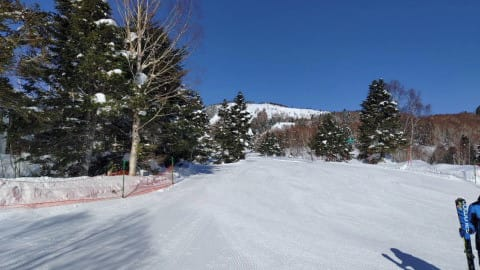
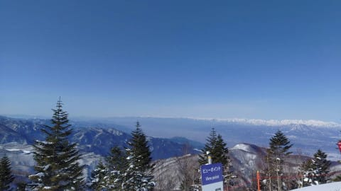
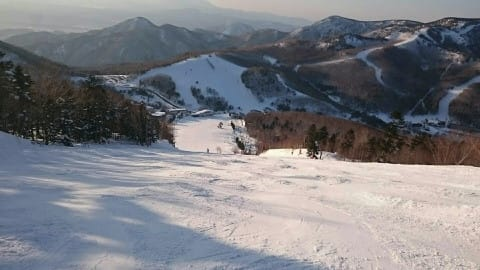

# 2021/2/13(土)の志賀高原スキー場特派員レポート…晴天シマシマ，気温は上がったけど良かったみたい

📅 投稿日時: 2021-02-14 02:54:10

えー．

本日も特派員レポートをお送りするわけなんですが．

最近のこのBlog，

あまり新しいネタがなくて，

特派員からの写真ばっかりだよね

とお思いになる方が多くいるでしょうから．

ひとこと言わせてもらいますと…

スキーに行かないで，毎日Blogを書ける

ネタがでてくるわけない

と．

開き直らせてもらいます（えへん）←胸を張って言うことじゃないから

…でも．

特派員情報だけじゃなく，天気予想やら

かなり小ネタをいろいろ入れていて．

毎日の記事がかなり長くなっているので…

実は大変だったりします←褒めてほしい

ってなことで．

土曜日の特派員情報へ！

本日の志賀高原ですが…

予想通りのすっきり晴天でスタート！

あさイチの山頂の気温は-2℃と．

2月上旬の志賀高原としては異常な高温

ですね．

で，さらに言うなら．

　朝の気温は，-2～-3℃くらいか…

という予想，見事当たり！

あさイチのゲレンデは…

シマシマ！

気温が高い割にはトップシーズンの冷えた

エッジが効くシマシマだったようで…

こんな晴天シマシマ，

シーズン何度もあることではないですね…

今日滑れた人はシアワセですね…

一の瀬方面も，エッジがガッツリ効く，

最高のシマシマバーンだったとの報告が…

あぁ…いいなぁ…

ただ，すっきり晴天のいいコンディションの

土曜ということもあり．

焼額の第1ゴンドラは…

すごい待ち時間だったようです！

駐車場まで列が伸びていたとか，

いないとか…

そして，公式発表では第2ゴンドラは

30分待ち！

でも，混んだのは焼額と奥志賀のゴンドラだけで．

それ以外のリフトはそんなに待ち時間なく，

ゲレンデも普段の休日に比べれば

空いてますね…

でも，すっきり晴天ということは．

やはり日差しが強いということで．

さらに気温が焼額第1ゴンドラ山頂温度計で

＋6℃まで上がった本日．

(この温度計，屋内なので晴れの昼間の表示は，外

気温よりちょい高めになりますが…）

焼額のGSコースなど，日当たりのいいバーンは

ちょっとボソボソした重めの雪に

なってしまったようです…

けど，奥志賀や一の瀬は，昼間もそれほど緩まず．

いいコンディションをキープしたようです．

…そして．今日は横手方面に行った特派員

もいたようで．

横手方面は，景色も雪も最高だった…

けど，渋峠のリフトはやっぱりイマイチ…

とのレポートを受け取っています(笑)．

このリフト，確かに遅いし，乗ってると

なぜか疲れるんですよね…

ってなことで．

本日はラストまですっきり晴天が続いた，

絶好のスキー日和の土曜だったようですが．

一の瀬，高天方面は何とか雪が緩まずに済み．

一の瀬パーフェクターは午後も最高だった

ようですね…

ただ，西館方面はさすがにちょっと

重めの雪になってたようです…

でも，晴天であさイチは冷え冷え雪で，

それほどゲレンデも混んでなくて．

いい土曜日だったようですね…

ただ．

今日は雪が緩んだコースは，

明日の日曜の朝イチは殺人コロコロバーン

じゃないかな…

そして，昼間は今日より気温が上がり，

一の瀬，奥志賀も雪が緩みそうです．

…まぁ，月曜の液体の危機に比べれば

1兆7000億倍くらいマシなので．

日曜滑る皆さんは，楽しんできてください…

月曜も滑る，

毎日志賀高原＆40日連続滑走

とかいう感じの特派員の皆さんは，

月曜は朝から液体が落ちてきますので．

日曜のうちに思う存分滑っておくことを

おススメしておきます…

…最後に．

今日はおこみん写真が無いぞ…？

とお思いの方がいるかと思いますが（いるのか？）

今日はおこみんは，別スキー場に出張だったようです…

斑尾かな？

志賀高原の写真じゃないけど．

今日も元気な（？）おこみんの写真が送られてきて．

ちょっとホッとした，Skier_Sだったのでした…

## 💬 コメント一覧

### 💬 コメント by (レインボー73)
**タイトル**: Unknown
**投稿日**: 2021-02-14 15:31:39

日曜日の志賀高原情報

エス様の予報通り、朝一のパノラマ、カラマツは、殺人コロコロバーンでしたよ。私らは『こんなこと当てるな』ですが、エス様はさぞご満悦なことでしょう。そこんとこで、ご満足を！　私らは滑って満足いたしますので。

今日もダイヤモンドでポール練習。全くの素人なんですが、面白すぎる。こんな機会はそうはないので、夢中でチャレンジしました。ゆっくり滑ればなんてことないと思うんですが、スピードを追求すると、DNF! 

無我夢中で昼でリタイア。

その後も練習は続いたようで、north fox様や西館様には、最後の片付けまでありがとうございました。エス様の取り持つ御縁で、いい人たちとお知り合いになれました。ありがとうございます。

お忙しいとは思いますが、今後ともご無理のない範囲で、ご継続をおん願い奉り候。

昼のサウスはグジュグジュ。すごいのはニゴンパーク。ぐちゅぐちゅ水たまり。明日の朝にはこれが氷になるのかなあ。

帰りの高天8℃　蓮池10℃　上林13℃。あーあ！

### 💬 コメント by (西舘)
**タイトル**: 素敵な時間をいただき、ありがとうございました！
**投稿日**: 2021-02-14 23:27:08

>レインボーさま、ほかご一緒いただいた皆々さま、ご縁を取り持ってくださったＳさま

いつも感謝しております、ありがとうございます。

昨日、今日と２日間ポール練習を体験させていただく機会をいただきました。

１本目は横滑り、２本目はシュテムターンもどき、３本目からやっと、それなりになんとなく。上部急斜面では、どうしても遅れてしまってずらし過ぎターンになってしまいますが、３本目くらいからは、なんとなく、それなりのライン取りで滑れたような。

折角いただいたチャンスなので、お昼ご飯はリフト上で済ます『20000m魂』でお昼休みに10本程度滑れました。

選手の方々のように格好良くは滑れないけど、対自分比で少しでもポールの近くへ。インへ。『決められたコースを滑る』練習にもなりました。

素人相手にお骨折り頂いた長岡の皆様、Ｕ先生、Ｔ先生、段取りしてくださったレインボーさま、本当にありがとうございました。次の機会がありましたら再びよろしくお願い致します！

実は本日は3段構成でして、夕方近くに20000m倶楽部の皆々様にご一緒していただくことができました。

今日も楽しかったなぁ。皆様に良くしていただいて、友人も喜んでおりました。

そして、昨日の終了間近には、KonSukeさまに『20000m倶楽部お友だちステッカー』100枚をわざわざお届けいただきました。

私たちにとってKonSukeさまは雲の上のお方なので、お声がけ頂くと緊張してしまって平常心でお話しできません。覚えていていただいて、感慨無量でございます。

### 💬 コメント by (Skier_S)
**タイトル**: 明日は雨．ダメです．諦めてください
**投稿日**: 2021-02-15 02:20:07

＞レインボー73さま

あたってほしくない予想は当たりますね(涙)

コロコロバーン＆ぐちゃぐちゃバーンですか…残念です．

でも，ポールは満喫できたようで…良かったです！

＞西舘さま

だんだん志賀高原仲間が増えて行っているみたいですね！

ポールバーンにもチャレンジですか…

いいなぁ…

西舘さんも，志賀高原で有名人になりつつありますね～！！

### 💬 コメント by (ダウンヒル)
**タイトル**: Unknown
**投稿日**: 2021-02-15 07:29:44

S様。

はじめまして（年末にヤケビで挨拶をしておりますが。）

いつも楽しく拝見させていただいておる、熱狂的ブログファンです。

この場をお借り致します。

山を下る(登山用語？を漢字二文字で表す。誤解されやすいけど◯下ではない）···またの名は"ダウンヒル"···と申します。

西舘様のおかげで、本日居合わせた何人かに挨拶できました。皆様、有り難うございました。命名下さった西舘様、有り難く"ダウンヒル"使わせてもらいます。また、新参者のわたくしにステッカーを下さったGokuさん、早速ヘルメットに貼らさせていただきました。有り難うございました。

志賀高原への次回出勤での楽しみが増えました。嬉しいです。

