# 2024年8月，今年も座間味で親子ダイビング！その5…座間味ダイビング，初日の2本目

📅 投稿日時: 2024-08-26 03:46:23

🏷️ カテゴリ: [ダイビング日記](ce3a7a8d424d112fce83ee85c81a0e344.md)

ヤバい…

かなりいろいろヤバい感じで．

週末の宿題が終わらなかった…（泣）

夏休み撮ってる場合じゃなかった…

Blog更新している場合ではないけど，

それでもダイビング日記を更新！！

…明日以降，記事更新する余裕ないかも…

ーーー

（[前回はこちら](ecf604baa121e50e13cb5565c197bbf40.md)）

ということで．

座間味の1本目のダイビングが終わり，

エグジットしたわけですが…

いやーーー．

1本目から大満足！

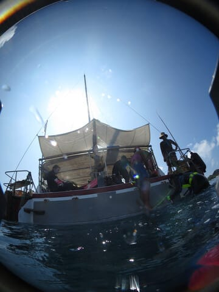

船に上がったら，まずは2本目に向けて，

空のタンクを外して新しいタンクに

交換しますが…

娘は昨年は4年ぶりに6本ほど潜った

だけで，今年も1本目の時はすっかり器材の

セッティングを忘れていましたね～…

でも，2本目はちゃんと自分でセット

できるようになってました！

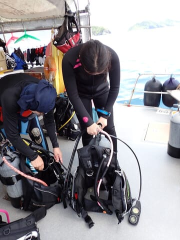

タンクを付け替えたら，船は1本目の

ポイントを後にして動き始めて…

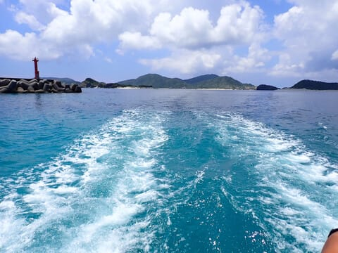

また一旦港に戻ってきます．

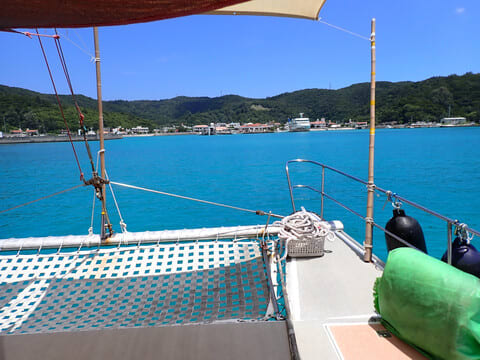

港では朝1便の高速船で座間味に着いた

ゲストを新たに乗船させただけで，

再びすぐに出港！

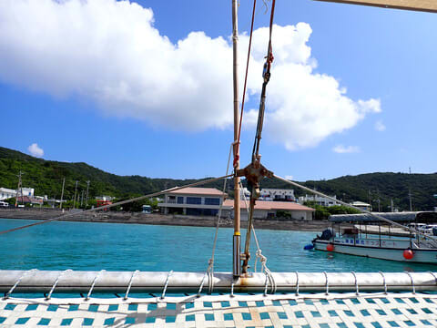

で．

2本目のポイントへ移動しますが…

あれ？

また安慶名敷島のそばにやってきましたね…

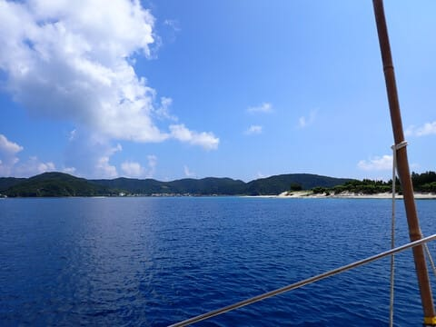

ということで．

また港から15分ほどでやってきた，

2本目のポイントも，1本目のポイントから

それほど離れてない所ですが．

もう少し島に近づいたポイントで．

いや…

ここも透明度良さそう！！

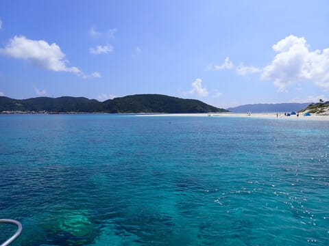

午前の2本目のダイビングのブリーフィングが

始まりますが…

2本目のポイントは「アゲナシク枝サンゴ」

というところ．

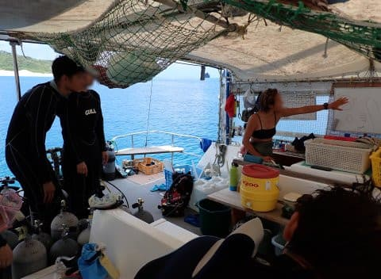

地図を書いて，

「このポイントはサンゴ保護のために

しばらくダイビング禁止だったので，

このあたりのサンゴが見事なんですよ！」

と，説明していますが…

どう見ても，この地図のサンゴを指し示す

海底に，巨大なメロンパンが沈んでいるように

しか見えない…

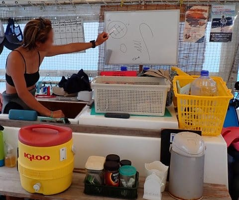

ということで．

巨大なメロンパンを見に，2本目へむかうわけ

ですが．

いやーー．

ホントに透明度がいいよ…！！

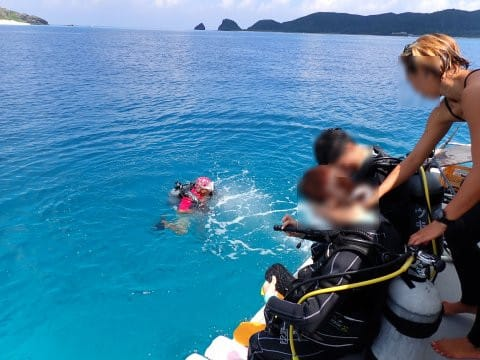

いざ，2本目へエントリー！！

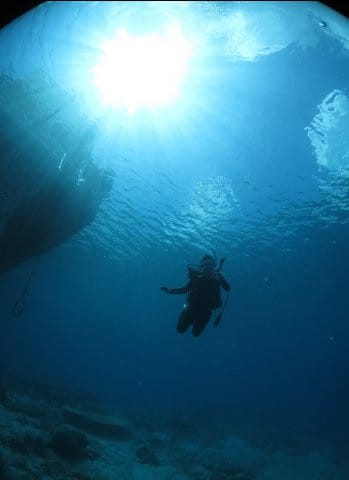

とりあえず，メロンパンのサンゴへ

向かい…

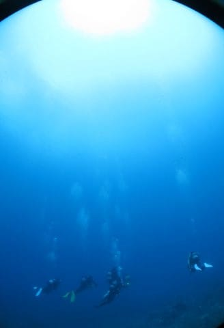

やってきました，見渡す限りのエダサンゴ！

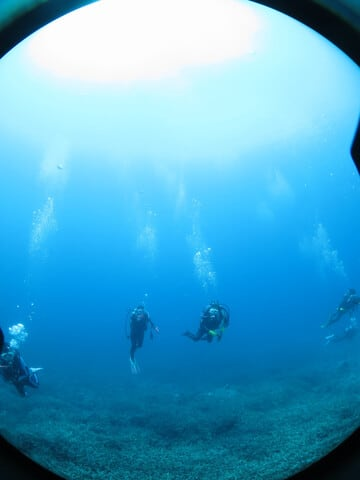

…確かに，長らくダイバーがはいってなかった

からか．

かなり元気なサンゴで，

サンゴの白化の影響も全然見られず，

見事な一面のエダサンゴです…！

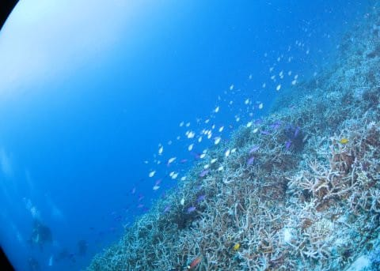

サンゴのうえには，ウミガメさんも

いましたね～…

いつも通り，他のゲストの逆側に回って，

カメさんを他のゲストと挟む形にポジション

取りをするわけですが…

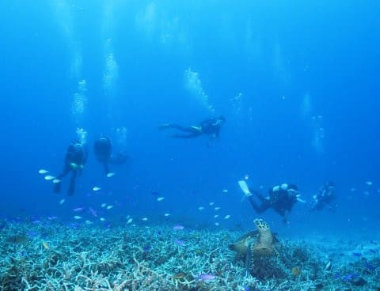

さて．

こっちに来てくれるか？

向こうに行くか？

向こうに行けば娘がしっかり写真を撮って

くれるだろうし．

こっちに来れば自分が写真を撮れる…

というポジションで眺めることしばし．

みんなに囲まれて居心地が悪くなったのか，

タイマイさんは泳ぎ始めましたが…

ちょうど娘の目の前を横切っていきましたね．

これなら，娘もかなり接近遭遇できて，

満足に違いない…

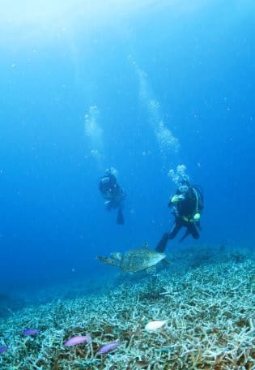

その後もしばし，見事なサンゴの上を

泳いでいきますが…

うーん．

空がちょっと曇ったらしく，

自然光が弱かったのが惜しい…

あんまりいい写真にならない…（ちょい涙）

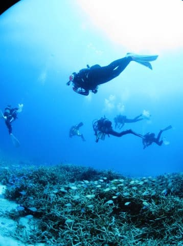

でも．

こんな写真は撮れているので．

サンゴのきれいさは十分伝わるかと…

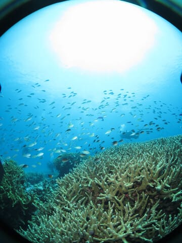

とりあえず，見事なサンゴの上を

しばらく堪能した後は．

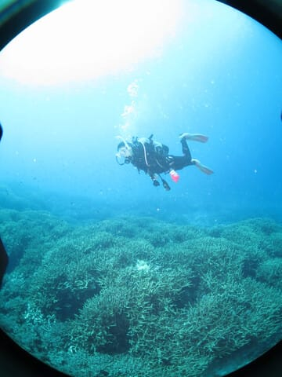

ヒメダテハゼなんかの，

共生ハゼとかをところどころ

眺めつつ…

（共生しているエビさんがハゼの陰に

隠れちゃってる…（涙））

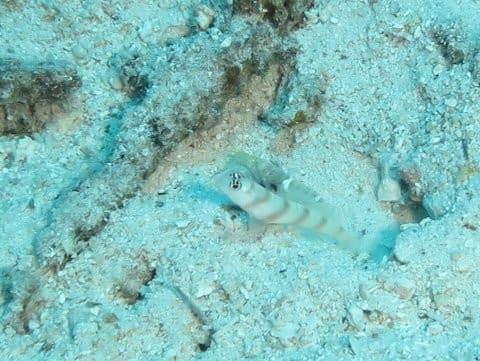

ボート下の浅瀬に戻ってきました！

このあたりの浅瀬で5分ちょい，

安全停止を兼ねてのんびりしたら…

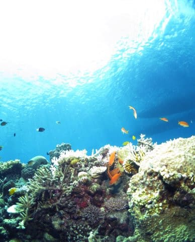

2本目終了！

船に上がります…

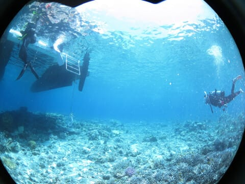

サンゴがきれいだったものの，ちょっと

魚影が薄めで1本目の方が満足度が

高かったけど．

それでも透明度は良かったし，

きれいなサンゴの上をゆったり流す，

のんびりとした癒しダイビングで．

2本目もいいダイビングでした！

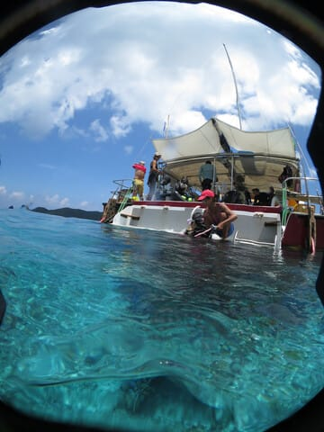

（[続く](eac2b38cb036ce0f0819b22d2d50185f9.md)）
