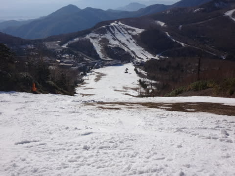

# 5月5日の志賀高原は…朝は冷えひえ！でも，昼間は暑かった…

📅 投稿日時: 2015-05-05 22:43:24

志賀高原滞在も残りあと1日となった

Skier_Sです．

うーーーん．

時間が経つのは早いもの…

そろそろ飽きた，といわれそうですが．

まだまだ続く，志賀高原レポート．

継続は力なり！←だから，何の？

今日も早朝から滑ったわけですが．

今朝は久しぶりに冷えましたよ～

朝の山頂の温度計は，もうプラスを指してましたが．

それでも，ここ数日で一番低い気温！

早朝の山頂は，マイナス6度まで冷えたようで…

ゲレンデは…

うはーーー！

ガチガチのアイスバーン！

これは，固いよ！

かなりの金属音を立てる，ホントのガチガチバーンだよ！

今シーズンの早朝で，一番固かったかも…

8時過ぎまでは，曇りで気温も上がらず，

かなり固めのバーンでした！

でも，9時過ぎには，日が射し始め…

雪はやっぱりやわらかくなっちゃいました…（残念）

8時～9時にかけて，一気に雪質は激変しましたね…（涙）．

あとは．

晴天の暖かい春スキーの一日で．

雪も粘つく，滑らない雪になり…（悲）．

まぁ，典型的な春スキーの一日かな～．

でも，焼額のゴンドラコースは．

雪が粘ついたものの，おおむねコースいっぱい

滑れるので．

志賀高原では一番マシかな？？

第2高速沿いの唐松コースは廊下になっちゃったし．

一の瀬ファミリーも，もう正面バーンはほぼ終わりですね～．

てか，昨日の段階で．

今日はもう営業しないんじゃないか？

と思ってたけど．

正面バーン上部，この状況で営業していました…

ある意味，すごい執念で営業しています…

正面バーン下半分も，結構穴があいてきたけど…

まぁ，明日まではもちそうだし．

GW最後まで，何とかもってくれたって感じかな～．

とりあえず．

ないても笑っても，明日で熊の湯，横手を除く

志賀高原の営業は終了（悲）．

シーズン券も，使えるのは明日が最後．

明日は暑い一日になりそうだけど…

まぁ，天気は良くなりそうかな．

ラストデーの明日，思いっきり滑るぞ～．

## 💬 コメント一覧

### 💬 コメント by (Goku)
**タイトル**: Unknown
**投稿日**: 2015-05-06 11:57:15

臨時K川県民のGoku です

なんとかGW 持ちそうですね

最後のヤケビ、思い残すことなく楽しんでくださいね。

### 💬 コメント by (Skier_S)
**タイトル**: Gokuさま
**投稿日**: 2015-05-07 01:05:14

GW最終日終わって帰ってきました…

ものすごい勢いで雪が消えたGWでしたが，

何とか最終日まで持った感じです…

今年も，ヤケビの今シーズン最後の客になってきましたよ～！！

