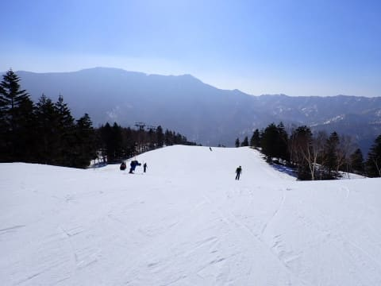
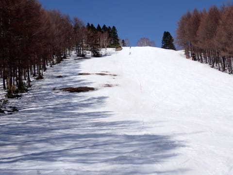
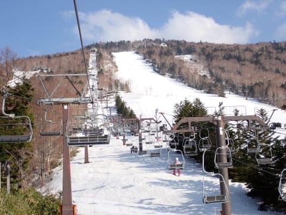

# 2023/4/1(土)の志賀高原スキー場は…終日すっきり晴天！朝は固め，気温は高かったけど板は滑ったよ！

📅 投稿日時: 2023-04-02 00:04:41

🏷️ カテゴリ: [2023スキー滑走日記](cd943df30cfcc3d0896469e2ff98720cd.md)

ということで．

睡眠を削りながらも，今日も無事に志賀高原に

やってきました～！！

まず，あさイチの志賀高原への上り坂は…

全く雪がありませんね（涙）

お勧めはしませんが，夏タイヤでも普通に

来れちゃうレベル（泣）

で．

今日から焼額は，朝6時からの早朝営業が

始まりましたが…

深夜12時半に寝て，1時半に起きて早朝に

間に合うように志賀に来る

のは自殺行為だと思ったので，通常営業に

間に合うようにやってきたわけですが…

でも，通常営業もいつもの8:30から30分

早まったので，いつもより早めの8時前に

間に合うようにやってきました～！！

8時前にいる人はみんな早朝参加者らしく，

通常営業の開始を待っている人は少ない

ですね…

で．

通常営業開始の8時のゴンドラに乗って

山頂に行くと，朝から気温は+2℃と

高め（泣）

天気はすっきり晴天で，日差しは強く．

朝から気温は暑いくらいだったので，

ゲレンデはゆるゆるだろうな…

と思って滑り出すと．

意外とバーンは締まってるよ！！！

…というか，予想よりかなり硬めのカリカリバーン．

6時の早朝の時は，激烈な硬めの電動マッサージ

バーンだったみたいですが…

通常営業開始の8時では，ちょうど表面が緩み

はじめ，硬めだけどしっかりエッジが効く

ちょうどいいバーン！

いや…

これ…

予想より，かなりいいですよ！！

ってなことで．

予想をいい方向に外して，9時過ぎまでは，

晴天なのに，思った以上に緩まない気持ちいい

バーンで滑れて．

これは予想外の嬉しい誤算…！！

ただ．

やはり気温は高かったので…

さすがに10時を過ぎてくると，ちょっと雪が

緩み始めてきましたが．

でも，春休みなのに意外と人が少なく．

雪が緩んでも，バーンがすぐ荒れることがなく．

緩んだけどフラット目の雪を，11時近くまで

気持ちよく滑れて…

いや…今日は来てよかった…！！

4月の学校春休み期間ですが．

朝から意外と人は少なく．

ゴンドラもゲート外まで並ぶことがなく，

さらに11時頃になると，第1ゴンドラも

ガラガラだし…

第2ゴンドラも全く待ちは無くて．

当然，第2高速リフトもガラガラ！

ただ，気温は10℃を超えて上がっていき…

雪は昼になってくると，さすがにそこそこ荒れて

来ましたが…

気温が高くて日差しがあるわりに，板は滑るよ！！

普通はこれだけ気温が高くて日差しがあると，

完全張り付き雪になるのに…

今日は板は気持ちよく滑ります！！

いや…意外と楽しい！！

ただ…

白樺コースは一部雪が薄くなったり，

唐松コースはもう穴が開きかけたり

してて…

例年より激烈に雪が少ないのは

間違いないです（涙）

でも，穴が開きかけたりブッシュが出てる

レベルなのは，明日で終了のコースのみ．

それ以外のコースは．

ちょっと雪は荒れ気味だったけど．

営業終了まで，雪は張り付き雪になれず

気持ちよく滑ったし，

しかし．今日から焼額の営業終了が

これまでの16:15ではなく，早朝が始まったぶん，

15:30に早まってしまったのが残念だけど…

ざぶざぶの板が張り付く悲しいバーンを覚悟

していたところ，天気も良くて意外と楽しめた

一日で．

焼額の営業終了まで楽しんできたのでした…！！！

…で．

焼額は終わりましたが．

…まだ15:30で，一ノ瀬はリフトが動いてますよね…

一ノ瀬，リフトが動いてますよね…

…一ノ瀬へ，ワーーーーープ！！！

ってなことで，

一ノ瀬へ瞬間移動してしまいました…！！

一ノ瀬も，雪は緩めだったものの．

板は滑るし，ちょうど春の柔らかコブって

感じで，意外と楽しいかも…！！

ってなことで．焼額が終わった後も，

16:20の一ノ瀬リフトストップまで，

しっかり滑り倒したのでした…

いや～…

今日は気温が高くてザブザブ雪だったものの．

ストップ雪にならず，板が走ったので，

意外と楽しい一日でした…！！

明日は今日より朝は気温が冷えて，

早朝は激烈に硬そうですが…

明日も天気はいいわりに雪が滑ってくれれば，

楽しい一日になりそうです…！

## 💬 コメント一覧

### 💬 コメント by (アツシ)
**タイトル**: Unknown
**投稿日**: 2023-04-02 10:21:37

楽しいコンディションになって良かったですね！

この土日、志賀で滑って今季終了の予定だったのに、金曜日から謎の発熱で寝込んでしまい、滑りに行けずでした。お世話になったお宿のご夫婦へのお土産も用意していたのに、まさかの前日キャンセル！なのにキャンセル料はいらないとの温情。あー何やってんねんオレ。

こんな形でのシーズン終了とか、ホンマさぶ過ぎ。来週以降の週末は毎週仕事の予定が入っており、GWまで連休はないのですが、GWまで雪が保たなそうとなると、どこかで「単身日帰り志賀高原」という禁じ手を繰り出すしかないのでしょうか？？大阪から往復1,000km超えるんですが💧Sさまが毎年シーズン最後に「日帰り月山」を敢行するのってこんな感覚なんですね？

### 💬 コメント by (Skier_S)
**タイトル**: ＞アツシさま
**投稿日**: 2023-04-03 00:56:52

あら…謎の発熱ですか！！お大事に…

しかし，来週から週末も仕事なんですか！

私よりご無体かも…

日帰り志賀，ぜひチャレンジしてみてください．

日帰り1000km運転してスキーで滑れるのは実証済みです（笑）．

でも，活動時間24時間越えるので，前後の日はしっかり睡眠しないと死にますが…

