# 12月23日は菅平…天気も雪も良く，恵まれたコンディション！

📅 投稿日時: 2013-12-23 22:40:51

🏷️ カテゴリ: [2014スキー滑走日記](c992167609b6415052179ee69ea1ea7d8.md)

ということで．

常識を持ち合わせた人間はまずやらないだろうという，

1泊2日志賀でリフトストップまで滑走→K奈川県に帰宅

→翌早朝4時出発日帰りスキー…

という無謀なプランニングにより．

本日は菅平修行場スキー場へ，日帰りに行ってきました．

んで．

今日は，朝から晴天っ！！

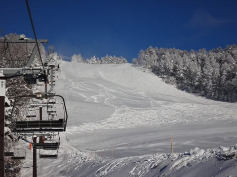

浅間山もきれいに見えてます！

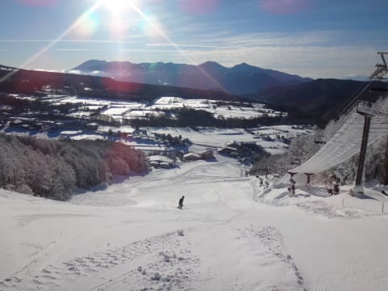

で．

菅平にしては珍しく，昨晩からちょっと降ったみたいで，

朝はやわらかい雪が乗った，シマシマバーン！

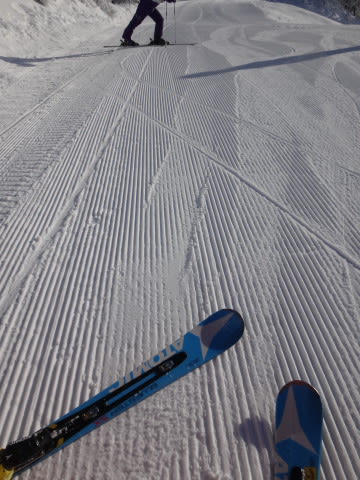

雪質はいいし，人も少ない！

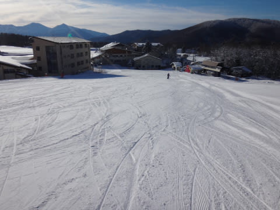

ファミリーも…

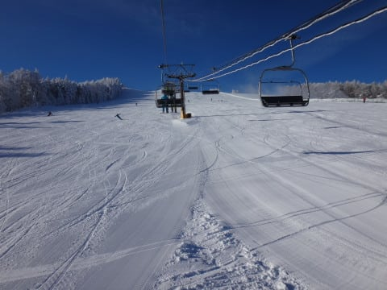

うはー！

シマシマ！

やわらかい圧雪！

下地が硬くない菅平，珍しい…

天気がいいのに気温が低く，雪質は最高！

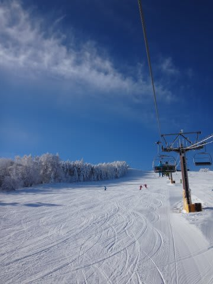

リフト待ちもほとんど無く．

…菅平って，こんな楽しいスキー場だったっけ？？

裏太郎は昨日からオープンしたようですが，

硬い小回り道ができない裏太郎って，めったに無いかも…

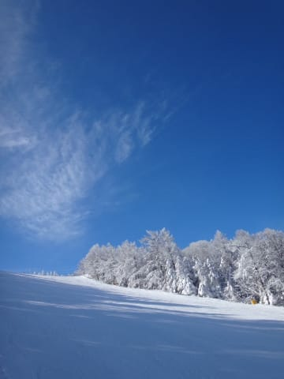

そして，ここも人が少ない！

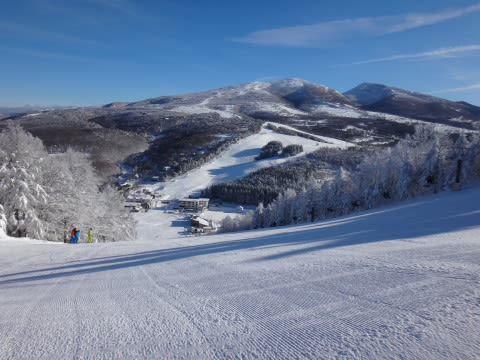

＃ところどころ，わずかに氷のコロコロはあったけど…

白金は，人工降雪をしっかり打ったのか．

結構しっかりしまったバーン状況で．

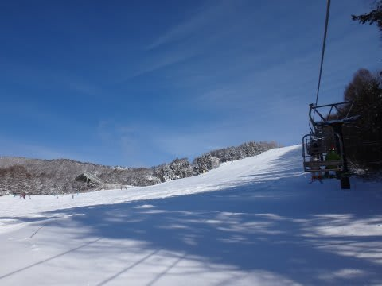

硬くてガッツりスピードが出るバーンで，

これもまた面白い！

いやー．

でも．

今日はさすが，2日滑ったあと＆6時間運転後に，

5時間睡眠で4時間運転…という無謀な状態なので．

ちょっと疲れてるし，帰りの運転もあるから，早めに帰ろう…

…って，思っていたけど．

思っていたんだけど．

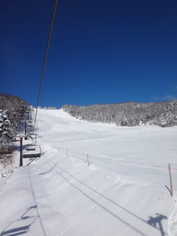

午後までゲレンデはこんな感じで，天気も最高で．

気温も最高でもマイナス5度以下と，雪も全く緩まず．

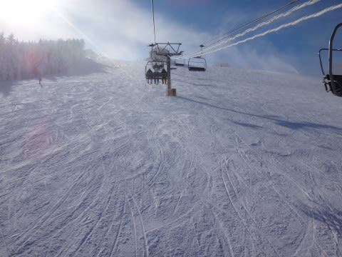

こんな感じの最高の状況のゲレンデさんが，

「帰らないで～」

って訴えかけるので．

心優しい私は

「もう，仕方が無いな～」

って感じで，ゲレンデさんの誘いをむげに断ることができず．

仕方なく，夕日がかげる4時まで滑ってしまったのでした…

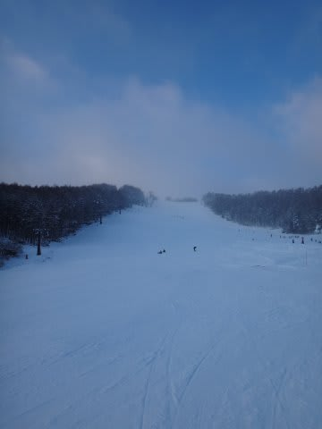

いやー．

でも．

レジャースキーヤーが楽しむスキー場というより，

私にとっては，なんだか修行場って感じの印象が強い菅平ですが．

＃異常にオガサカ率が高いし(笑）

今日は，純粋に楽しめるゲレンデ状況でした！

この3連休，恵まれた3日間だったなっ！！

## 💬 コメント一覧

### 💬 コメント by (aqura)
**タイトル**: Unknown
**投稿日**: 2013-12-23 23:21:39

お久しぶりです。今シーズンのスキー始め、３日間志賀高原にいました。土曜日の夜、死ねほど降りましたね。あのなかで滑っているとは・・・

### 💬 コメント by (ゆうこ)
**タイトル**: スタバ
**投稿日**: 2013-12-23 23:46:49

今日は、志賀高原もイイお天気でした。

私は横手山のスタバ行ってきました！天気が良くて遠くに富士山も見えましたよ。

飲み物は普通のスタバですが、ロケーションは普通ではないので話のネタに一回行ったらいいと思います。

横手山は、結構いい集客になってそうでした。

### 💬 コメント by (Goku)
**タイトル**: Unknown
**投稿日**: 2013-12-24 19:37:41

昨日は菅平でしたか。

志賀に比べるとかなり近かったですね(笑)

昨日私は八方でしたが２時にて太腿売り切れです。

### 💬 コメント by (Skier_S)
**タイトル**: 皆さん充実の3連休だったようで…
**投稿日**: 2013-12-25 00:02:13

>aquraさま

をを！お久しぶりです！

3日間志賀ですか．一の瀬やヤケビを滑ってたなら

どこかですれ違ってるかもしれませんね(^^

土曜の夜のナイターは良かったですよ！

誰もいなくて…（笑）．

最終日は菅平は晴天だったのですが，

志賀はどうでした？

>ゆうこさま

あ，話題のスタバ，行きましたか！

お値段は普通なんですか？

やっぱり割高なんでしょうか…

ぜひ行ってみたいのですが，

ハイシーズンは焼額ラブなので…

何か機会があったら横手山に浮気してみます(笑）．

>Gokuさま

志賀に比べると近いですが…

うちから見れば，5時間→4時間と，

20％程度の短縮なので，劇的改善では

ありません…(涙)．

八方も良かったみたいですね～！

私は菅平では午前中はレッスン的なものを

受けてきたので，滑走量が少なくて，

リフトストップまで滑らないと気がすまない

感じでした(笑）．

### 💬 コメント by (ゆうこ)
**タイトル**: スタバ
**投稿日**: 2013-12-25 00:55:34

スタバの値段は普通と同じですよ。

ただしトールサイズしかないです。

メニューも10種類くらいです。

フラペチーノとかもあるので、ホットだけとか偏りはないですが、シーズンドリンク的なのはないです。

私は横手山のスタバいいと思いますよ。焼額が急にリフト点検で動かないとかあったら行ってみて下さい。営業時間は9～15時です。

私は平日仕事ときは一日2回くらいスタバのラテを買うスタバフリークなので、なんか宣伝になってしまいました。

### 💬 コメント by (Skier_S)
**タイトル**: ゆうこさま
**投稿日**: 2013-12-25 01:56:49

あ，普通の値段なんですね？？

うちのスキーヤー仲間でも結構話題になっているんですが．

誰も行った事無いんですよね～．

ということで，初めて実際に行った人の

話を聞きました…

春先とか，熊＆横手に行ったりするので，

そのときにでも立ち寄ってみます！

天気が良くて景色がよければ最高でしょうね～！

