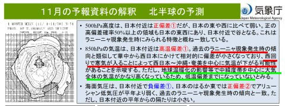

# スキーシーズン前の11月は冷えるのか？気象庁の9～11月の3か月予報を見てみた…9，10月は気温高めだけど11月はほぼ平年並み，スキー場はそこまで壊滅的じゃないと期待

📅 投稿日時: 2024-09-09 00:27:45

えー．

8月20日に，気象庁から3か月予報が

発表されていたのですが…

スキーシーズンじゃない今，あまり

天気図を見ないので，すっかり忘れて

ました…

ってなことで．本日ようやく9，10，11月の

3か月予報を目にしたので．

ちょっと読み解いてみましょう…！

気温傾向を見ると．

9月は高温になる確率が60%，

10月は高温になる確率が50％と，

「ほぼ間違いなく平年より気温が上がるよ」

という予想ですが…

11月は平年並み40％，平年より高めが40％と．

「平年より冷えないだろうけど，平年

　並みになる可能性も高いよ…！」

という予想です！！

うーん．

9月はどうしようもないとして．

10月が暑いと，イエティはヤバいけど…

でも，11月がせめて平年並みになって

くれれば，11月下旬～12月上旬オープンの

スキー場にとっては，悪くない予想かな！！

とりあえず，詳細を見てみると…

下の説明図の左側にあるように，

太平洋高気圧が強くて偏西風が北に

押し上げられるので，平年より気温が

高くなる傾向ですが．

右下に赤字で書かれているように

11月は偏西風がやや南に蛇行して，

日本付近は平年並みになる

ということのようです！

この傾向は，下の図の解説のように，

今後ラニーニャが発生しそうで…

10月以降，ラニーニャが発生する確率は60％．

なので，11月以降はこのラニーニャの影響が

出て偏西風が南下するんじゃ無いか…

ということですが．

…でも，右下の図に緑線で示したように，

11月，12月になっても水温はそこまで下がらず，

ラニーニャはそこまで強くなさそう…

ってなことで．

ラニーニャの影響が出ていないこの

9月の200hPa流線関数を見ると．

①に赤い高圧性循環領域があり．

これにより，緑矢印のように偏西風が

北寄りに押し上げられて，9月は高温に

なっちゃう予想です…

そのため．

9月の850hPa気温の偏差を見ても…

①の日本近辺が平年より1～2℃気温が

高い予想になっています（涙）

というか，北半球全域が平年より暑く，

その中でも日本付近が高めって感じ…

それに比べ，ラニーニャの影響が出る

11月の200hPa流線関数を見ると…

③に青い低圧性循環領域があり．

こいつのおかげで，偏西風は

この南を回り込むように南下した

流れになります！

この偏西風が南下することで，気温の

低い北側の空気を南側にもたらすので…

11月の850hPa気温図は，冷えるはず！！

…と思ってみたら，

日本は気温が高い赤～黄色の領域だよ（涙）

でも，二つの赤く記した，さらに高温な

領域に挟まれている感じで，特に西日本

側は周辺よりは気温が低めの感じ．

ってなことで．

この11月の気温をどう読むかというと．

この下の解説のように．

（赤線部分）ラニーニャで気温が下がる

傾向のはずだけど…

（緑線部分）地球温暖化で全体の気温が

かなり上がっているので，平年より

低いところまでいかない

ということのようです…

うーん．

なんとも微妙な予報…（涙）

でも．

ここしばらく，11月～12月は平年より気温が

高い年が続いたし．

せめて平年並みなら…

と期待したいところ．

…だけど．

だんだんラニーニャの予想が弱まって

いるので．

ラニーニャにならないと，また平年より

気温が上がる可能性が高いってこと

だな…（涙）

とりあえず．

気象庁から毎月10日に発表される，

[エルニーニョ監視速報](https://www.data.jma.go.jp/gmd/cpd/elnino/kanshi_joho/kanshi_joho1.html)．

9月分は次の火曜日発表のはずだから，

気になる方は，見てみてください…！

ってなことで．

11月の予想はまだ微妙ですが．

9月の1か月予報を見てみると…

9月7～13日の第1週は高温の確率が80%，

9月14～20日の第2週も80％，

9月21～10月6日の3，4週は70％

と．

9月はまだまだ異常高温がずっと続きそう

です…（涙）

この暑さのおかげで，まだまだスキー

シーズンって感じはしませんが．

あと1か月ちょいでイエティが

オープンするはず…

そして，軽井沢やその他のスキー場が

次々オープンする11月には，きっちり

例年通り冷えてくれることを期待して．

このBlog読者の皆様におかれましては．

今から必死に冷え冷え踊りを踊り続けて

いていただけるよう，お願い

申し上げます…
