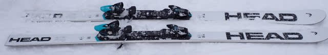
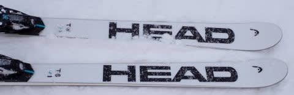
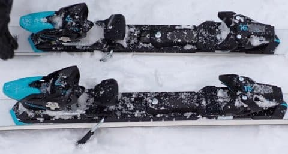
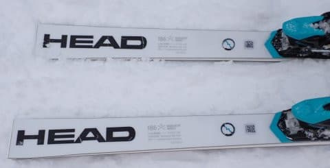
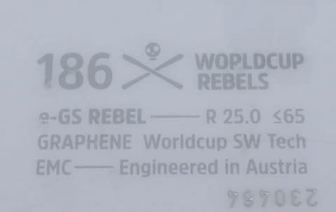

# 2025シーズンモデルのスキー板，試乗レポートその13…HEAD WORLDCUP REBELS e-GS RD

📅 投稿日時: 2024-06-15 02:43:28

🏷️ カテゴリ: [スキー板試乗](c0bd8048615710cee890e403a36cc9a2b.md)

昨日も寝たのは朝5時過ぎで．

そして今日も帰宅は深夜0時ちょっと前

なんですが…（泣）

さらに，今日はお昼ご飯も出張で移動中に

駅からビルまでの徒歩5分で食べた

サンドイッチのみで．

夜ご飯も，夜10時過ぎにオフィスを

出てから駅に着くまでに食べた

クリームパン1個…（泣）

今日は朝食以外はすべて歩きながら

済ませましたね（涙）

でも．

今週は5日のうち2日も，ちゃんと昼休みに

休めたから恵まれてる…！

…と，喜ぶ基準がちょっとズレてきたSkier_Sです．

いや．

これで明日，朝5時過ぎに家を出て

1泊2日で遊びに行こうっていうんだから…

スキーシーズンが終わったのに何を

やっているの？？

と，自分でも思う今日この頃←ゆっくり寝ようよ

ってなことで．

本日も2025シーズンモデルのスキー板の

試乗レポート．

今回はヘッド編です…！

〇HEAD WORLDCUP REBELS e-GS RD 186cm

GS競技用（FIS非準拠）

R=25mの，FIS規定外のGS板です．

これも昨シーズンからキャリーオーバー

なのかな？

どこが変わったのか全く分かりませんが…

とりあえず，R=25m ながらも，結構

本格的なGS板だということですが．

試乗コンディションが冷え冷え新雪が

積もった日の朝のゲレンデで，

柔らかい圧雪の上に5cmほど新雪が積もり，

その新雪が結構まだらに踏まれている

という，GS板があまり得意としなさそうな

コンディションでしたが…

履いてみたところ，意外といいよ…！

板がずっしりしているので，安定感・

直進感があって．

まだらに新雪が踏まれている難しい

コンディションでも，何事もなかったかの

ように板がまっすぐ走っていきます．

踏まれたところ，新雪が乗っている

ところの境界を越えても，何事も

なかったかのようにまっすぐ滑っていけて．

…そして，キレとズレのコントロールが

すごい楽！

板が重くてひたすらエッジグリップして

まっすぐ行くだけじゃなく．

荒れた新雪でも，谷回りで板を動かして

好きな方向に板を振っていける

コントロール性の高さがあります．

ズレも，しっかり板の圧を感じられる

中で，ジリジリとずらしていくという

安定感の高いズレができるので，

荒れた斜面でも板を動かして

弧を作っていけるし．

安定感があるくせにコントロール性が高く，

楽に滑っていける，手ごわさがない

板ですね…

R=25mで，こんな楽に滑れていいの？

って感じ．

ただ，そこはGS板なのでフレックスは当然

結構強いんですが．

それでも素直に荷重していけば，気持ちよく

GS板らしい旋回半径でガッツリカービング

で切っていってくれるし．

トップスピードを出していっても，

板が負けていくような軟弱さは全く

感じず．

私のトップスピード程度では

「全然まだまだいけますよ」

という感じの余裕を見せる板．

…それなのに，ガッツリグリップで

どうしようもなくまっすぐ走っていって

しまう板ではなく，

適度にズレを入れて，ゆっくりした

スピードでも滑っていけるし．

荒れた斜面でも割と気楽に滑って

行けるし…

これ，GS競技用というより，ゲレンデ

大回り板としてかなりイケるよね…！？？

GS競技用なので，やはりある程度の脚力と

スピードがないとたわませられないけど．

人の少ないゲレンデで，そこそこの

スピードを出す大回り板が欲しいなら．

この板ならある程度の荒れたバーンまで

滑れるし，ゲレンデ用として十分行けると

思います…！
