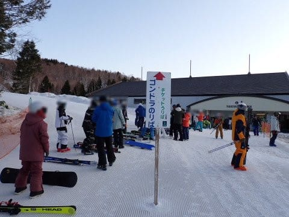
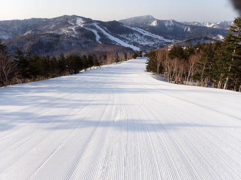
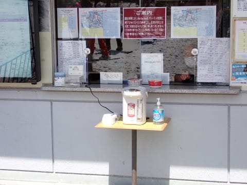

# 2024/4/14(日)の志賀高原焼額山スキー場の詳細レポート！…晴天高温の春スキーの一日．早朝から朝にかけては良かったよ！雪はたっぷり，あと2週間はいけそう

📅 投稿日時: 2024-04-16 02:00:49

🏷️ カテゴリ: [2024スキー滑走日記](c453f687e8a0f05679e95831d0a02cd0c.md)

昨日の日曜で第2高速リフトと

第2高速リフト沿いの唐松コースが

営業終了になった焼額ですが．

どうも本日から，SGSコースを経由して

滑ることができたイーストコースも

クローズになったようですね…（ちょい涙）

まぁ，まだ雪がいっぱいあるけど，

滑る人もほとんどいなかったし，

GWの営業に向けた雪出し用に

クローズした感じでしょうか…

とりあえず．

昨年の同じ時期，

今のままの高温が続くと，GWラスト

までの営業が厳しそうな感じなので．

雪出しでもなんでもして雪を持たせて

欲しいところですが．

今，去年の同じ時期，2023年4月16日の

焼額の写真を振り返って見ると…

GW2日目の4月29日に焼額が息絶えた

この年は，今と同じ時期でもかなり悲惨な

状態だったみたいなので…

（1年前，2023/4/16の写真）

去年と比べれば，今年の雪の量は

ずっと多いことがわかるので．

何とかGW後半までもってほしい…

と強く念じるところ．

でも，また今週も気温が上がりそうなんだよな…

そして，火曜から水曜にかけて，雨が

ぱらつきそうなんだよな…（涙）

しかし．

かつてはGWに雪が積もった，

[こんな日](eba61d11d0f815e551b10894aaa068317.md)や[こんな日](e67cca56325c920aef370bffc4fd9f704.md)もあったので．

これからまだ奇跡が起こって，

あと3週間．GW最後まで雪が

もってくれることを願うばかり…

ってなことで，本題へ．

昨日速報した，週末日曜の志賀高原の

詳細レポートです！

まず．

この日は焼額第1ゴンドラの6時からの

早朝に間に合うようにスタート！！

なんと．

早朝から，かなり多くの人が集まっている

ことよ…

もしかしたら，3月の土日のあさイチより

混んでるんじゃなかろうか？？

ってなことで，朝6時のゴンドラに乗って，

山頂へ向かうと…

山頂の気温は，朝6時の段階で+5℃（泣）

とても4月の早朝の気温と思えない…（涙）

でも．

朝早くの，太陽が昇りたてのゲレンデは

すごい気もちいい！！

明け方はかなり冷えていたのか，

あさイチのゲレンデはかなりガチガチに

締まっていて．

硬いのが嫌いな人にはちょっと辛いか

もしれないけど，硬いといっても

ツルツルアイスバーンじゃない，

ガリガリとエッジが引っかかってくれる

硬めのスピードバーン！！

そして，あさイチゴンドラは混んでたけど，

早朝から2コース滑れて人も分散

するので…

ガラガラなハイスピードバーンを

思う存分飛ばす快感を味わえます！！

この，まだ誰も滑ってない締まった

シマシマを滑れる，この快感…！！

ただ．

さすがに気温が高く，すっきり晴天で

日差しも強いので．

あさイチのガリガリ電動マッサージ

バーンは2本ほどで緩み始めますが…

3本目くらいからは，適度に表面が

緩んでエッジがいい感じで食い込む，

貯度いい感じのバーンに変わって

いきます…！

いやーーー．

早朝2時間で4000円とちょいと高いけど．

焼額限定シーズン券，または焼額限定

1日券・2日券で早朝から滑れるので．

これは絶対早朝から滑ったほうが

いいですよ…！！！

ってなことで．

8時から通常営業スタートで，

第2ゴンドラと第2高速も動き出しますが…

早朝が終わったタイミングで第2高速沿いの

唐松コースに飛び込むと，まだほぼ誰も

滑ってない，シマシマフラットバーンが

滑れます…！

…しかし．

この唐松コース．

まだ問題なくコース幅いっぱい滑れるのに．

今日で営業終了とはもったいない…

ちなみに．

先週末がラスト営業だったオリンピック

コースも，かなり土が出ているものの

まだ雪はいっぱい残ってるし．

プリンスホテル東館前も，雪寄せされて

いるけど，雪はまだたっぷりあるし…

暖冬の雪不足が心配された今シーズンだった

けど，去年の同じ時期と比べると，かなり

恵まれていることがわかりますね…！

ってなことで．

朝はかなり硬かったので，

朝9時過ぎまでは比較的下地がしっかり

した感じのバーンが滑れて．

朝10時くらいまでは，バーンはそこまで

荒れなかった焼額ですが…

さすがに朝10時ごろとなると，

かなり雪が緩み始めて．

さらに，標高が低い，ゴンドラ乗り場

近辺の緩斜面では，板の滑りが悪くなって

来ました…（ちょい涙）

でも．

早朝が終わったら，一気に人が減った焼額．

人が滑ってないので，雪が緩んでも

バーンはそんなに荒れず…

11時を過ぎても，一番あれているところで

せいぜいこの程度．

昼頃になっても，こんな程度しか荒れてない

バーンを，好きなだけ大回りできます…！！

ただ．

昼の最高気温は+17℃と，

6月の月山なつスキー並みの気温まで

上がり，Tシャツで滑っても大丈夫だよ…

というくらいの高温だった本日．

当然，雪質は春のザブザブ雪になっていき，

雪質に期待してはいけませんが…

それでも，バーンは昼を過ぎて午後に

なってもそこまでひどく荒れなかったし．

最後の緩斜面以外は結構板が滑って

くれたので…

天気も良くて，意外と快適な

春スキーの一日だったかも？？

そういえば．

昼で思い出したけど．

諸般の事情で，春スキー期間中に焼額山で

唯一お昼ご飯を提供する予定だった，

第1ゴンドラ下の「リトルスターマックス」が

クローズしてしまったようなので…

第1ゴンドラのリフト券売り場で

カップラーメンを売っているらしく．

券売所の前にお湯のポットが置いてあり

ましたね…！

そして．

リトルスターマックスが営業予定だった

場所は，無料休憩所として開放されている

ので．

ここで買い込んだカップラーメンやら

持ち込んだモノやらを食べてくれ，

ということのようです…

…まぁ．

お昼ご飯をレストランで食べない私には

関係ない話ですが（笑）．

ってなことで．

お昼休みも取らず，早朝からひたすら

滑り続けていたわけですが．

GSコースも，まだコース幅いっぱい

滑れるし．

GWまで大丈夫かな…と思っていたら．

午後になって，この一か所．

土が出始めてきました…（泣）

うーん．

こういう感じで土が出始めると，

ここから雪が消えるのが早いんだよな…

GW最後までもたせるのはやっぱり

厳しいのか…

とはいえ．

今シーズンはGSコースにも，3月に

たっぷり人工降雪を打っているという

話なので．

まだまだこの1か所以外はコース幅

いっぱい雪があって，雪の厚みも

そこそこありそうだし．

パノラマコースも，この落ち込みの

右側部分，コースサイドになる部分に

わずかに土が見える程度で，そこ以外は

まだまだコース幅いっぱい雪は

ついてるし．

異常高温が続いても，あと2週間．

GW前半までは何とかなりそうだな…

と，ちょっと安心しながら．

気温は高かったものの天気も良く，

朝は締まってかなりいい雪で，

午後になっても雪がそこまで荒れなかった

本日．

早朝6時から営業終了の15時半まで

9時間半．

第1ゴンドラ最終搬器に乗り込み，

本日最後のお客になるまで，ひたすら

休まずに滑り続けてしまったのでした…

ってなことで．

意外と雪がもってくれて，今週末も結構

楽しめたわけですが．

今週19，20，21日と4月26日以降のGW期間，

第1ゴンドラ，第2ゴンドラの2本とも

6時から営業開始

という，気合が入っている焼額山．

ぜひGWまで，GSコースと

パノラマ・サウスが幅いっぱい

滑れるといいなぁ…
