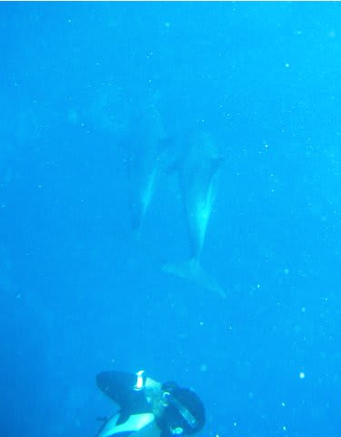
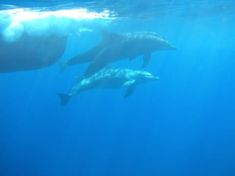
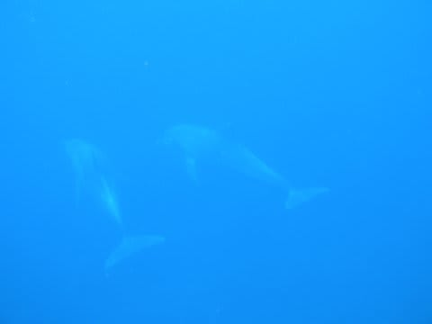
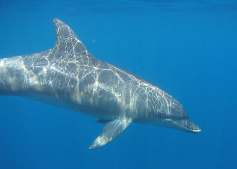
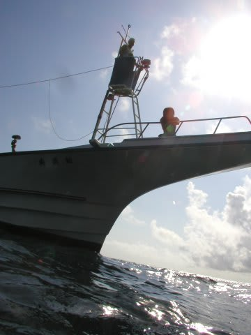
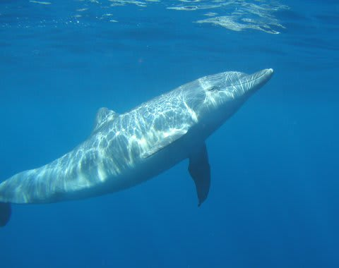
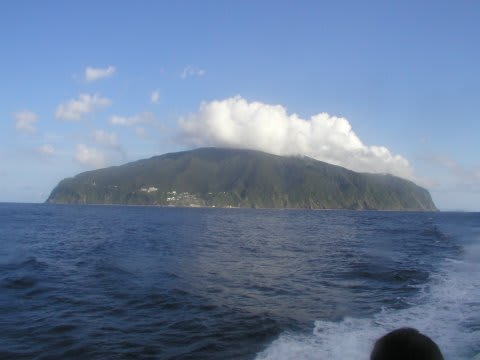
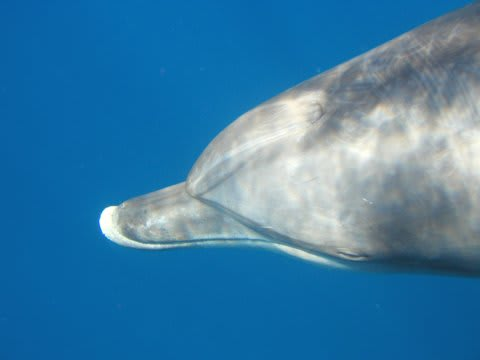
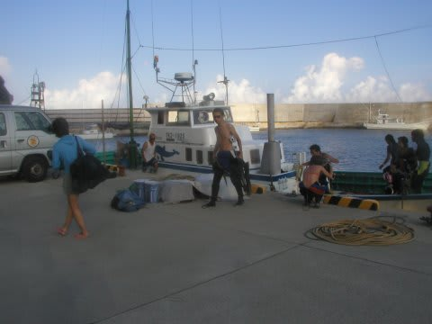

# 2007年8月　三宅島ドルフィンスイム＆ダイビング旅行記　その8

📅 投稿日時: 2013-09-18 00:37:33

という感じで，2度目のスイムも10分くらいで終わり，

船に上がり，また3本目．

今度も，船の上では3分も休めずに飛び込みです．

3本目は，2本目に比べてさらに飛び込む人が減って行く，

サバイバル状態…(笑）．

今度は，イルカの動きを見切っての潜行にチャレンジ．

よし！今だ！と，潜行に入るけど…

タイミングが遅かった！潜行途中でイルカを追いかけないと

いけない位置関係に．

うぎゃー．イルカの後姿しか撮れなかった！

ふえーん．ゴミ写真(泣）．

よーーーし，次こそ！

またこっちに来たぞ～．

船が上手くイルカをこっちに追い込んできてくれてる！

よし，さっきより早いタイミングで潜行だ！

と思ったら，今度は遠すぎたか？

私が潜ったところに来る前に，イルカは向きを

変えてぜんぜん遠くに行っちゃった…．

うぎゃー！また，ゴミ写真(泣）．

なかなか潜行のタイミングが見切れません．

うーん．慣れてる人はうまいなぁ．

ガイドなんて，息が続く時間長すぎ．

水中でえら呼吸してるんちゃうか？？？

…こうして数回潜っていくと，だんだん息が続く時間が

短くなってきます．

(最後のほうは水面から撮った写真ばかり…)

ぐはぁ．もうだめ．

と思ったところで3本目終了．

また，船の上に上がります…．

(この見張り台からイルカの位置を指示してくれる)

船から飛び込んでは泳ぎ，船に上がっては飛び込み…のサイクルが，

かれこれ10回くらい続けられたでしょうか…

飛び込む人も，1人，2人と減っていき．

もう，だんだんヘロヘロになってきます．

飛び込んでひたすらイルカを追いかけて泳ぎ…

…を延々2時間．

これは…要体力です．

2時間ほど泳いだり上がったりを繰り返した4時前，「これで最後の1本！」の声．

最後に飛び込んだのは，「やっぱりこいつらか！」というようなイキのいいのが4人だけ．

＃自分も含む(笑）．

強烈なサバイバルレースでした…

最後の1本から上がったときは，

「もう満足っ！もういいっ！一休みしたいっ！」

というのが正直なところ(笑）．

しかし…午前中にダイビングで，午後ドルフィンスイムでよかった．

午前中にドルフィンスイムやったら，午後にダイビングをする

気力が残っていただろうか…

＃でも，午前中のほうがイルカが遊んでくれるらしい

そして，船は御蔵島を後にしますが．

いやーーーーー．

泳いだ泳いだ．

イルカもいっぱい見れた．

野生のイルカと，触れるかも？

…と思うほどの至近距離に近づけるとは，大感動．

それも2時間の長きにわたって，イルカと泳ぎ続け．

満足，満足．

…しかし，もう，水面からイルカを見るだけでは満足

できない人になってしまった…．

水族館でイルカショーとか見に行っても．

「こんな遠くからしかイルカが見れないなんて！」とか思っちゃいそう．

うーん．ゼイタクになっていく…．

帰りは波が収まっており，船のデッキでのんびり日向ぼっこを

していると1時間ほどで三宅島に帰港．

あとは宿に帰って夕食．

食堂では，同宿のダイバーたちとダイビング議論が尽きません．

同じダイバー同士，初めて会った面々でも話が盛り上がります．

で，朝5時に島に着いたというのに，この日は夜遅くまで

ダベり続けたのでした…．
