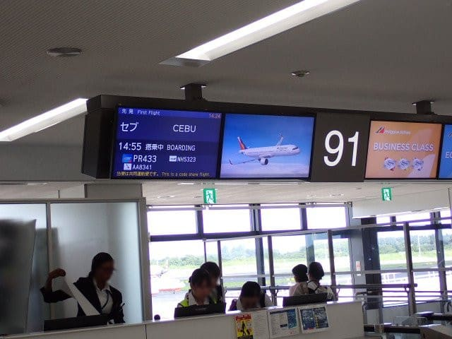
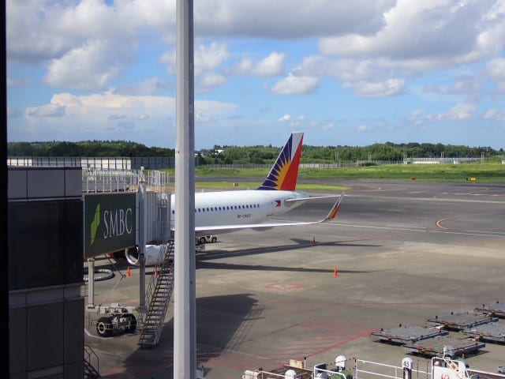

# 2024年8月，5度目の子連れモアルボアル，コロナ後初の海外へ！その2…モアルボアルへ到着！

📅 投稿日時: 2024-10-05 00:38:16

週末がやってきたけど．

仕事をするだけの週末なので，週末が

来てもあんまり嬉しくない…（涙）

しいて言えば，普通に夜寝られるのが

ちょっと救いかな…

しかし，ホントに暑い．

本日10月4日の東京の最高気温，30℃超えって

どういうこと？？

もう10月なんですけど？？

スキーシーズンが始まる月なんですけど？？

…そして，昨日発表だった気象庁の1か月

予報を見ても，やっぱり

第1週，第2週は気温が高くなる確率が80％

と，異常な高温傾向を示していて．

第3-4週も高温になる確率が60%（涙）

今回の予報の第3~4週って，10/19から11/1で，

もう11月に突入する時期ですけど…！？？

これから先の850hPa気温予想を見ても，

11月に入るまでずっと平年比+2℃以上が

続きそうな感じで…

これ，Yetiの造雪が大丈夫か？？（泣）

ってなことで，とても10月と思えない，

まだ夏が終わってないような日が続いてますが．

今日の本題は，まだ終わってないこの夏の

盛りの時期に行ってきた，モアルボアル

ダイビング旅行記です…！

ーーーー

（[前回はこちら](ee098b07e871c38d9f4da621aabcaf08c.md)）

ということで，セブ直行のフィリピンエアーは

定刻に搭乗開始となりましたが…

機体を見ると…

エアバスのA-321ですね．

翼端にシャークレットがついてるので，

新しい321 neoかな…と思ったけど．

エンジンを見ると，なんとV2500じゃ

ないですか…！

日本企業も参加した，インターナショナル

エアロエンジン社製のV2500エンジン，

久しぶりに見たな…

今となっては30年以上前のエンジンか…

懐かしい…

懐かしのV2500エンジン搭載となると，

A-321でも，neo (New Engine Option)

じゃなく，旧型のA-321 ceo (Conventional Engine Option) になりますね…

ちなみに，どうでもいいことですが．

A320シリーズのneoで選べるのは，

CFM社のLEAP-1Aエンジンと，PW社の

PW1100エンジン．

PW1100エンジンは驚異のギアードファン

エンジンで，[恐ろしく静かだったのが
印象的](e08e59674a7427e73bfe4dbd155164730.md)…

（こいつも不具合で全機運行停止になる

　曰く付きエンジンだったけど）

ということで，いざ搭乗ですが．

さすがナショナルキャリアのフィリピンエアは

第2ターミナルなので，以前LCCでフィリピンに

行った時みたいに，[格安第3ターミナルでの
タラップ搭乗](ec959ccef6e54ecfd0505637ee8a810f2.md)でなく，ボーディングブリッジを

通って搭乗します…

で．

A321-neoではない，古いA321の今回の

機体なわけで．

やっぱり，座席にエンターテイメントシステムの

画面はついてませんね…

でも，wifi接続すれば，スマホで映画やらの

エンターテイメントが楽しめるという，

最近よくあるパターン．

スマホを繋げば，ブラウザでこんなメニュー画面に

アクセスできて…

映画・音楽のほか，リアルタイムのマップとか

見ることができます．

ってな感じで．

飛行機はオンタイムでプッシュバックされて…

午後3時過ぎに成田空港の滑走路16Rから

Take off！

離陸後しばらくで，機内食が出ますが…

うん．機内食ってのも5年ぶりなわけ

ですね．

そして．

2時間睡眠で家を出てきたあと，

成田空港まで運転してきて．

さらにラウンジと機内でお酒を飲んで

しまったので…

機上ではほとんどの時間，熟睡してました…

3時間ほど熟睡して，気が付くと飛行機はもう

フィリピンのセブ島そばにやってきてました…

いや．

直行便は早い！

ってなことで．

夕暮れのセブ島上空を降下して行きますが…

空港のあるマクタン島へ近づくと．

あれ？マクタン島に通じるあんな橋，

あったっけ？

…って感じで．5年間のブランクで，

どうやらセブもかなり変わったらしいのが

上空からでも感じ取れます…

そして．

フライト時間わずか4時間半．

日本時間午後7時半，現地時間で午後6時半に，

セブ・マクタン空港へ到着！

飛行機を降りて…

戻ってきましたよ，セブへ！

…このころ，35℃以上の異常高温が続く

関東より，セブの方が涼しいなぁ…

（[続く](ed4e531d8311ac81bdcfdaf9aaa677e24.md)）

## 💬 コメント一覧

### 💬 コメント by (新米パパ)
**タイトル**: Unknown
**投稿日**: 2024-10-08 12:18:45

なんか、むちゃコスパもよさそー

行きたくなってきました、

### 💬 コメント by (Skier_S)
**タイトル**: >新米パパさま
**投稿日**: 2024-10-09 01:10:33

コスパは間違いなくいいですよ～！

ショップはエメラルドグリーンダイビングセンターがおススメ！

ホテルは私が泊まったRISATAよりもっとコストパフォーマンス高いホテルがいっぱいあるので，

お好みのところが選べます！

ツアーもWTPとかSTWとかからダイビングフィー込みプランが出ているので，

LCCとホテルを自分で抑えるとか，格安ツアーを探すとか，いろいろ探せば

かなり安く行けます．

