# 1月22，23日の週末の志賀高原の天気は…土曜朝は雪が残りそうだけど，土曜午後から日曜にかけて晴れて冷え冷えいいコンディション！

📅 投稿日時: 2022-01-20 00:45:08

🏷️ カテゴリ: [スキー天気予想](c6554f5c3c106093b511a8daae23757e8.md)

えー．

本日の志賀高原は．

　朝は-12～13℃程度．寒い．

　朝までに20cmくらいかな？

という予想が概ね当たり，

気温予想より低めにずれたものの，

-15℃と2℃の誤差で当てて．

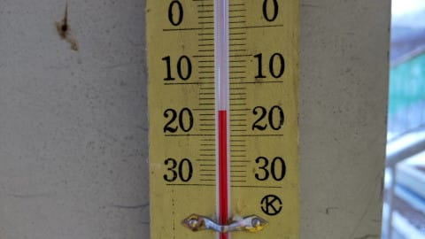

そして，朝までの積雪量も大体20cm

ほどだったようです…！

…が．

でも．

だけど．

なんだか，晴れてますよ！？？

確か，誰かの予想じゃ，

　この日も昼間もひたすら雪が

　降り続ける

と言っていたはずでは…？？

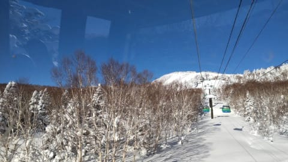

昼間はずっと晴れ，午後にわずかに

薄く雲が出た程度だったようで．

全く雪は降らなかったようです…（涙）

積雪と気温は当てたけど…

天気の予想は完全に外しました（泣）

しかし．

…何で外したんだろう？？？

今日は天気図も縦縞の冬型で，

見事な北風だったし．

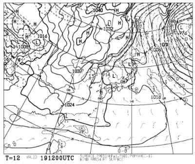

さらに，気象衛星の写真を見ても，

日本海は寒気の吹き出しの雪雲に

覆われて．

それもかなり北よりの風で，

志賀に雪雲が流れる風向きで

雪雲が流れてるし…

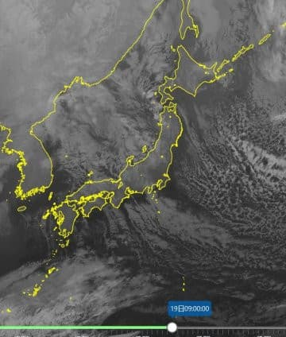

そのうえ，500hpa＆湿数図を見ても，

志賀高原は湿数0の完全飽和状態を示す

網掛け領域になってて，雲が出る

はずの湿数だし…

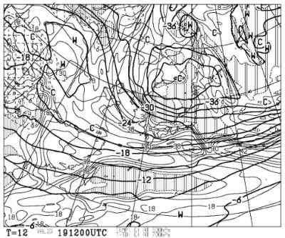

どう考えても，山には雪雲がかかりそうな

天気図なのに．

なんで晴れたのか，よく分からない…（涙）

うーん．

しいて言えば．

ここに発生しているプチ高気圧．

こいつが志賀高原近辺を晴れに

したのかなぁ…

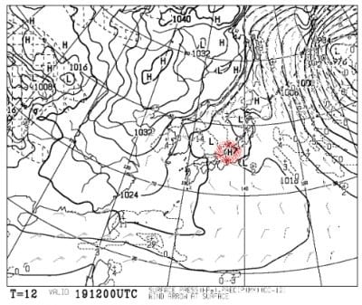

悔しい…

予想外して，かなり悔しい…(ちょちょぎれる涙)

なので．

明日以降の予想を当ててリベンジするのだ！！

まず．

20日の木曜の850hpa図を見ると．

この日も志賀高原には水色の-9℃線

がかかるレベルなので，

朝は-10℃以下の冷え冷え！

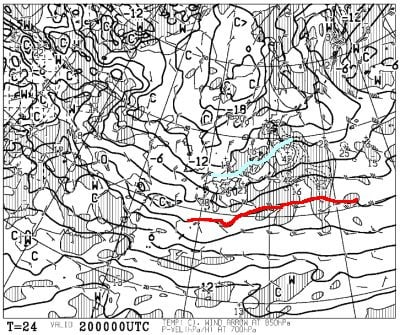

そして，地上天気図は…

うーむ．

日本海側に雪雲がかかっているものの．

それほど多くの降水量が予想されて

ないし，朝は雪はそんなに積もらないかな…

朝は曇り，本格的に雪が降るのは

近畿～朝鮮半島にかけての等圧線が

詰まったエリアが志賀高原まで

かかってくる，午後からっぽい感じ…

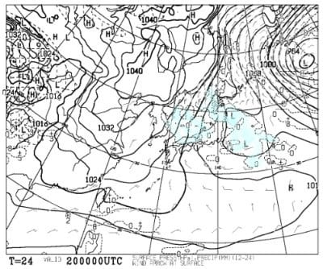

続いて，21日金曜日の850hpa図は．

…これは，水色の-12℃線が志賀に

かかっているので…

朝は-15℃以下まで下がりそうな，

激冷え！！

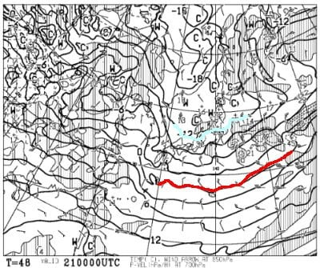

そして，地上天気図は…

うーむ．

結構冷えているのに，日本海全体に

雪雲がかかるほどではなく．

そんなに降らなさそう…

数日前までは，20，21日とドカ雪に

なりそうだったけど．

そこまですごいドカ雪にはならないかな．

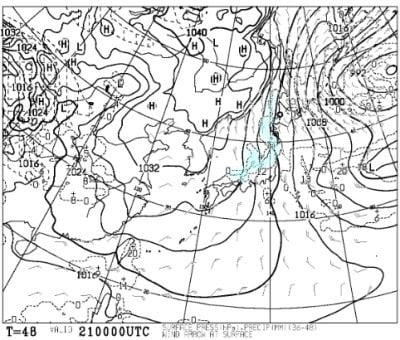

で．肝心の週末，22日土曜の850hpa図は．

水色の-9℃線が志賀にかかっているので．

朝は-10℃以下まで冷える，そこそこの

冷え込み！

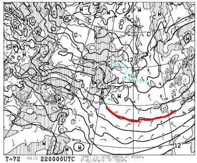

そして，この日の地上天気図を見ると…

うーむ．

中国地方に高気圧が張り出してきてるけど．

午前中はまだ雪がぱらつきそう…

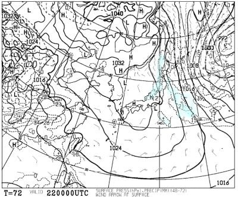

そして，23日日曜の850hpa図は．

これは，水色で示すのは-6℃線．

ここ数日に比べると気温は高め

だけど，昼間もマイナスキープの

気温なので，雪質の心配はなさそう．

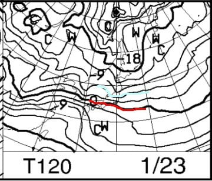

地上天気図は…

西から低気圧が近づいてるけど，

志賀高原には全く影響なさそうで．

一日晴れになりそう…！！

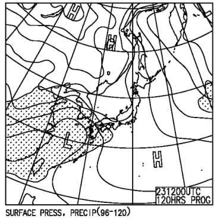

ってなことで．

まとめると．

20日(木)：朝は-12℃程度．

　朝までにうっすら積雪．

　朝は曇り，午前中は時折雪が

　ぱらつく程度だけど，

　午後から雪が強くなる．

21日(金)：朝までの積雪は20cmくらい．

　朝の気温は-15℃くらいの冷え冷え！

　この日は終日雪がぱらつくが，

　ドサドサ積もるほどじゃない．

22日(土)：朝までの積雪は10cmくらい．

　朝の気温は-10℃を下回る程度．

　朝は雪がぱらつき，やわらか圧雪の

　上にうっすら積雪．

　昼ごろに雪は止み，午後は晴れて

　いい感じになりそう．

23日(日)：朝から晴れ！

　朝イチはやわらかトップシーズン雪の

　シマシマバーン！

　終日晴天だけど，昼間もマイナス

　キープで雪質は良いまま．

　夕方まで晴天，雪質最高の

　絶好のスキー日和

…ってな感じでしょうか．

20，21日は当初予想ほどの大雪には

ならなさそうですが，それぞれ

10～20cmは積もりそうだし．

週末は土曜日午後から日曜日終日

晴れそうで．

ここ3週間連続，平日に降って

週末に晴れるという，いいパターンが

続きそう…！！

…しかし．

コロナ感染者が増えてきてる…(泣)

## 💬 コメント一覧

### 💬 コメント by (地元民)
**タイトル**: Unknown
**投稿日**: 2022-01-20 06:27:45

天気予報⇒不調に陥ってますか?

さて、今夜は?

日常生活に役立つので、気象台の予報と平行させて利用させていただいています。周囲にも知らせると、よく当たると好評ですよ。

今回、もしかしたら初めてかも。気象台の予報、徒然予報が大きく異なるのは。どちらがあたるかドキドキ。

### 💬 コメント by (レインボー74)
**タイトル**: Unknown
**投稿日**: 2022-01-20 15:59:34

木曜日の志賀高原情報

朝の上林-5℃　蓮池-8℃。今日も寒い。なんでこんな寒い所に好き好んで？

山へ登る途中からさらさら志賀の雪が。

パノラマからカラマツヘ。すんごい修旅団体だ。この時はまだシマシマ。

だんだん雪が本降りになり、レインボー(２時)には車に30cm近くも。

オリンピックは10cmあったけど、入るタイミングが悪くてコースを確保できなくて、幅狭ターンでがっかり。一旦止まって待てばいいのだけど、それでは仲間を待たせてしまう。

しばらくやけびを回していたら、昼の銀嶺まで時間がない。

ダイヤも駆け抜けてファミリーへ。

上部は15cmの新雪。下部にはおびただしい修旅生。

昼食後は西舘から。かなり積もって一気降りに付いていくのが辛い。誰も老人をいたわってはくれません。いたぶっている！

高天の非圧雪を滑っていると、困っている人を発見。聞けばスマホを落としたとか。放っておけないので、電話を鳴らしてみんなで探したけど、結局見捨てるはめに。残念！

そうこうするうちに雪が激しくなってきて視界不良に。

やけびではGSサイドへいったけど、昨日ほどは面白くない。

今日は普通にぎんぎん滑っていると、ずくっとけつまずくことがあったため、今一つ楽しめませんでしたが、明日がある。明日は大雪パウダー満喫かなあ。

### 💬 コメント by (地元民)
**タイトル**: Unknown
**投稿日**: 2022-01-20 17:08:29

大雪で飯山線、長野〜十日町まで全線運休に・・・。山はどうなってるんだろう?

### 💬 コメント by (Skier_S)
**タイトル**: 予想が難しい天気図…
**投稿日**: 2022-01-21 01:25:21

＞地元民さま

なんだか，ここ数日間，いくつかの天気図が矛盾していて，

コンピュータの計算値である予想天気図をそのまま信じるか，

あるいは経験則上補正をかけて読むか，難しいのです…（涙）

ちょっとここ数回外してますね（泣）

今晩も雪が強くなるとは思ったけど，ここまで積もるとは…

まぁ，500hpaで-36℃だったから，かなりの雪になると読むべきだったけど．

地上天気図はそこまで積雪にならなさそうだったので，

「あぁ…500hpaに-36℃が入っても，そこまで積雪が無い時もあるのね！」

と思ってしまいました…

＞レインボー74さま

今日もパウダーだったんですね…うらやましい…

明日朝イチはすごいパウダーになってそうですよ！！

今年はパウダー当たり年ですね…

