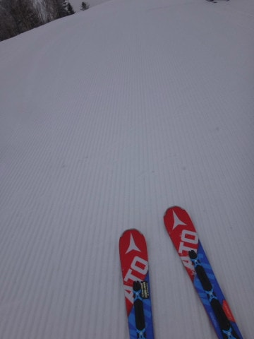

# 4月23日，日曜の志賀高原・速報レポート…朝は小雪，じきに晴れ．昼まではGoodコンディション！

📅 投稿日時: 2017-04-24 02:26:33

ということで．

そうです．

今日も帰宅はかなり遅くなりました…（涙）．

だもんで．

日曜深夜恒例の，志賀高原速報レポートです～．

えー．

本日．

朝はどんより曇り空で．

時折小雪もぱらつく天気で

スタートで…

誰だ！！？？日曜は朝からすっきり晴れるって

言ったやつは！←自分でしょ

でも，雪が降るほどの冷え冷えだったので．

朝のゲレンデはかなりガッツリ硬く凍ってます．

シマシマのまま，かなりいい感じで

固まってます…

で．

朝は雲が多かったですが．

9時半になると，日が射してきましたよ～！

日が射しているのに，気温は低めで…

午前中のゲレンデコンディションは，強烈に

Good！

下地はしっかり締まっているのに，表面はエッジが

かかる緩みぐあいで．

…そして，ゲレンデの人も少ない！

こんな気持ちいいハイスピードバーンを，

人を気にせず気持ちよく大回り可能！

いやー．

午前中は最高だった…

で．

午後は奥志賀に移動したんですが．

気温自体はわずかにプラスに振れる程度で，

この時期としては結構寒かったにもかかわらず．

午後はやはり日差しが強かったからか…

あれ？

雪が一気に緩み始めました…（涙）

そしてコースは強烈に重いザブザブ雪に

なりはじめ…

午後遅くには，荒れ荒れ斜面になってしまいました（泣）．

で．

それが夕方になると固まりはじめ…

なんだか最後は，かなりのデンジャラスバーンに…（涙）

まぁ，午後はちょっと残念な雪でしたが．

でも，気温が低かったからか，板が

張り付くような雪にはならず．

4月下旬と考えれば，午後も比較的マシな

コンディションで，楽しめました～！

…なんてったって，去年の同じ時期は

こんな感じだったんだから．

これに比べれば．

こんなコンディションで滑れた本日は．

シアワセという言葉以外は無いでしょう…

…詳細レポートは，また明日！

## 💬 コメント一覧

### 💬 コメント by (まいる)
**タイトル**: 雪の貯金が
**投稿日**: 2017-04-24 06:36:55

Sさん、お疲れさまです。

志賀高原、雪の貯金が多く、今シーズンは昨年と比べるとかなり良いですね。

私は、土日、恒例の山形の天元台に行ってきました。まだ、積雪平均2mくらいで、板が走る走る。快適に滑りました。まぁ、こちらも昼くらいには緩みますが。あと1回くらいで私のスーキーシーズンは終わりそうです。

### 💬 コメント by (かず)
**タイトル**: 午前で終了です
**投稿日**: 2017-04-24 11:53:53

日曜は最初で最後の一ノ瀬でした　笑　冷えてたのにお昼にはあんな感じになるんですね　移動考えると今シーズン昨日で終了です　お世話になりました　今年でシーズン券辞める予定でしたが　来年も板2枚買うのでシーズン券にします　パウダー予報よろしくお願いしまーす

### 💬 コメント by (Skier_S)
**タイトル**: GWも志賀高原滑り倒し予定
**投稿日**: 2017-04-25 02:29:27

＞まいるさま

結局今シーズンはお会いできずじまいでしたね…

志賀高原は，雪はまだまだたっぷりあって

シアワセです．

天神平も良かったのですね…．

あと1回で終わらせるなんて，勿体ない！！

＞かずさま

最初で最後の一の瀬ですか（笑）．

GWは滑らないのですね…

とりあえず，今シーズンはお世話になりました～！

しかし，来シーズンも板2枚ですか！？？

それは，板がヘタって買い替えなのでしょうか…？？？

また，来シーズンもパウダー予想やりますので．

志賀高原でお会いしましょう～！

