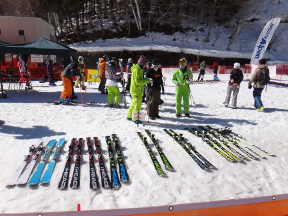

# 3月16日の尾瀬岩鞍は…晴天！

📅 投稿日時: 2013-03-17 00:04:30

🏷️ カテゴリ: [2013スキー滑走日記](c91dbe557f9a69230b1600e48622fdd61.md)

えー．

今日は，予告したように．

志賀高原ではなく，尾瀬岩鞍に行ってきましたよ～．

いやー．5シーズンぶりくらいですね～．

で．

今日は朝から晴天で…

気温も高く，朝の時点でプラス6度ですか…

もう，暑いです．汗だらだらです．

でも，早朝は気温が冷えてたのか，結構しっかりした雪で，

朝のうちは表面がうっすらやわらかくなった程度で，ちょうど滑りよい，スピードが出せるバーン．

10時近くまでは，快適フラットバーンを飛ばせます！！

いやー．

尾瀬岩鞍，結構いいなぁ…

…でも．やっぱり．

10時を過ぎてくると，ちょっと日当たりの良いコースは，雪が緩み始めて．

ちょっと荒れてきたかな～．

でも，下地が結構しっかり硬いままで，その上の雪が柔らかくなっている感じで．

壊滅的ざぶざぶ雪にはならずに済んだので，この超暑い晴天と考えれば，

かなーり快適なコンディション．

リフトもがらがらで，待ち時間はなし！

ゴンドラは，5-10分ほど混んでたけど…

一人用通路は待ち無しでした…

…だけど．

何でかゲレンデの人口密度はちょいと高めでしたね～．

うーん．

志賀高原より，人は多いのかな．

午後になると，女子国コースはちょっと荒れてたけど…

板が張り付く雪になることも無く．

天気も，午後3時ごろまでぴかぴかの晴天！

4時前から曇りだし，わずかに小雪がちらついたけど…

まぁ，気温が高かったことを考えれば，雪が壊滅的に解けてしまうことも無く，

かなーり楽しいコンディションで．

(夕方でもこの程度の荒れ具合)

いやーーー．

尾瀬岩鞍，いいなぁ…

と思わせる，楽しい一日を過ごしてきたのでした…

…ってことで．

なんだ？これは…！

はい．そうです．

今後のレポートをお楽しみに…！

## 💬 コメント一覧

### 💬 コメント by (いか)
**タイトル**: Unknown
**投稿日**: 2013-03-17 01:45:29

かなり快適な春スキーって感じですね！

3月頭に行ったときは、アイスバーン、じゃがいも収穫祭、カチンコチンコブの三拍子そろったタイミングで半泣きだったのですが…(笑)

試乗会、楽しそうです。遭遇したら、一度参加してみたいものです。

レポートたのしみにしてます！

### 💬 コメント by (Skier_S)
**タイトル**: いかさま
**投稿日**: 2013-03-17 10:58:41

快適な春スキーでしたよ！

試乗会は，ウェブで探せば結構いっぱい

出てますよ…

大体が事前予約必要なので，狙って行くことを

お勧めします．

結構楽しいですよ！

次は，4月6，7日の志賀高原，ダイヤモンドで

試乗会です．

http://www.alpen-group.jp/event/2013ski_shijyojyuchu/index.html

に案内があります～．

