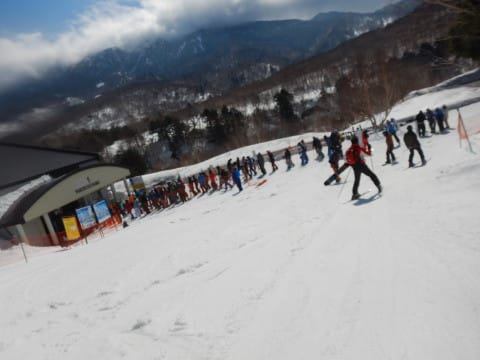

# 2022/4/3(日)の志賀高原スキー場速報レポート！…朝は晴天！硬めのバーン，午後はザブザブ雪ながらも雪降り

📅 投稿日時: 2022-04-04 02:08:25

学校が春休みの，4月の第1週の週末も

終わってしまったわけですが…

これにて，志賀高原も一の瀬エリアより下は

全部終わってしまい．

残るは

・一の瀬ファミリー

・一の瀬ダイヤモンド・高天・寺小屋(週末，GWのみ)

・焼額第1ゴンドラ(水曜は運休)

・奥志賀全面

・熊の湯第1，第2（第3は週末＆GWのみ)

・横手山

のみとなりました…（涙）

まぁ，まだこれだけ滑れるだけ，志賀高原は

すごいんですが．

で．

平日に動いているのは，

横手・熊の湯と，

ファミリークワッド，焼額第1ゴンドラ，

奥志賀全面

のみとなりますね…

あぁ…

もうスキーシーズンもラストスパート…

スキーシーズンのなんとも短いことよ…（泣）

ってな感じの本日も．

当然のごとくラストまで滑って，

先ほど帰ってきました…

取り急ぎ，いつもの速報レポートにて！

えー．

まず．

今日は朝6:30からの早朝営業から参戦！

あさイチは見事な晴天！！

…この早朝スキーのために，焼額の

2ndシーズン券を買ったんですから．

最大限活用せねば…！

と，飛び込んだあさイチのゲレンデは…

見事に締まった，スピードが出る

シマシマバーン！

…っていうか．

かなりカリカリした感じの硬く

かたまったバーンで，

硬いバーンが嫌いな人はダメな感じ…

…でも，GS板ならハイスピードでガッツリ

切って行ける，最高の大回りバーン！！

あさイチは硬かったバーンも，

強烈な春の日差で8時ごろには表面が

しっとりわずかに緩んで…エッジが効く

いい感じになってきたよ！！

しかし．

逆に言うと．

日が高くなるにつれ，気温は低めながらも

強烈な日差しで雪が緩み続けたので…

10:30ごろには，焼額は全面ユルユル雪に

なっちゃいました（涙）

ただ，昼ごろになるとだんだん雲が

増えていき…

昼過ぎには，完全曇り空になりました…

うーん．当初予想では，朝から曇り空

だったはずなんだけど…

ちと予想外したかな（泣）

昼過ぎには太陽は隠れたけど．

それまでの強い日差しで，ゲレンデは全面

春の重い雪になってしまっていました…

もう少し早く曇っていれば，ここまで

全面緩まなかった気が…（涙）

ちなみに今日のリフト・ゴンドラ待ちですが．

さすがに春休みの週末．

9:30ごろにはゴンドラ待ちもちょい長く

なりましたが…

今日のピークのゴンドラ待ち時間はせいぜい

このくらい．

11時からはゲート内に収まる

待ち時間となり．午後は飛び乗り．

第2高速は終日待ちなしでした～！！

ってなことで．

午後は雪も荒れてしまったこともあり，

滑っている人も減って，ゴンドラも

飛び乗りになりましたが…

なんと，本日．

午後2時頃から雪がぱらつき，

午後3時過ぎには本格的な雪が降り始めました！

…降ってたのは，かなり湿った重めの雪ですが．

でも，リフト終了までの1時間で，

ゲレンデにうっすら積もるほどの

強い降りになりました…！！

…荒れ荒れゲレンデに重い雪で，

滑りにくさ120％アップになっちゃった

感じですが…

でも，雪が積もってくれるだけ，

日差しで解ける一方よりマシかな？

…ってな感じの，本日の志賀高原だったのですが．

なんと，志賀高原，今も雪が降ってるみたい

です！

（[北信建設事務所道路気象情報ページ](http://hokushin.pref-nagano-roadcamera.jp/)より）

この雪は，明日4日月曜の昼間まで降り続き

そうなので．

月曜朝は，かなり重い雪が5-10cmほど積もって，

昼ごろまで，みぞれっぽいかなり湿った雪が

降り続けそう…

5日の火曜は気温が上がって晴れそうなので．

この4日に積もった雪が日差しで解けて，

5日はストップ雪になりそうな予感…

6日も気温が上がって晴れそう！

あさイチからプラス気温，最高気温は

+5℃を越えそうで，雪が解けていきそうな

気温です…

うーん．

今後1週間で雪が降りそうな可能性があるのは，

8日金曜日だけかな…

まぁ，8日に雪が降ったとしても，9，10日の

週末は晴れて気温が上がりそうなので．

やっぱり，次の週末もずっしりと重い

春の雪を覚悟した方が良い感じ…

でも．

焼額はまだ1か月以上シーズンが残って

いるのだ！！

まだまだ滑りますよ～！！

## 💬 コメント一覧

### 💬 コメント by (レインボー74)
**タイトル**: Unknown
**投稿日**: 2022-04-04 17:55:46

月曜日の志賀高原情報

朝の上林+3℃　蓮池+1℃。

小雨だったけど、蓮池からは雪に。

ヤケビは今日からイチゴンのみの営業。

パノラマ回しですが、ストップ雪です。連絡道が疲れる。

でも３本目からは、妖怪の手をたたっ切るため、緩い所もエッジで滑るようにしたら、まずまず楽しめました。

パノラマぐるぐるのあとGSへいったら、もうガタガタになっていました。

今日は東館でリッチにステーキです。外食でステーキなんて、多分74年間で初かと。

雪は悪くても幸せを感じれた一日でした。

### 💬 コメント by (you160)
**タイトル**: Unknown
**投稿日**: 2022-04-04 20:31:15

昨日、5歳、2歳、ボーダーの妻とお話しさせて頂いたものです。

お会いでき、さらに貴重な滑走の時間にも関わらずお話しできて、夫婦共々楽しかったです。

お声掛け、お会いするまでは、毎週ヤケビに行き、帰ってきて寝ずに仕事をこなす、あのブログを書くのはどんな人なんだろーって夫婦共々不安でしたが、気さくでとても話しやすく、さらに、スキーしないと死んじゃう病に感染した私としては、感染源？に安心しましたw

準会員として、家族一丸（妻はボーダーですが）、いつの日か正会員になれるよう精進します！

>レインボー74さん

まさか、あんなにイキイキしている感じで、私のスキーの師匠である父と同じ74歳とは思いませんでした。父も、昨年仕事からリタイヤし、来シーズンからスキー再開したいと言っていましたので、レインボー74さんの元気さを伝えようと思います。またヤケビでお会いできるの楽しみにしてます！

### 💬 コメント by (レインボー74)
**タイトル**: Unknown
**投稿日**: 2022-04-04 21:39:17

お借りします。

you160様、昨日はありがとうございました。二歳の子が余りにお上手なので、ついついお声掛けしてしまいましたが、まさかエス様と一緒に目の前に現れるとは！

五歳の子も優しくて微笑ましかったです。

また是非ともやけびにお越しください。

お子さまのご成長を楽しみにしております。

### 💬 コメント by (Skier_S)
**タイトル**: 眠い…
**投稿日**: 2022-04-05 05:52:19

＞レインボー74さま

今日はコンディションひどかったみたいですが，それでも

シアワセを感じられたのがさすが人生の達人です…

＞you160さま

コメントありがとうございます～！

そして，日曜はお子さんの世話をしなくてはならないところ

お邪魔しちゃってすみませんでした…

でも，2歳のお子さんはハンパないですね…

トライスキー無しであれだけの春の重い雪で板を抑えられる脚力，

普通の2歳児には備わってませんから…！！

まだまだGWまでシーズンは長いので，また焼額にお越しください．

小学校高学年以上ですが，キッズ仲間もいますよ！

### 💬 コメント by (ゆあの父)
**タイトル**: Unknown
**投稿日**: 2022-04-05 15:53:31

先日はお疲れ様です。

土曜は思ったよりも雪もよく滑りやすくて、夜中の2時30分に起きてきた甲斐がありました。

2歳のお子さんは、何度か見かけためっちゃ上手な小さなスキーヤーさんかな？2歳ってスキーできるのかと、まずそこで驚きです。

荒れ荒れのGSコースを私が手こずって滑っている横を、普通に通り過ぎていくのを見かけて驚きました、すばらしいです！

日曜の帰りに大変な目にあいました。

昼頃にあがり14時頃出発したのですが、一ノ瀬すぎて、パノラマ駐車場の前あたりで急にキュギューとすごい音がしてボンネットから白煙上がって停止。

やむ得ず保険会社に連絡し、雪降る中1時間30分程レッカー車の到着を待ち。

麓のスバルまでレッカー車で運んで調べてもらうと、コンプレッサーの焼き付きとのことでした。

応急処置してもらい、なんとか自走して帰ることが出来ました。

2日前に定期点検出したばかりで、まだ新車で購入して4年、4万キロ弱なんですけどね、さんざんな目にあいました。

### 💬 コメント by (Skier_S)
**タイトル**: ＞ゆあの父さま
**投稿日**: 2022-04-07 02:49:01

土曜はバーンも締まって良かったですね～！

2歳のお子さんは，多分その子です．

めっちゃ上手かったです．すごい脚力だと思いました…

で，コンプレッサー焼き付きって…

エアコンコンプレッサーですか？

2日前に定期点検に出したばかりで故障って，

かなり残念な感じですね…

4万kmだと保証期間内だから，無償で修理してもらえるんでしょうか…？

しかし大変でしたね．お疲れ様でした！

