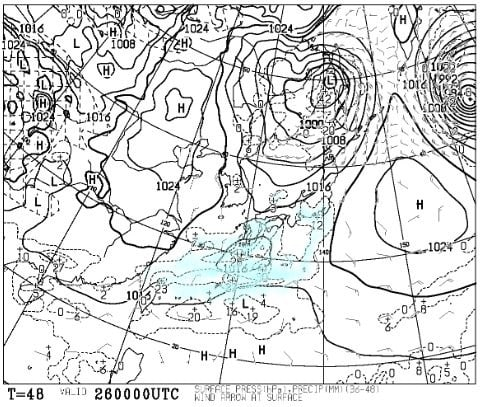

# 11月26，27日の週末のスキー場の天気は…26日は高温，志賀は曇り．27日は志賀では雪になりそう！！

📅 投稿日時: 2022-11-25 03:00:20

🏷️ カテゴリ: [スキー天気予想](c6554f5c3c106093b511a8daae23757e8.md)

えー．

志賀高原の横手山近辺．

24日深夜…というか，25日の2:30の時点で

雪が降ってます！

硯川のライブカメラを見ると，

気温-1.8℃とそこそこ冷えていて．

暗くて分かりにくいですが，雪が

道路に積もってます！！

（[北信建設事務所道路気象情報カメラ](http://hokushin.pref-nagano-roadcamera.jp/)より）

[22日の記事](ea36b05517dd6f2bf6caf2ff15f355064.md)で．

　24日，横手ならギリギリ朝に人工降雪

　打てるかもしれないけど…

と書きましたが．

その予想よりは冷えたみたいです…！

が．

この冷え込みは，残念なことに

25日金曜の朝までの短い命．

雪も，朝には止んでしまい，

25日の昼間以降は気温が上がります

ので，あまり期待しないように…

ってなことで．

昨日は祭日だったので，一日遅れで

水曜恒例の週末のスキー場の天気予想です！！

えー．

土曜26日の850hpa気温を見ると．

赤い0℃線は北海道のはるか北．

志賀高原近辺には，水色の+6℃線が

近づいてます…(泣)

ダメです．

この日も人工降雪は打てず（涙）

そして，この日の地上天気図は…

東海地方に水色の降水域がかかって

いるので．

イエティや飛騨方面は雨がぱらつくかも…

軽井沢，横手は曇り～晴れですかね．

そして．

27日の日曜ですが…

850hpa気温図を見ると…

をを！

久しぶりに赤い0℃線が志賀にかかってる！！

そして，地上天気図を見ると…

日本は西側が気圧が高く，

東が気圧が低い西高東低．

で，日本海側に降水域がかかっているので…

これは，志賀は降りそうです．

いや．

日本海側の標高が高めのスキー場も，

雪が降るかも…！？？

太平洋側に降水域がかかってますが，

降水域は陸地にかかってないし．

冬型だし．イエティは晴れそう．

ってなことで．

まとめると．

26日(土)：気温は朝から高め．

　横手は前日からの人工降雪無し．

　志賀や軽井沢は朝は晴れ，午後曇り．

　イエティは朝から曇り，昼にちょっと

　雨がぱらつくときがあるかも…

27日(日)：志賀は朝早くから雪！

　ぱらつく程度でそれほど積もらなさ

　そうですが…

　朝から人工降雪も久しぶりに

　動かせそう．

　昼間も気温がそれほど上がらず，

　横手は午後まで雪がぱらつくか？

　この日の夜までは人工降雪が打てそう．

　イエティは終日晴れ．

　気温は低め．

って感じでしょうか…

で．そのあと．

28，29日は予想通り気温が上がって，

29日は雨も降りそうです…(泣)

でも．

その後，30日，12月1日の850hpa

気温を見ると…

…来た～！！！！

来ましたよ！！

冷え込みが来ますよ！！

30日は赤い0℃線が志賀にかかり，

12月1日は，赤い0℃線は太平洋側．

志賀には-6℃線がかかってます！！！

かなりの冷え込みです！！

このままの予想で行ってくれれば…

30日夜から降ります！

12月1日は終日雪が降り続けそう…

風向きが西じゃなく北なら，志賀も

積もってくれます！！！

1日，2日と降ってくれそうなので．

3日の週末のスキー場オープンは期待

できそう…！

　

とりあえず．

今週末も，丸沼，鹿沢，かぐら，野沢，

高峰(アサマ)はオープンできなさそうですが．

来週は行けそう…！！！

皆さん，ここで気を抜かず，

ひたすら冷え冷え踊りを踊り続ければ，

12月3日の週末には，天国のゲレンデが

待っているはず！！！

12月3日に雪の降りが足りなければ…

その時は皆さんの踊り方が足りなかった

ということですから…←人のせいにしてはいけない
