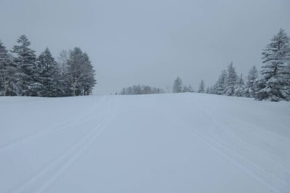
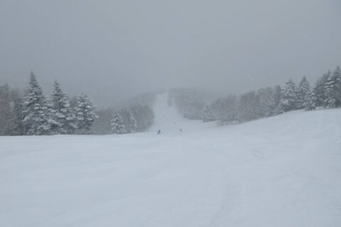
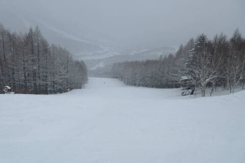
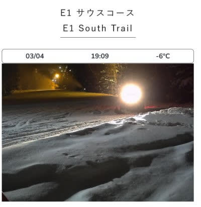
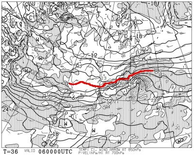
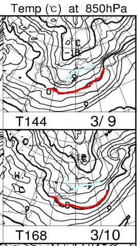
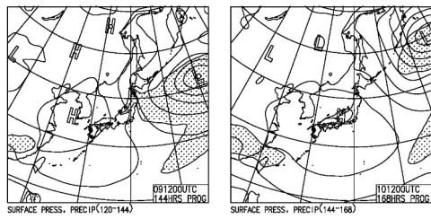

# 5日から6日にかけての志賀高原スキー場，雨の危機はほぼなくなったよ！今週末もコンディションよさそう

📅 投稿日時: 2024-03-05 03:52:41

週末にスキーに行かなかった週明けを

迎えたわけですが…

結局この週末も，この私がスキーに

行けないほどの大量の宿題を抱えていた

わけなので，睡眠時間が短めで．

それでいてスキーをせず，精神的な

リフレッシュができていないので，

月曜から辛かった…（涙）

で．

本日も特派員から志賀高原の写真を

送ってもらいましたが．

本日4日の月曜の志賀高原は，

昨晩から雪が降り続け，朝までは20cm

ほど積もったようで…

圧雪のゲレンデも，圧雪の上に冷え冷え

柔らか雪が5-10cmほど積もった，

真冬のゲレンデ状況だったようです…！

そして，朝から午前中にかけて，

結構冷えて，いい雪が降り続けたよう

で…

ふかふか新雪が楽しめたみたいです！

で，午後は雪が止んで曇り空になり．

さらに圧雪の上の新雪が蹴散らされて，

ちょっとバーンが荒れてきたようですが…

でも，人も少なく，雪もトップシーズンの

柔らかそうな雪で．

うーん．

2月よりコンディションが良くなって

来ているのでは？？？

でも．

積雪量が例年より少ないのは

間違いないので．

焼額は白樺コース，ブナコースに続き，

SGS，イースト，ミドル，ミドル連絡が

クローズになりましたが…

白樺コースやブナコースからの雪出しが

もう始まっているようです．

さらにそのうえ，3月4日の夜7時ごろの

焼額のライブカメラを見ると…

なんと．

今晩も人工降雪機が動いてますね！！！

（[焼額山スキー場ライブカメラページ](https://www.princehotels.co.jp/ski/shiga/livecamera/)より，以下同）

分かりにくいと思うので，写真を拡大

してみましたが…

いや…3月になってこんなに人工降雪を

打つなんて…！！

普通のスキー場はやらないよ！？？？

焼額，すごい…

そして．

今週5日から6日にかけての雨の危機ですが．

最新の6日朝の850hPa気温を見ると…

をを！！

赤い0℃線，何とか志賀高原より南で

踏みとどまってくれます…！！！！

これなら，雪です！！！

志賀高原で液体が降る危険性は

ほぼなくなりました！！

標高が低いところでは液体っぽいか

もしれないけど，志賀は雪です！！

それも6日朝にかけて，20~30cmくらい

積もるんじゃないかな？？

かなり重い雪なので，軽い新雪を楽しむ

という感じじゃないけど．

風で飛ばされる雪じゃないので，着実に

積雪が増えてくれそう…

そして，今週末は土曜9日，日曜10日

とも，850hPaの赤い0℃線はかなり

南に下がり，さらに志賀高原には

冷え冷えの水色-9℃線が近づくレベル

なので…

これは真冬並みの冷え冷えになりそう！

現時点での予想図では，9日の土曜は

冬型気圧配置なので，雪がちょっと

積もってくれて，冷え冷えトップシーズンの

バーンを楽しめそう…！！

日曜は高気圧が本州を覆うので，

午後に晴れ間も出てくるかな？？

とりあえず．

今シーズン最高のコンディションだった

この週末にスキーに行けなかったのに，

次の週末がひどい雪質だったら

暴れるところだったけど．

ピカピカ晴天にはならないかもしれない

けど，雪質はいいままキープしてくれそう

なので…

とりあえず一安心．

とりあえず，今週末もいい雪で滑れそう…！！

## 💬 コメント一覧

### 💬 コメント by (レインボー76)
**タイトル**: Unknown
**投稿日**: 2024-03-05 15:38:32

火曜日の志賀高原情報

朝の上林-2℃　蓮池-5℃。どんより曇り空。

ヤケビのパノラマからは感動もの。今日滑っておかないと、、、

GSも勘違いバーン！

奥志賀のエキスパートは最高の仕上がりだけど、次第に混んできたので３高へ。

3高も次第に少しの凹凸ができて勘違いできなくなってきたので、バスで一ゴンへ。あとは足が売り切れで、湯田中の仲よしラーメンへ直行しました。

### 💬 コメント by (Skier_S)
**タイトル**: ＞レインボー76さま
**投稿日**: 2024-03-06 02:16:06

今日もレポートありがとうございます～！

天気は良くなかったみたいですが，今日もコンディションはよかったみたいですね…

このまま週末までいいコンディションがもってほしいです（懇願）

