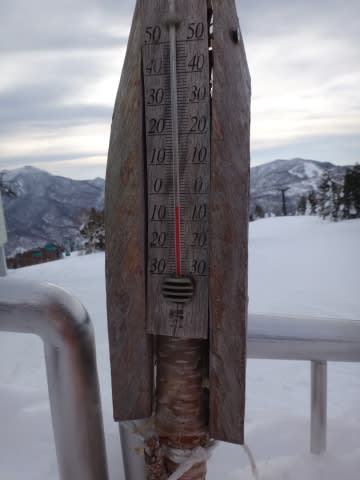
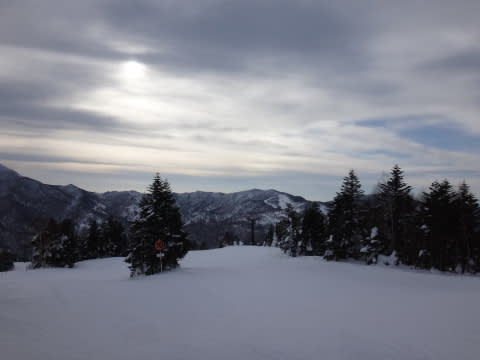
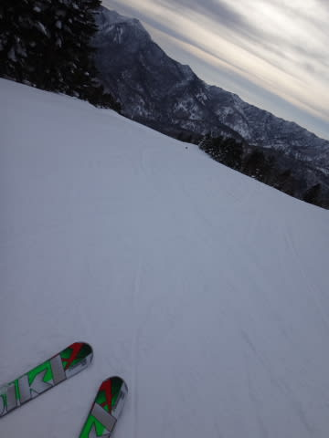
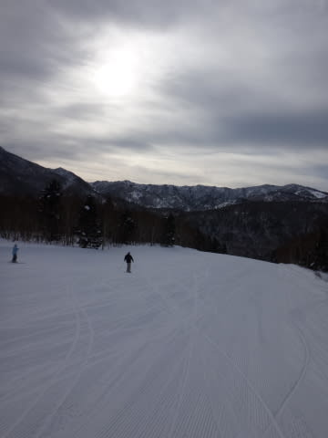
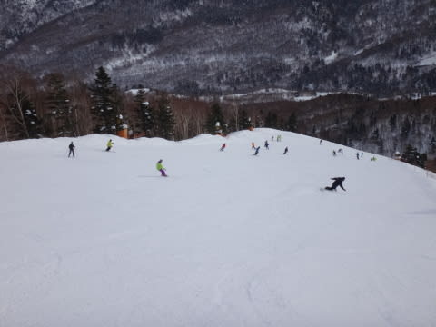
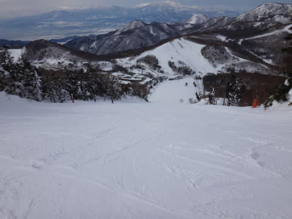
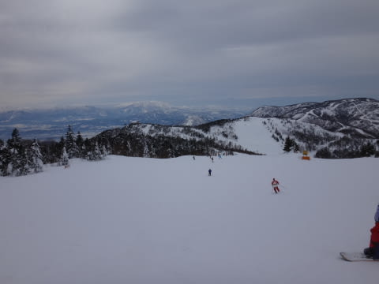
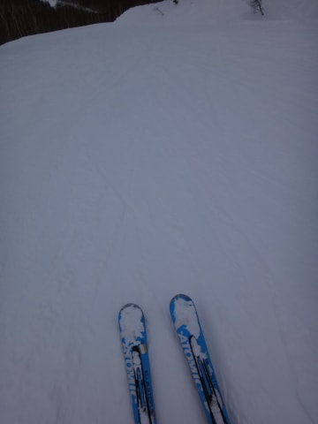
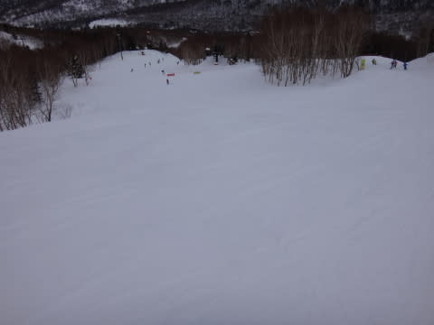
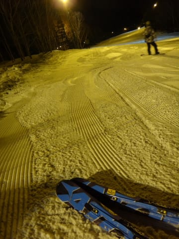

# 1月25日の志賀高原は…暖かいうす曇の一日

📅 投稿日時: 2014-01-25 23:06:22

🏷️ カテゴリ: [2014スキー滑走日記](c992167609b6415052179ee69ea1ea7d8.md)

えー．

本日の志賀高原ですが．

…妙に暖かかったですね～

＃ただし志賀高原基準

こーんな感じで．

朝の山頂はマイナス4度．

…朝の山頂で，マイナス5度以上ってのは，1月の志賀高原では

珍しい…

でも．

気温が高い中，超晴天になると雪が融けたりするけど．

今日は終日うす曇だったのが，逆にラッキー！

昼間は0度近くまであがったけど，直射日光で雪が

融けずに済みました…(感謝)

それも，完全にでこぼこが見えなくなる曇りじゃなく，

うす曇ってところがさらにGood．

…ってことで．

朝のうちは，気温は高いとはいえ，氷点下．

朝イチは，いつもどおりのウハウハ大回りバーン！

ぴかぴか圧雪の，快適がらすきバーンを堪能！

いやー．

やっぱ，朝イチ焼額はええなぁ～．

…でも．

今週は，先週よりちょっと人が多かったのがちと残念．

とはいえ，焼額第1ゴンドラは駅舎の外まで人が並ぶことはなかったし．

一の瀬ゲレンデもこんな感じで，人は少なめ．

結構快適に滑れますな．

そして．

ここ数日新雪が積もってないというのもあり．

人も先週よりは多いとはいえ，そんないっぱいいないので．

今日も夕方まで，ゲレンデはそんなに荒れることなくフラットなまま！

人がいないタイミングを選べば，十分大回り可能！

って感じで．

超がらがらの先週ほどではないにしろ．

今日も終日大回りデーで，満足だったのでした…

うーん．

志賀高原．

やっぱり，去年より人が減った気がするなぁ…

そして当然．今日もナイターまで滑って．

結構満足な一日だったのでした…

今，まだ雪は降ってませんが．

今晩から降り始めるはず．

うーむ．

でも．志賀ではまだ星がきれいに見えてます．

## 💬 コメント一覧

### 💬 コメント by (Goku)
**タイトル**: 同じルート
**投稿日**: 2014-01-26 06:40:39

あれれ？

Ｓさんが珍しく焼額山以外を滑っている。

しかもこの画像を見る限り、焼額山～一の瀬～寺小屋～焼額山って感じで、私と全く同じルートだ！

なぜ会わなかったんだろう？

### 💬 コメント by (aqura)
**タイトル**: 今日は、湿り雪
**投稿日**: 2014-01-26 07:54:19

おはようございますm(_ _)m。ようやく志賀高原に戻って来ました。昨日は第一ゴンドラで４本滑っただけで、連れがリタイヤとなり、仕切り直しで、一人寺子屋、そしてブナ平とリフトストップまで、満喫しました。今日はどうしよう、連れはまだ夢の中(^_^)ゞ

### 💬 コメント by (Skier_S)
**タイトル**: 帰ってきました
**投稿日**: 2014-01-26 23:24:56

）Gokuさま

実は，私は一の瀬のリフトの上から

Gokuさんを見かけてたりします…

この日は，志賀が初めてと言う人がいたので，

ヤケビ→一の瀬→寺子屋→東館→ブナ→ジャイアント

→蓮池→丸池→サンバレー

と移動して，その後西舘経由で帰ってきました．

…毎週志賀に行きながら，東館なんて3年ぶりに

滑りましたよ…（笑）．

）aquraさま

お久しぶりです…．

ヤケビも寺子もブナも滑ったので，どこかですれ違っている

かも知れませんね（笑）．

今日は，朝一ヤケビから昼ごろ奥志賀に移動，

3時ごろに戻ってリフトストップまでヤケビでした．

今日は結構降りましたね～．

aquraさんはどちらを滑ってたんですか？

### 💬 コメント by (aqura)
**タイトル**: ブナ平
**投稿日**: 2014-01-27 12:57:43

日曜日は、天気悪過ぎで？、滑らずに帰っちゃおうか…

具合の悪い娘を置いて、ブナ平、西館を中心にお昼まで滑っていました。

主さまのように………吹雪は苦手ですU+1F605

### 💬 コメント by (Goku)
**タイトル**: Unknown
**投稿日**: 2014-01-27 18:53:22

あら～

なんと発見されていたとは・・・

それにしても焼額山～サンバレー、我が家で言う「志賀高原遠足」満喫してますね！

### 💬 コメント by (Skier_S)
**タイトル**: aquraさま
**投稿日**: 2014-01-27 20:03:41

あ，ちゃんと日曜も滑ってらしたんですね．

日曜は，午後からさらに寒くなりましたよ～．

…でも，具合の悪い娘さんを置いてって(＾＾；

大丈夫だったんですか？

### 💬 コメント by (Skier_S)
**タイトル**: Gokuさま
**投稿日**: 2014-01-27 20:05:31

いやー．

志賀高原が初めてってひとには，

とりあえず志賀高原を一通り見てもらわないと！

…横手山方面まではさすがにいけませんでしたが…

で．

最後に

「やっぱり焼額がよかったねー」

と言わせれば，私の勝ちです(笑）．

