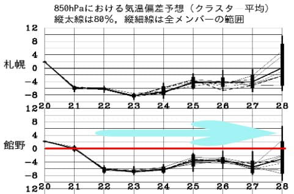
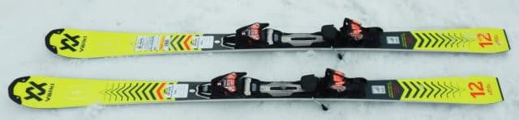
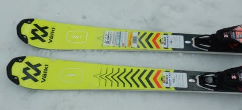
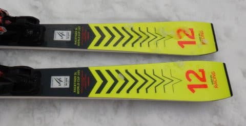
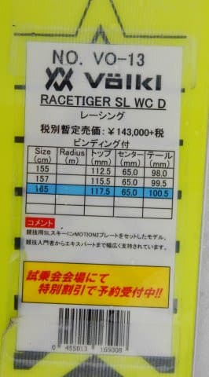
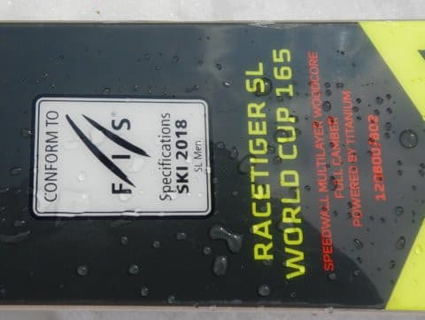
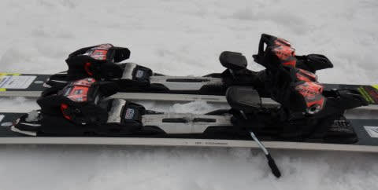

# 2021シーズンモデルのスキー板，試乗レポート…VOLKL RACETIGER SL Worldcup D

📅 投稿日時: 2020-04-22 04:15:13

ということで．

雪がたっぷりあるにもかかわらず，

志賀高原がGWを待たずに

終わってしまったわけですが．

…明日，22日(水)からの一週間．

むちゃくちゃ冷えこみそうですね…！！

これから1週間，平年比-6～4℃ほど

冷え込む日が続きますよ！！

特に，23日から24日にかけて，

季節外れの積雪になっても

不思議じゃなさそう…

いや．

これから一週間，志賀高原は降れば雪です．

なんと奇跡の4月なことよ…！！

あぁ…GWに滑りたかった…

ってなところで．

志賀高原が終わった本日は，特派員レポートも

もう無いですが．

まだまだ続く，冬モード．

今日は，3月下旬に試乗した，2021シーズン

モデルのスキー板の試乗レポートです．

今回はフォルクル編．

では，どうぞ～！

○VOLKL RACETIGER SL Worldcup D　165cm

SL競技用，基礎小回り用

VOLKLのRACETIGER SLは3種類あって，

ガチ競技用トップモデルのRACETIGER SL Worldcup，

このモデルのプレートを優しくした　RACETIGER SL Worldcup D，

そして基礎小回り用の　RACETIGER SL (今シーズンモデルだと，RACETIGER DEMO SLに匹敵）

というバリエーション展開になります．

SL WorldcupとSL Worldcup Dは，

板は全く同じでプレートが違うだけのため，

今回履いたWorldcup Dも，FIS認定モデルに

なります．

ただ，ビンディング＆プレートは，基礎用の

RACETIGER SLと同じrMOTION2プレート付き

ビンディングなので，ガチの競技トップモデルに

比べれば，扱いやすくなります…

ってなことで．

滑ってみると…

これもかなり強烈なカービングマシーンですね…！

さすが，板そのものはFISのSL競技用なだけあって，

コアのウッドの張りが強い感じで，

スピードが無いうちはたわまないけど，

スピードがでて板がたわんでいくと，

たわみに乗ってオートマチックに

すごい気持ちよく小回りカービングターンが

できます．

板が強いので，スピードを出してもかなり

安定感が高く，

かなり快適に高速カービング小回りができます．

切りかえ直後から板のトップが捉えて

板が回り始め，きれいに板にたわみが出て，

たわみに沿って円くきれいに弧を描いて

行ってくれます．

板のばね感も結構強く，早く帰ってくるので，

素早く気持ちよく小回りの切り替えができます．

ズラシもできないわけではないですが，

板の捉えが早く，エッジグリップがかなり強いので，

谷回りで板を好き勝手なところに動かして

いくとか，いろんな小技を使うような

板ではない感じ…

結構板の張りも強いので，低速よりも

高速で実力を発揮します．

谷回りの傾きの作りで回転弧を制御できる

コントロール性もあり，どうしようもなく

回ってきてしまう小回りスペシャルじゃなく，

中回りまでは十分引っ張れます．

求められるスピード域はかなり高めですが，

スピード派にとっては，強いグリップと

ばね感を活かして，ハイスピードの

カービング小回りから中回りをキメられる，

結構楽しい板でした！

## 💬 コメント一覧

### 💬 コメント by (地元民(ほぼ麓))
**タイトル**: Unknown
**投稿日**: 2020-04-22 16:06:53

低温きますね。里も桜、まだ満開です。奇跡の１ヶ月間、咲き続け。こんなの初めてです。

### 💬 コメント by (Skier_S)
**タイトル**: ＞地元民（ほぼ麓）さま
**投稿日**: 2020-04-23 00:31:40

いや…これから1週間，まだまだ冷えそうですよ！

スキーは残念ながらできませんが，長らく桜を楽しめていいですね…（笑）．

### 💬 コメント by (ikkun)
**タイトル**: Unknown
**投稿日**: 2021-06-04 17:12:02

今さらですが…この一年前の半額になっている同model「デモばかりでは成長しないかも」と先輩指導員さんに云われました(笑)いいバランスになりそうですね？

### 💬 コメント by (Skier_S)
**タイトル**: ＞ikkunさま
**投稿日**: 2021-06-05 02:00:34

この板，私は結構好きですよ～！

