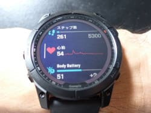
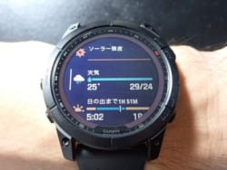
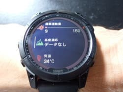
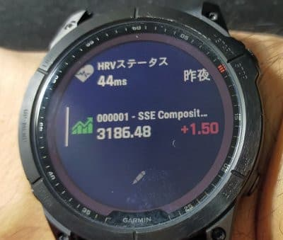

# Garmin Fenix7Xのファームウェアアップデートがあったけど…いくつかの謎機能（？）が追加されたよ

📅 投稿日時: 2022-09-04 01:06:10

🏷️ カテゴリ: [PC,カメラ&小物](c0d8caed13e597efe97b661a8ae56bed0.md)

金曜も，夜中に会議が終わってから

資料を作っていると，周りが明るく

なってきて…

寝たのは朝5時でした(涙）

そして．

一週間の疲れのせいか…

今日，午後2時近くまで死んだように

寝てました（泣）

で．

明日の日曜は一日出張なので…

うむ．

週末の宿題を，今日の土曜のうちに

終わらせなくちゃならないということ

だったんだけど…

やっぱりダメだった（泣）

…明日の新幹線の中で，必死にレポートを

書いている自分の姿が見える…(涙）

せっかくの土日が，なぜ宿題と出張だけで

終わってしまうのか…（激涙）

ってなことで．

そんな時間がない中でも．

なぜかBlog更新！！←そんな暇あったらレポート書けよ

長々とレポートが続いている，Garmin Fenix7X

ですが．

先日，ファームアップデートが

通知されて…

（通知画面を写し忘れた…）

「アップデートに5分ほどかかるよ」

という画面が出てきたので，

アップデートをタップすると…

ファームウェアがウォッチのWiFi

経由でダウンロードされて…

アップデートが自動的に始まりました！

そして，5分ほどたつと…

アップデートが完了したようです．

新しいファームウェア，いったい

何が変わったのかな…？

と，[Garminのホームページで確認する](https://www.garmin.co.jp/products/wearables/fenix-7-sapphire-dual-power-gray/#updateTab)と．

この，新しいv9.33のファームウェア．

9月1日にリリースされたらしく…

かなり数多くの改修・追加項目が並んでますね…

このGarmin Fenix7X．

今年1月に発売されたばかりで，

まだ8か月くらいしか経ってないのに，

早くも既に7回目のファームアップみたいです．

前のAmazfitだと，年2回くらいの更新で，

バグがあってもなかなか直らなかったところ，

さすがGarmin，こまめな改修を入れてくれてます…

さらに，5年以上前のモデルでも，まだ継続して

ファームアップされて，バグフィックスされたり，

機能追加されたりしているので．

やっぱりスマートウォッチのトップ企業だけあって，

サポート力はバツグンですね！

…しかし．

リリースから8か月たった今回のアップデートが

最大規模のアップデートっぽくて，

改修項目数が89項目もあるのはいいとしても．

リリースから8か月たっても，再起動するレベルの

不具合がまだこんなにあったのか…

でも，こういうのをちゃんと改修してくれるのは

すばらしい！

で．

今回のアップデート．

改修だけじゃなく，いくつかの機能追加も

あったんですが…

大量のウィジェットがずらずらと並ぶ，

このウィジェット画面．

このウィジェット画面にフォルダが

作れるようになったようです！

これまで，ずらずら並んだウィジェットを

スクロールして，見たい機能を探す

しかなかったけど．

複数の似たようなウィジェットを

フォルダでまとめられるので，

便利になりそう…！

こういう細かな便利機能の追加が，購入後も

行われるのが嬉しいですね．

…そして．

さらに一つ，謎機能が追加されました…

そいつがこいつ．

なんだ？？？…株式ウィジェットって…

と思って，ウィジェット画面をスクロール

させていくと…

…うわ．確かに，こんなのが追加されてる…！

この画面をタップしてみると．

デフォルトでは，3種類の指標が見れるようです．

ひとつはSSE Composite Index．上海総合指数．

もう一つは，日経225．

最後の一つは，TWIIって…どうやら台湾の株式市場の指数みたいです．

さらに，日経225のところをタップすると．

インデックスの変動グラフが見れて…

これをさらにスワイプすると，

始値，前日終値，最高値，最安値が

表示されるようです…

うん．

いろんな機能追加があって面白い．

面白いよ…

スマートウォッチで株式指数が見れるように

なるとは思わなかったけど．

しかし．

一体だれが時計で日経225の値を見たいと

思うんだ？？？

とツッコミたくなる，Skier_Sだったのでした…
