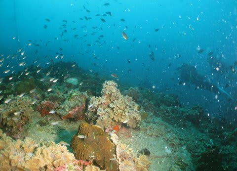
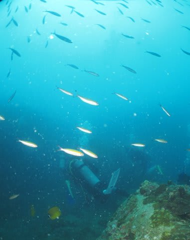
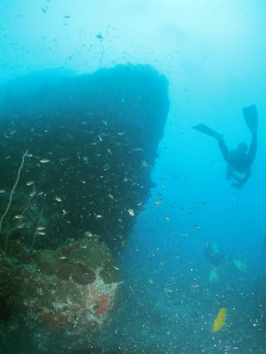
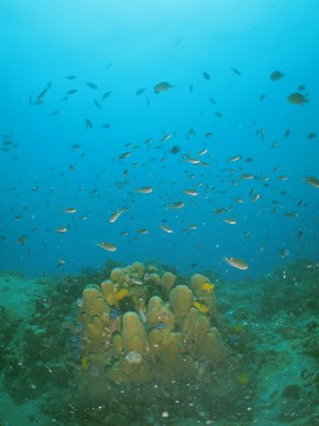
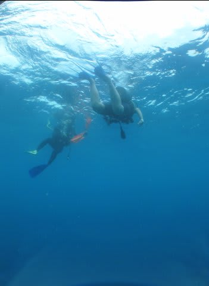
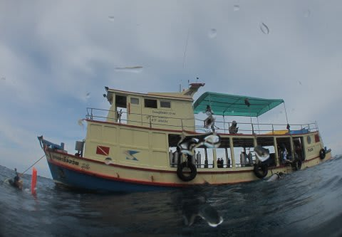

# 2013年9月　子連れタイ・タオ島ダイビング旅行記　その28…5日目午前の2本目は………………

📅 投稿日時: 2013-11-21 01:52:17

えー．

気温が冷えていて，丸沼やかぐらでは，

順調に人工降雪が進んでいるようですね～．

とりあえず．

この週末までは冷えてくれるけど．

でもやっぱり，信州では雪が降らないんだな～．

これから週末まで，土日も含めて．

晴れ～曇りって感じの天気です．

ってことで，基本的にこの土日は晴れ，時々雲が流れてきて，

気温は冷え込み，スキー場では昼間でもわずかにプラスにふれる程度…

って感じでしょう．

んで．

来週月曜，25日ですが…

来ますね．

来ます．

…いや．

悪いほうです．

残念ながら．

そう．

雨です．雨(涙)

月曜はね～．

標高が高い，志賀高原でも雨ですよ．

かなり降りますよ…（泣)．

でも．

雨が降るのは25日だけ．

26日は雨はやみます…

26日，日本海側は降るかもしれないけど，標高がそこそこ高ければ

降っても雪なのでご安心を．

…と，このブログの本題を終えたところで，

ここからはおまけのタイ旅行記です．←本人もこっちがおまけと認めたのか？

-----

ってことで．

念願のチュンポンピナクルでの，ジンベエ狙いのダイビングから

妻が戻ってきました．

次の1本は私が潜るし，

午後はジンベエが出ない沿岸ポイントなので．

タイでのダイビング最終日となる本日．

妻にとっては，この1本がジンベエ狙いのラストチャ～ンス．

果たして．

無事，妻はジンベエを見れたのか？

あるいは…

私「見れた？ジンベエ，いた？」

妻「…

　　…

　　…

　　…

　　…いなかった(；_；)」

…あいやーーー．

あららら～．

高いお金を払ってここまで来たけど．

…か，空振りだったか…

しかし．

しかし．

私には．

まだ残りワンチャンスがある．

次は，私がチュンポンでジンベエチャレンジだっ！

…と，意気込んだ，まさにそのとき．

ガイド「今日は時間が遅いので，チュンポンは1本だけで，次の1本は

　　沿岸に戻って潜ります～！」

…え？

え？え？？？えええええ～ッ！！！！！！？？？？？？？？？

なに？どーゆーこと？？

ガイド「もう1本ここで潜ると，お昼までにホテル前に戻れないので…」

がががががーーーん！

ど…どうしたことだっ！

どーゆーことだ．

タオに5日間も滞在したというのに．

セイルロックにも，チュンポンにも．一度も潜ることなく，

日本に帰国しなきゃならないのか～っ！！！！！

ひ，日ごろの行いが悪すぎたのか～っ！！！！

…という絶望感に打ちひしがれていたので．

午前の2本目(私にとっては1本目)．

沿岸部を潜ったらしいのですが．

沿岸部の透明度が悪いポイントだったという印象以外，

何も記憶に残っていない1本になったのでした…(悲)．
