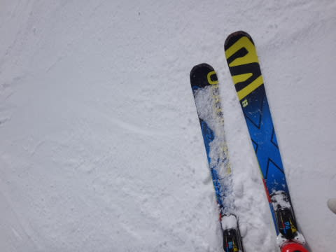
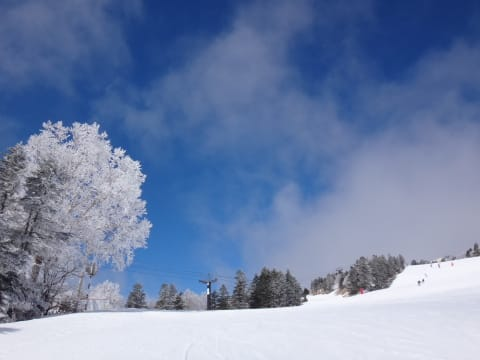
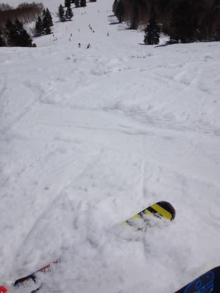
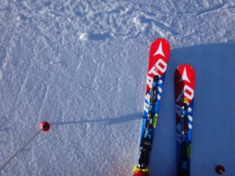
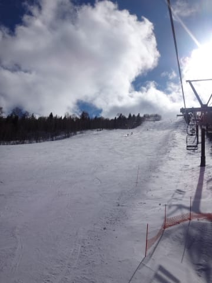
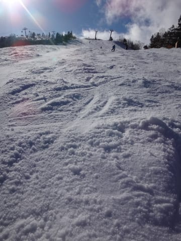

# 3月21日，3連休最終日の志賀高原，速報モード…アイスバーン＆春雪なれど，晴れて意外と良かった一日

📅 投稿日時: 2016-03-22 02:35:04

🏷️ カテゴリ: [2016スキー滑走日記](c70c67ed5248e9432b899dcd5747048bb.md)

ということで．

3連休最終日の渋滞にやられ．

帰宅が深夜1時近かったSkier_Sです…

…眠い．

眠いので．

当然，今日も速報モードにて…

えー．

本日ですが．

残念ながら．

皆さんの日ごろの行いが良くなかったようです．

…残念ながら．

気温は冷え込んだものの．

期待していた，10cmの積雪はありませんでした．

繰り返します．

皆さんの日ごろの行いが良くなかったようで

残念ながら，積雪はありませんでした．←人のせいにしている…っ！

とはいえ．

今朝の雪は，しっかり冷え込んだ圧雪で．

昨日までのガチガチアイスバーンってほどではなく，

エッジが効く，かなりしっかり締まった圧雪で…

いや，意外と楽しいハイスピードバーン！！

さらに．

朝はチラチラ雪がちらついていたものの．

10時半にはすっきり晴れてきました！

…しかし，太陽が出てきてからというもの．

気温は低めで，昼間も0℃程度までしか

上がらなかったとはいえ．

強い日差しのおかげで，日当たりのよい焼額のゲレンデは，

昼前にはかなりクリーミーな感じの，

ドロドロ春雪になっちゃいました…(涙）

奥志賀のリフト沿い，エキスパートコースは，

北斜面なので．かなり固かったものの，

春雪になることはなく，意外と夕方まで滑り良かったなぁ…

で．

夕方に焼額に戻りましたけど．

ドロドロ春雪化していた焼額は，午後3時ごろには…

うひゃーーっ！！

ザブザブ凸凹がそのまま凍った，

強烈に手ごわいバーンコンディションに…（涙）．

…おかげで誰も滑ってません(笑)

ってことで．

午後はアイスバーンor春雪という，ちょっと微妙な

コンディションではあったものの．

朝は結構いい感じのハイスピード圧雪バーンが楽しめて．

昨日よりも1024倍くらい楽しい一日を過ごせたのでした…

とりあえず．

詳細レポートは，また明日…

## 💬 コメント一覧

### 💬 コメント by (ゆ～じ)
**タイトル**: Unknown
**投稿日**: 2016-03-22 09:41:26

三連走！お疲れ様でした。

わたしは、２１日、嬬恋スキー場に行ったのですが、上部の１コースのみでしたが、Ｓ様の大好きな締まったバーンにうっすらと積雪がある状態で、「ここは北海道？」とちょっと大袈裟ですが、とてもよいコンデションに恵まれました。

アクセスの悪さが良い意味で影響してガラガラでしたが、帰りの混雑は、それはそれは酷でしたね！

渋滞40Kをこの時期としては久しぶりに見た感じで、90年代後半のスキーブーム時を思い出しました！

（わたしはズッと下道で帰って来ましたが・・・）

### 💬 コメント by (まいる)
**タイトル**: 熊の湯は・・・
**投稿日**: 2016-03-22 19:22:11

Sさん、お疲れ様です。

昨日、熊の湯は、午前中だけでかえりました。

スケート場みたいなゲレンデで、ボードにはつらかったです(>_<)

来シーズンは、もう少し早い時期に来ようと仲間と話しました。

### 💬 コメント by (Skier_S)
**タイトル**: 3連休終了…
**投稿日**: 2016-03-23 01:36:06

＞ゆ～じさま

3連休で21日のみ滑ったというチョイス，ベストですね…！

私も帰りの渋滞で結構やられました（涙）．

信州中野インターを7時近くという

遅い時間に出たのに，まだ渋滞が残っていて，

帰宅が深夜1時…（泣）．

でも，今年は渋滞は少ないほうかと思います…

＞まいるさま

熊の湯はツルツルアイスバーンでしたか…！

焼額は朝イチは気持ちいいハイスピードバーンで

良かったですよ！

この日は傾きまくりターンを楽しめました…

また志賀にお越しの際はよろしくです！

