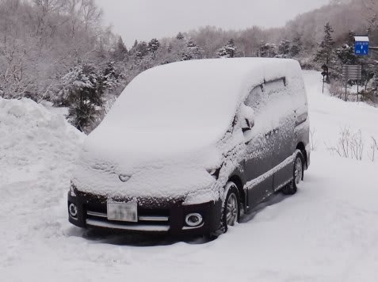
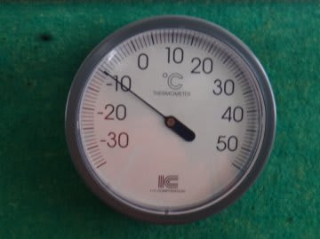
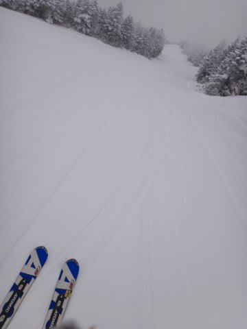
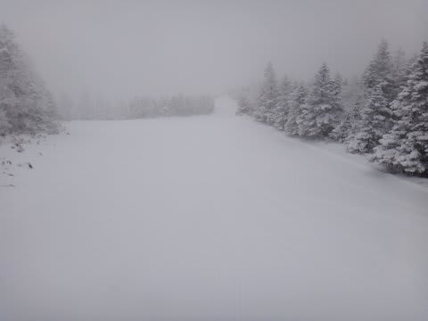
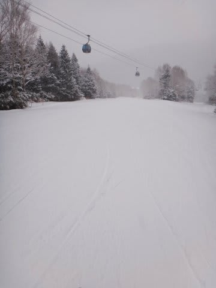
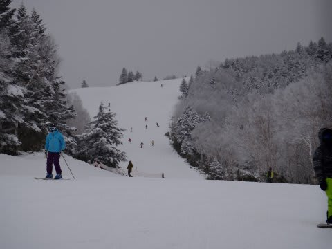
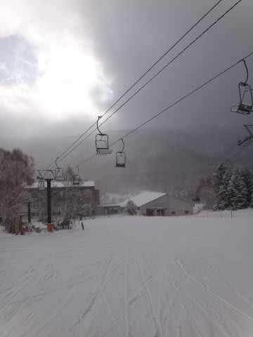
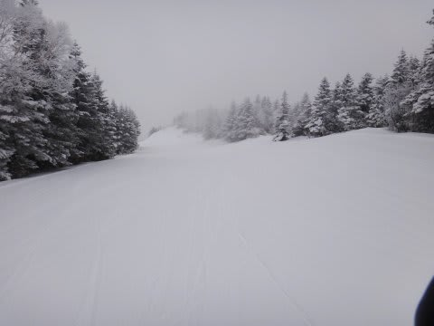
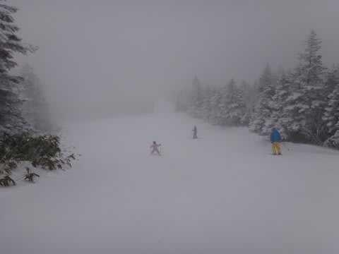
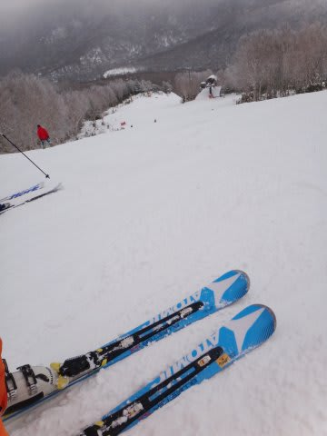

# 12月9日，日曜日の志賀高原も…良かったよ～

📅 投稿日時: 2012-12-10 00:02:56

んで．今度は日曜日のレポートです．

今日も焼額は，第2ゴンドラと第2高速が動きました．

土曜の夜から日曜にかけては志賀高原では雪が降ったものの．

それほど積もらず…こんな程度．

積雪は10cm弱かな～．

新潟方面は，どかっと積もる気圧配置だったんですけどね～．

志賀はそれほど積もらず．見事に天気予想のとおりになりました…．

で．朝の天気は小雪．

気温は－10度．

むちゃくちゃ寒いよっ！

山頂に出ると…

きれいに圧雪された上に，うっすら新雪が乗ったコンディション．

硬いバーンも好きだけど，やわらかい圧雪も最高っ！！！！

そして…朝10時までは全く人がいない，怖いくらい人がいない，

好きなラインとり放題の，こんなゲレンデを．

圧雪の上にうっすら乗った軽い新雪を蹴散らしながら，思う存分自由落下！！！！

いいのかっ！

12月2週目で，こんなにコンディションよくていいのかっ！

10時を過ぎると，さすがに人が増えてきたけど…

それでも，ゴンドラの待ち時間は搬器4－5台待てば乗れる程度．

昼ごろには，[天気予想](e546d5530e9c95761c8d814c758cd95e0.md)に

雪はそんなに降らないかも…

まだなんともいえないけど．

もしかすると志賀では青空がちらちらと見えるかも．

って書いたように，うっすら太陽が見えたりもしましたね～

で．1時を過ぎると，みんな帰り始めるのでまた人が減っていき…

再びサルのように滑ることができたのでした．

コースも午後までそんなに荒れることなく．

ブッシュが出てくることも全くなく．

雪もたっぷり．コース幅いっぱい滑れて．

完全トップシーズンのゲレンデ状況を楽しめたのでした…

しかし．

今日は風が強く，ゴンドラが結構減速運転に入ることも多かった上に…

日曜の午後は．

しっかり降りそうです．

夕方くらいから強くなって，かなり積もりそうなんだけど…．

って天気予想が見事に当たってしまい．

午後3時ごろから，にわかに雪が強くなり．

凍死するんじゃないか？？？って吹雪になってきました．

…おそらく．

明日の朝は最高だろうなぁ…

雪が降るのが，1日遅かった…

まぁ．

でも．この週末．

トップシーズンなみのコンディションなのに．

シーズンオフのがらがら度合いという．

きわめてうれしいゲレンデが楽しめ．

満足の週末だったのでした…

で．

で．

なんだ？この板はっ！？

…明日のレポートをお楽しみに…
