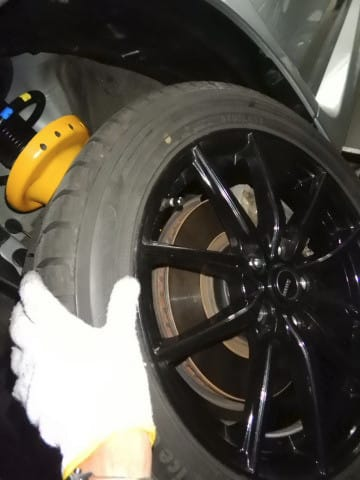

# レヴォーグ君のタイヤをスタッドレスに換えたよ！…そして，いつも通り下周りを磨くっ！！

📅 投稿日時: 2019-11-27 01:40:43

🏷️ カテゴリ: [車](cba0e8330b3f2ded7c1addfacc75d4547.md)

えー．

予想通り，昨日の26日火曜日は気温が高く，

人工雪が打てなかったようで…

このまま，27日の水曜も人工雪は打てません（涙）

ただ．

28日の木曜から冷える！

28日は朝から天然雪も降る！（そんなにドサドサ降らなさそうだけど(泣））

29，30日は雪は降らなさそうだけど…

でも，28日から30日の土曜までの3日間は，

すごい冷えるのだ！！

もし，28日の天然雪がそこそこあれば，

30日はいくつかのスキー場がオープン

してくれそう…

また明日，詳細な週末の天気予想やります～！

…ってなことで，本題へ．

話は遡り，先々週のこと．

16日(土)　Yeti

17日(日)　某国へ出発

　-- 一週間某国で仕事 --

23日(土)　夜帰国

24日(日)　運が良ければ熊の湯…

という予定でいたわけだけど．

…ちょっと待てよ．

もし，24日に熊の湯に行く場合は，

スタッドレスタイヤを履いてないと

ヤバいんじゃないか？？？

23日の帰国後の夜，タイヤを換えるのは

厳しいので．

これは，某国出張前にタイヤを換えて

おかないとヤバいのでは…？？

…ということに気づいたわけで．

17日の飛行機が午後だったのを幸い，

朝早起きしてタイヤを換えて，

シャワーを浴びたらそのまま空港へ直行

という．

ただでさえご無体日程の出張前後に，

さらにご無体予定を突っ込んで，

タイヤ交換にいそしんだのでした…

で．

タイヤ交換を始めるわけですが．

そう．

いくら時間が無いタイヤ交換でも，

手を抜かない．

もう，走行距離4万km近く走っているので．

いつも通り，タイヤ交換時に

しっかり足回りをメンテするのだ！

以前のタイヤ交換から半年間の

汚れが溜まった足回りを…

磨く！

磨くのだ！

磨いてきれいになった足回りは，

いつも通りシャーシコートクリアを

吹き付けて，錆防止をしておきます…

これでピカピカ！！

フロント側も同じく．

汚れの溜まったアームや

ロッド類を…

磨く！

5-56とクレポリメイトで磨きまくって，

シャーシコートでガード！

ってな感じで．

いつも通り，下周りがピカピカすっきりに

なったところで，スタッドレスを履かせます…

この時点で，家を出なくてはならない

1時間前を切っていたので．

慌ててシャワーを浴びて，家を飛びだす

という慌ただしさで，強引にタイヤ交換を

済ませたのでした…

（そしてこのあと，目的地のホテルまで移動時間22時間（涙））

…

…

…

が．

帰国すると，気温は+10℃だとか20℃だとかで．

全然スタッドレスを履かなくても大丈夫な

状況で．

さらに，熊の湯もクローズ（涙）

…無理して海外出張出発直前に

タイヤ交換しなくても良かった

という結果になり．

　中6日の日本滞在で，

　5日仕事して，

　2日スキーに行った上に，

　タイヤ交換＆下回りメンテまでする

という，どう考えても計算が

合わないような苦労をしたことが，

無駄になってしまった感があったのですが．

…でも．

帰国して，ドカ雪が積もっていて．

「タイヤ交換してないから熊の湯に行けない！！！」

ってなってたら，多分，

のたうち回って悶絶していた

と思うので．

保険として換えておいて良かったんだ…

と，自分に必死に言い聞かせている，

Skier_Sだったのでした…

## 💬 コメント一覧

### 💬 コメント by (tamaWRX8)
**タイトル**: ハードワーク
**投稿日**: 2019-11-30 22:45:38

こんばんは！

遊びも車弄りもいつも全力なので尊敬します！

一つ疑問なのが仕事も遊びもハードなのに、いったいどこで体を休めてるのかですね笑

タイヤ交換の件はやらずに後悔するより、

やって後悔する方が良いと私は思います！（＾＾）

私も現在フィリピンに2週間の出張中なのですが、出発前日までホイール付けたり外したりコーティングしたりしてました笑

### 💬 コメント by (Skier_S)
**タイトル**: ＞tamaWRX8さま
**投稿日**: 2019-12-02 01:54:25

お久しぶりのコメントありがとうございます～！

いや，私は，

平日は体を休めて．

休日は頭を休めて．

交互に異なる部分を休ませているつもりなんです…

で，フィリピン出張中ですか！？？

それも2週間…

この時期のフィリピン，日本から行くと季節感を

失いますね(笑)．

体調を崩さないようにご注意を…

そして，出発前日まで車弄りですか．

お疲れ様です．

