# 2023/12/31，大晦日の志賀高原焼額山スキー場は…雨はぽつぽつ降っただけで雪は融けず，夕方から本格的な雪に！

📅 投稿日時: 2023-12-31 23:19:10

ということで．

志賀高原滞在3日目ですが…

今日も焼額は，パノラマコースと唐松コース，

サウスコースしか滑れず．

GSコース，白樺コース，イーストコース，

オリンピックコースをはじめとする，

ほとんどのコースが滑れない状況が

続いています（涙）

しか知．雨の予想だった本日．

予想はかなりいいほうに外れてくれて．

雨が降ったのは，朝のうち30分ほど，

「あれ？降ってるかな？どうかな？」と思う

程度にわずかにぽつぽつ降ったのと，

午後1時ごろから10分ほど，ぱらぱらと

ウエアがしっとりするくらいの強さで

降ったくらい…

このどちらも，雨が降ったのは標高が低い

リフト乗り場だけで，ゴンドラの山頂は

ずっと雪でした！

さらに，午後2時以降は完全にふもとまで雪に

なりました…！！

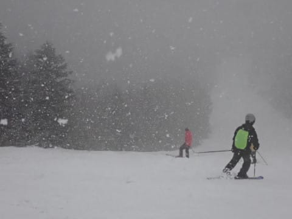

ってなことで．

今日の焼額山は，ほぼ雨にやられず済み．

そして夕方からかなりの雪になり…

志賀高原は今も雪が降ってます！

…明日までに積もるといいなぁ…

ということで．

今日は大晦日で，いろいろイベントがあり．

のんびりBlogを書く時間がないので，

速報モードにて…！

降っても昼からだろう…と予想していた

本日，意外と朝のうちに雪が降り，

駐車場には3cmほど積もってました…

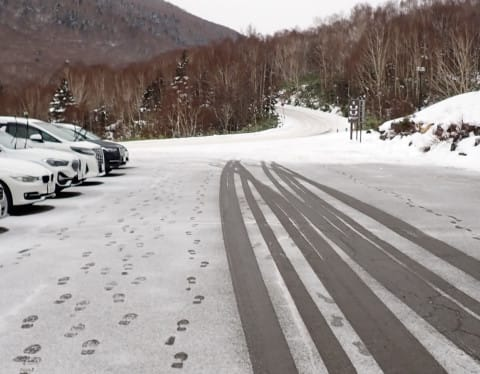

ただ．

営業開始の8時半ごろは，リフト乗り場

付近は一瞬雨（涙）

でも，あさイチの山頂はー1℃と，際どい

ながらもマイナス気温だったので…

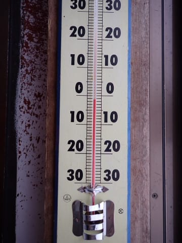

山頂は雨にならず雪で．

3cmほどの新雪が楽しめました…！！

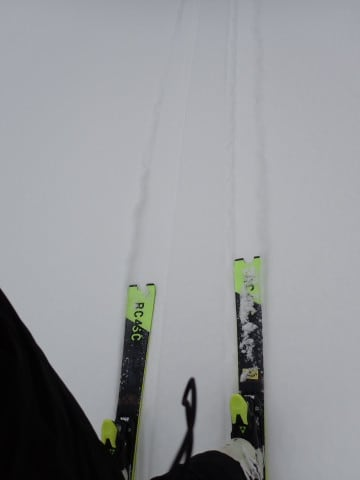

ふもと付近はギリギリ雨と雪の境目

だったので，積雪はなかったけど…

いい感じに締まったシマシマ！

雨の影響もほぼなく，1本目はかなり楽しい

感じ！

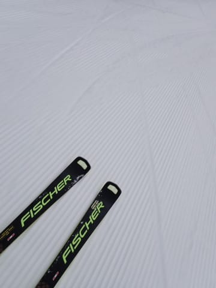

ゴンドラ2本目には雪＆雨も止んで…

人が少ないいい感じのバーンを楽しめ

ましたが…

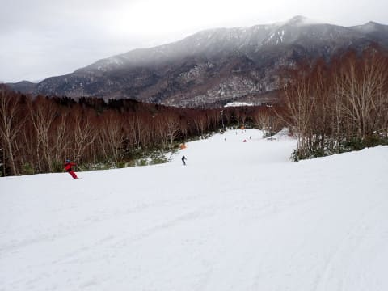

やはり正月休みの本日．

朝9時過ぎには，ゲレンデはかなりの

人口密度になり…

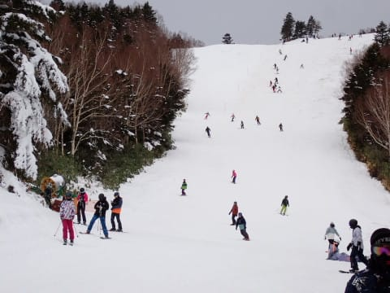

第2ゴンドラ，第2高速リフトはかなりの

列になりました…（涙）

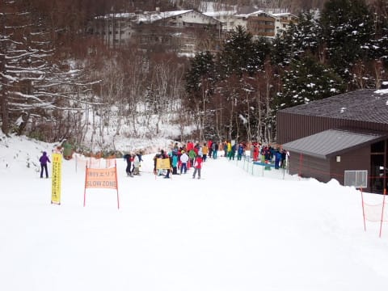

まぁ，第4ロマンスと…

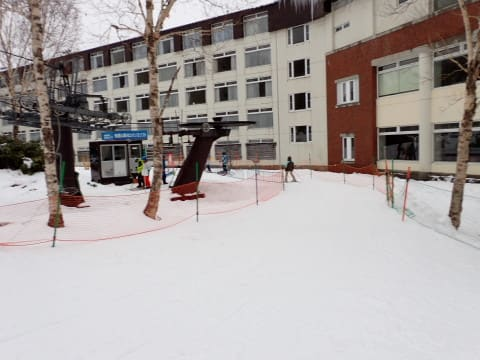

第1ゴンドラは，そんな中でも終日ガラガラ

だったので，リフトを選べば待ち無しで

グルグルできたので良かったのですが．

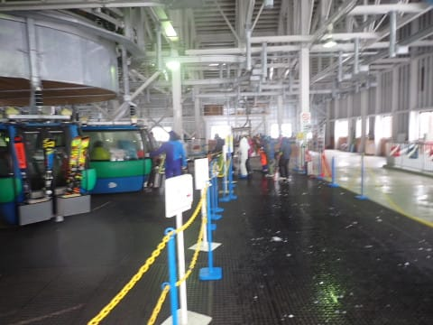

でも，ゲレンデの人口密度は終日

高かったので．

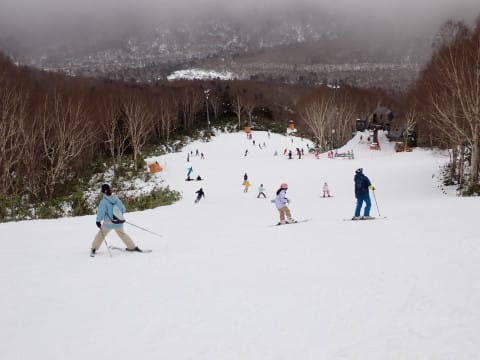

山頂付近でわずか2-3cmの積雪は

すぐにはがれてしまい…（涙）

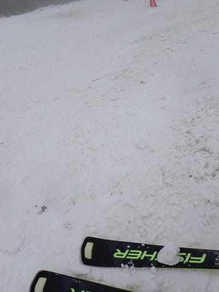

そこかしこに，危険なブッシュや石ころ

エリアが…（泣）

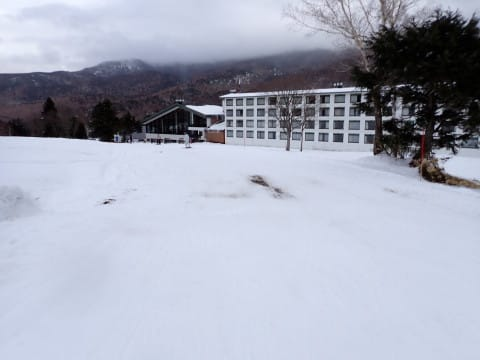

焼額スタッフが，必死にコース外から

雪を集めて…

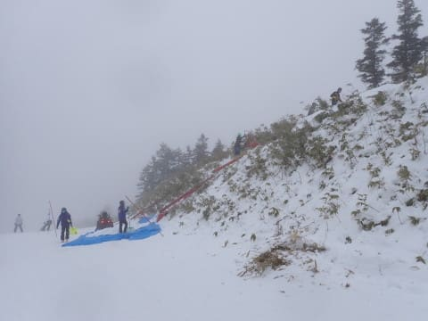

スノーモービルにひかせたブルーシートの

上に雪を乗せて，雪不足のところに運んで

コース修復をしてましたが…

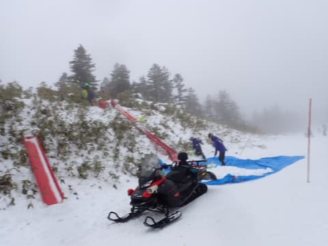

え？そんなところから雪を集めるの？？

ほとんど雪ないじゃない…？？

ってところから，必死に雪を集めて

ました…

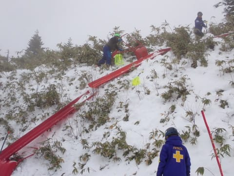

それでも．

雪が薄いエリアは広く，人力で雪を入れても

茶色いエリアは埋めきれない感じ…（泣）

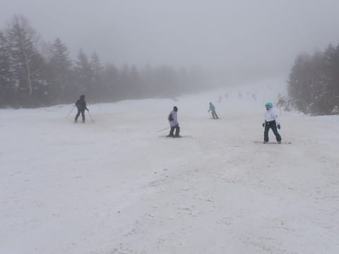

…でも．

午後2時前には，朝に止んだ雪が再び

降り始めました…！

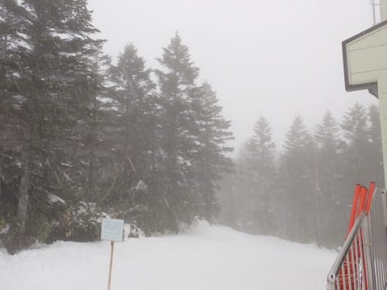

雪は降ったりやんだりでしたが．

かなり湿った，いい感じで積もっていく

雪が降ってくれたので…

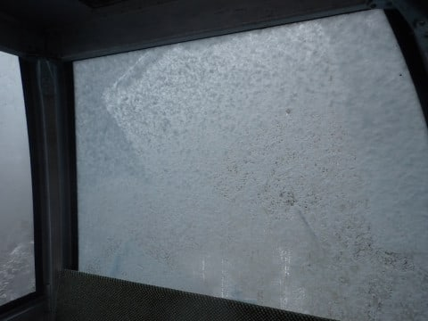

リフト営業終了の16時には，茶色いところが

隠れきるほどではないけど，うっすらと

コースに積雪が！

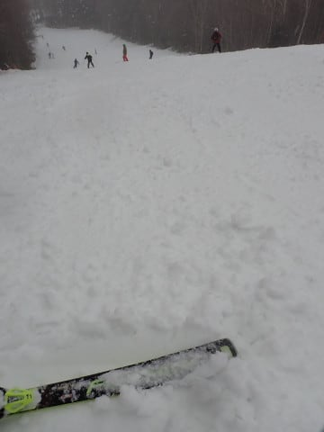

このまま降り続けてくれれば，明日は

ゲレンデ状況が改善しそう…！！！

と，期待させる降りっぷりで，

16時の営業終了を迎えたのでした…

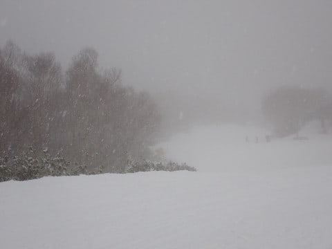

ってなことで．

今日もコース上はかなり混雑した上に，

雪不足でコースのそこかしこにブッシュや

石ころが出てくる，残念な状況で．

さらに最後は激しい雪で前が見にくくなる

という，かなり厳しいコンデションで．

楽しかったか？？

と聞かれると，

微妙…

と答えざるを得ない1日でしたが．

かなりいい感じの，夕方の雪の降りっぷりで，

明日への期待を残して，一日を終えたのでした…

明日までに，この重めの良く積もる雪が，

50cmほど積もってくれると嬉しいな…！！

2024年は，新雪で迎えられることを期待…

ということで．

今年もお世話になりました～！！
