# え？明日から1泊2日で志賀高原？…そうです．トレッキング＆大蛇祭り見に行ってきます

📅 投稿日時: 2017-08-19 00:44:30

🏷️ カテゴリ: [日記](cc4b5682fb7b8b144980957a978653fb0.md)

えー．

どうやらこの週末．

首都圏は天気が悪そうですが．

長野方面，何とか天気がもちそうなので．

そうです．

昨日の記事で「行こうかな～」と書いていた

志賀高原．

ええ．行ってきます．

行くことに決めました～！！

あとは現地の天気次第ですが．

いろいろトレッキングしたり，

野猿公苑でお猿さん見たり，

中野の町中や小布施でいろいろ買い物したり．

1泊2日でぶらついてきます…

しかし．

わが娘．

この夏の思い出が．

高山に行ったり．

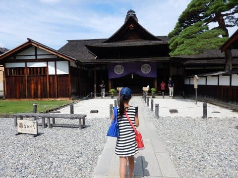

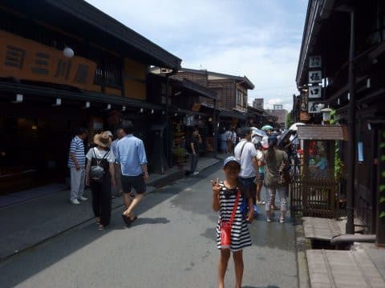

某河原でBBQをやったり

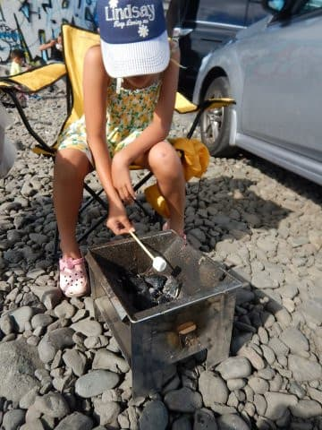

…サンマを焼くのをBBQというのは微妙な

気がするけど…

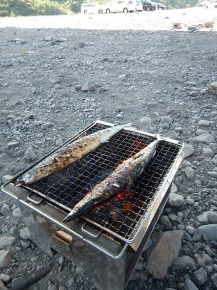

そして，例年恒例の，静岡県某所で

釣りをやったり…

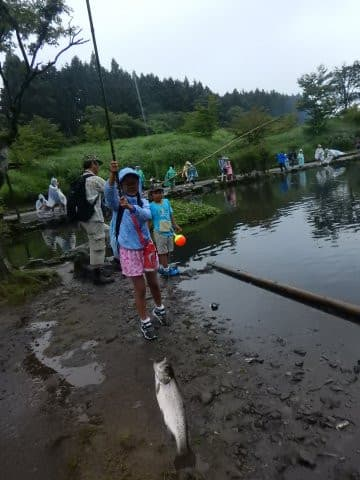

カヤックに乗ったりしてきたうえに．

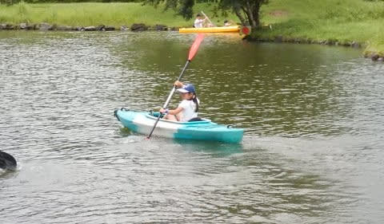

さらに，バイクでツーリングに出かけ…

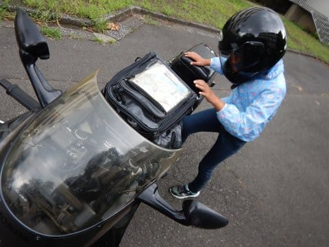

満開のひまわりを見て回ったり

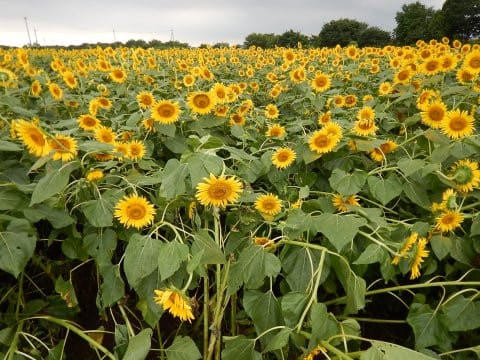

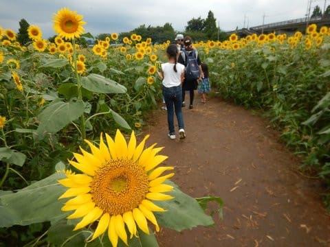

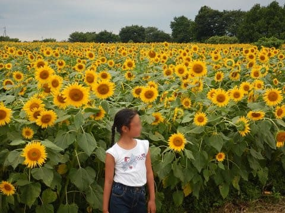

そして，座間味で楽しみ．

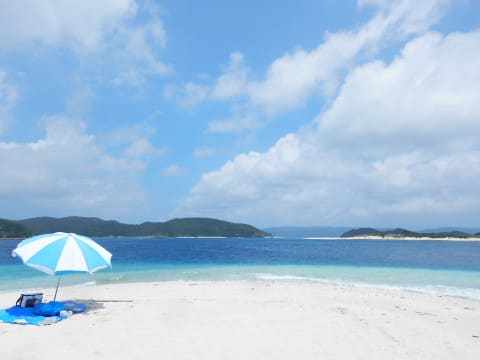

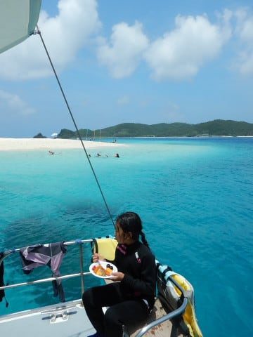

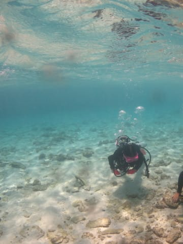

…これだけで，普通の子供の夏休みの

思い出の5年分はありそうな気が

するんだけど…

だのに．

さらに今週末は志賀高原に行って．

そして，その2日後からパラオですか…！！

なんてゼイタクな…！！←だから，ゼイタクさせてるのはあなたでしょ

なんだか．

私の記憶が確かなら．

8月の31日中，泊まりで13日間出掛けている

気がするのですが…！？？？

もう，わが娘．

この夏の思い出がありまくりですね．←遊び人の親をもった宿命か…

とりあえず．

いつも通り，仕事がヘビーで帰宅はこんな時間なので．

あと3時間しか寝れませんが（涙）

4時過ぎに起きて，志賀高原へ行ってきます～！

＃なんだか，数か月前まで毎週繰り返していた

＃懐かしいノリだ…

## 💬 コメント一覧

### 💬 コメント by (Goku)
**タイトル**: Unknown
**投稿日**: 2017-08-19 13:28:46

ありゃ！

我が家も日曜日大蛇祭り行こうか～

なんて思っていたところです。

### 💬 コメント by (Skier_S)
**タイトル**: Gokuさま
**投稿日**: 2017-08-19 23:30:16

あ，大蛇際いらっしゃるんですか！

Gokuさんも，志賀高原への忠誠度高いですね（笑）

私は明日は朝のおねりを見たら，

午前中だけ高天ヶ原かダイヤのブナ巨木ルート

でも見て帰ろうかと思っています…

そうそう．

下山途中で，しっかりジンギスカン買って帰る予定です！

