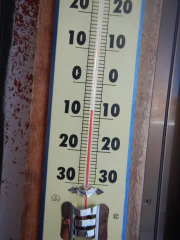
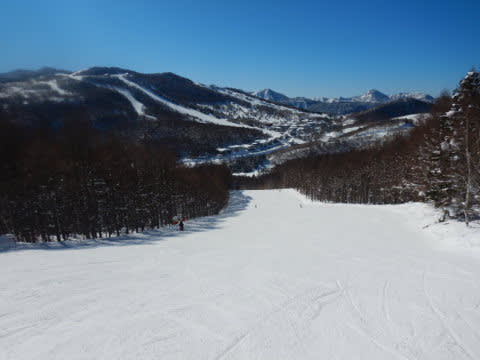
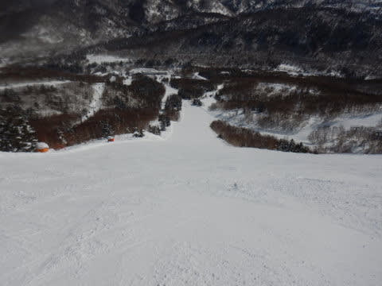
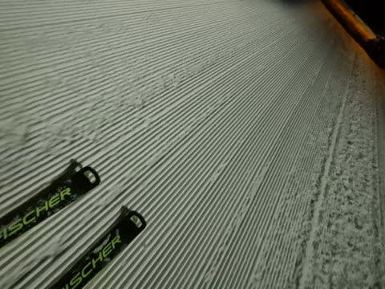

# 2022/2/26(土)の志賀高原スキー場は…終日晴れ！昼間は0℃まで気温が上がったけど雪質はGood！それほど混まず最高の一日

📅 投稿日時: 2022-02-27 00:31:16

ってなことで．

今日も志賀高原で滑ってきましたが…

いやーー．今日は，天気よし，

雪質よしの一日で．

今シーズンベストだったのでは？？

といういいコンディションでした！！

まず．

あさイチから…雲一つない快晴でスタート！！

で，8:30の焼額第1ゴンドラで山頂に上がると…

気温は－8℃．

予想の－6~7℃からは1℃外したか…

でも，大体予想通りの，ちょいと気温が

高めの朝でした．

とはいえ．

まだ-10℃近くまで冷え込んでいるので．

雪質は冷え冷えトップシーズンの

シマシマっ！！

焼額の圧雪職人が仕上げた，

継ぎ目のや穴のない，見事なまっ平らの

最高級のシマシマ，いただきま~す！！

…ぐははははーーー！！

今日も最高！！

ちょい柔らかめだけど，板がガッツリ

食い込んで思う存分傾きまくれる，

「人生にこんな気持ちいいこと他にあったっけ？」

って感じの最高級バーン！！

いやーー．

今日は天気も最高だし．

人も少ない朝のうちは，思う存分

コース幅いっぱいの大回りが堪能

できまるよ！！

…と．

快楽の自由落下を楽しんでいると．

営業開始1時間後の9:30には…残念ながら，

第1ゴンドラが5分待ちを越えてきました（涙）

だもんで，第2高速リフト側の唐松コースへ

逃げましたが…

唐松コースはガラガラ！！

10時になっても，11時になっても

大回りしたい放題じゃないですか！！

第2高速リフトはずっと混まず．

最大でもこのくらい待ったのが2-3回

あった程度．

ゴンドラは最大15~20分待ちまで行ったようですが…

とはいえ，混んでいたのはせいぜい9:30から

11時過ぎまでの1時間半ほど．

いつも通り，11時半ごろになると…

みんな昼休みに行くのか，

ゴンドラもがら空きになってきましたよ！！

がら空きゴンドラで，晴天でガラガラの

ゲレンデをグルグル滑りまくるのだ！！

昼間の最高気温は，昨日予想した通り

0℃まで上がりましたが…

でも，0℃近くで日差しがあるにも関わらず．

日当たりがいいバーンでも意外と

雪は全く緩まず，雪質はいい感じに

締まった圧雪でいてくれて．

そして，比較的締まり気味なので，

雪はほとんど荒れることなかったし…

そして．

今日は昼休みが終わる時間になっても，

全くゲレンデは混む気配がなく．

ゲレンデ，完全無人になるときも

あるくらいなんですが…っ？

なんでこんなガラガラなの？？？

…と，不思議に思っていたら．

12時ごろにダイヤモンドクワッドが故障して，

一の瀬から焼額へ移動できなくなったらしく．

そのおかげで，焼額に人が流れてこず，

晴天最高雪質なのにガラガラという

奇跡の状態が出現！！

さらには，第3高速沿いのイーストコース．

第1ゴンドラからコブのSGSコースを

通ると行けるのですが…

今日は第3高速が動いてなかったので，

誰も滑る人がいないみたいで．

午後になってもこんなシマシマが

滑れるんですけど？？

いや．

今日，土曜ですよね？？

平日じゃないですよね？

いいんですか？？

午後になっても貸し切り状態で，

こんなシマシマバーンを滑れて

いいんですか？？？

ただ．午後数回，ゴンドラ待ちがこの程度まで

伸びることがありましたが…

相乗りレーンならばほぼ待ちなしで乗れたので，

ノープロブレム！！

ってな感じで．

比較的締まり気味の雪で，人も

少なめだったこともあり．

夕方まで大回りしたい放題の

フラットバーンが続いてくれて…

晴天の土曜にもかかわらず，

ダイヤクワッド故障による奇跡の

ガラガラ，そして雪質も最後まで

締まった冷え冷えという超最高の状況の中．

「あぁ…今日という一日が終わらないでほしい…」

という願いもむなしく．

日が暮れていき…

無念にも，営業終了時間になってしまったの

でした…

あぁ…なぜこんないい日が終わってしまうの

でしょう…（涙）

今日が永久に続いてほしい…

うむ．

まだ終わるのは惜しい．

まだまだ滑りたい！！

全然滑り足りないぞ！！

…ということで．

そうです．

今日も懲りずに，ナイターへ出動！

18時からの焼額ナイターで，

シマシマアゲインです！！

うほーーー！

今日もいい感じに冷えた，最高シマシマ！！

いや．

ホントに，今日ナイター滑らない人は

もったいない…

と思うほどの激烈快楽シマシマ！

今日はいい．

朝から夜まで，一日ずっと最高だよ…（感動）

…

とりあえず．

昨日の記事で危惧した，

「ナイターが秒で終わるんじゃないか説」

はやはり間違いだったらしく．

今日もナイターはしっかり20時まで

営業してくれて．

2時間たっぷり滑り倒しました～！！

ラストまで，いい感じの冷え冷えフラットで．

ナイターも良かった…

…しかし．

なんと．

これが焼額ナイター，今シーズンのラスト営業です（涙）

2月の週末で焼額のナイターは終わりです…

3月からはナイターなしです（激泣）

あぁ…これからは，滑り足りなくても

ナイターに行けないのか…

（一の瀬ペアのナイターは3月中旬までやってるけど，

　遅くて緩斜面のペアリフトのナイターに2300円払って

　いく気はない）

でも．

今日はホントに最高の一日でした！！

…明日はやっぱり，曇りベースの天気で．

時折日が射したり，雪がぱらついたり…

って天気になりそうかな．

うーん．

今日みたいな晴天の最高コンディション

アゲインとはいかないけど．

でも，明日も雪のコンディションは

よさそうです～！

## 💬 コメント一覧

### 💬 コメント by (真美子)
**タイトル**: Unknown
**投稿日**: 2022-02-27 12:14:12

うらやましいの一言のみ!

### 💬 コメント by (アリス)
**タイトル**: 関東は春あけぼの
**投稿日**: 2022-02-27 17:04:59

S様

連日の志賀高原情報ありがとうございます。

こちら地元はポカポカの春陽気ですが、志賀高原は降雪ありでの氷点下なんですね♪

今シーズンの雪は例年になく多くワクワクしてます♪

イーストコースのナイター終了は残念です・・・

私どもの事業所内で発令されていた、社員への県外への不要不急の往来自粛要請がやっと解除されましたので、明日よりしばらく志賀高原に滞在しシマシマ、ガラガラを堪能したいと思います♪

### 💬 コメント by (かず)
**タイトル**: Unknown
**投稿日**: 2022-02-27 19:14:48

スノーナビの23日ギックリ腰中の熊落とし僕が写ってると連絡ありました笑笑

### 💬 コメント by (マルハバ)
**タイトル**: お久しぶりです
**投稿日**: 2022-02-27 19:47:59

25・26日と1年ぶりに志賀で滑ってました。

第1ゴンドラ乗り場でSさんらしき人物（板＆ブーツ）をお見かけしましたが「固いニット帽？」装着の為確認が取れませんでした。（涙）

それにしても20000ｍクラブステッカーを多数目撃しましたね～ 驚いたのは YAKEBI ALL STARS ステッカーまであるんですね！

私が初めてＳさんを見つけた頃（多分GOKUさんの次あたり？）とは隔世の感がありました(笑)

### 💬 コメント by (みこみん)
**タイトル**: Unknown
**投稿日**: 2022-02-27 22:54:34

お疲れ様です( ´∀｀)

今日は、Sさんの予報通りの天候でした！

思っていた以上の雪が降り、最高の新雪を味わうことができ、大満足な1日となりました〜♫

私は、明日で、今シーズンラスト？？と思っています（ ;  ; ）

明日は天候も良さそうなので、思い切り楽しみたいです♪

来週から一気に気温が上昇しそうですが、再度冷えて、雪が降ることがあれば…なんとか、もう一度〜

もう一度、来たいです！！

Sさんの予報を、今後も期待しています♪

### 💬 コメント by (ikkun)
**タイトル**: Unknown
**投稿日**: 2022-02-28 00:54:13

羨ましいのです

実はこの日 流れで？テクニカルの養成講習の日でした(泣) こんな土曜日最高の日に

結果は聞かないで下さい

終わった後青空になった日曜でした(泣)

### 💬 コメント by (Skier_S)
**タイトル**: 今日はそれほど良くなかった…（涙）
**投稿日**: 2022-02-28 01:32:50

＞真美子さま

土曜は良かったです…

でも，日曜はちょっと残念な天気でした．

またいい日にスキーできる時もありますよ！

＞アリスさま

今日もかなり寒い雪降りでした…

今シーズンの積雪量はハンパないです．

明日月曜はいいコンディションだと思いますよ．

第2ゴンドラ動かないのでご注意を！

＞かずさま

https://www.snownavi.com/skireport/shiga220223/

これですか！

いい写真ですね…！！

＞マルハバさま

あぁ…あの硬いニットキャップを被ってから，以前から知っている人が

私を見落とす率が上がってます（笑）．

いつも会ってる知り合いにすらスルーされたことも…

硬いニットキャップにもゴールドステッカー貼ってるので，

また探してみてください！

＞みこみんさま

午前中の激しい雪以外は大体当てましたが…

予想以上の雪でしたね（涙）

明日はコンディションいいですよ～！

楽しんできてください！

＞ikkunさま

テク受験お疲れ様でした…

検定に縁がない私にとっては，受験しようと頑張っている人を見ると，

すごいな～，と思っちゃいます．

私はひたすら自分の欲求のまま滑るだけなので…

