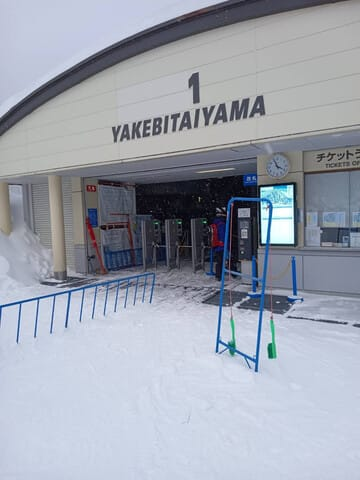
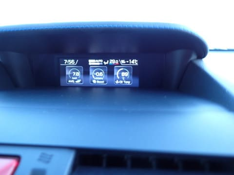
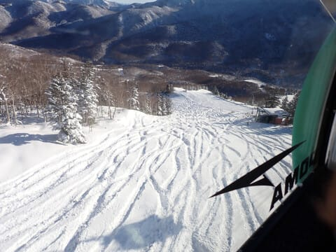
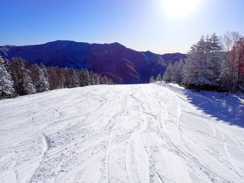

# 2024/1/14(日)の志賀高原焼額山スキー場の詳細レポート！…終日晴天，朝は激冷え，昼間は暖かかったけど雪質はトップシーズン！天気よし，雪よし，ガラガラの恵まれた日

📅 投稿日時: 2024-01-16 02:36:36

🏷️ カテゴリ: [2024スキー滑走日記](c453f687e8a0f05679e95831d0a02cd0c.md)

えー．

本日…というか，もう昨日になった15日の

月曜日の志賀高原ですが．

特派員情報によれば…

もう少し降るかと思ったけど，

朝の積雪は残念ながら20cmほど（ちょい涙）

午前中は雪の降りも断続的で，

それほどではなく．

昼間は薄日が差すこともあったようですが…

昼間も-9℃近くと冷え冷えで．

リフトやゴンドラはガラガラで，

待ち時間もなく．

午後は結構雪の降りが強くなるときも

あったようですが…

ガラガラで雪質もよく，楽しめたようです！

ちなみに今回の積雪のおかげか，

明日から奥志賀連絡コースもオープンし，

これで焼額はヤケビウォール・ヤケビバレイを

除く常設コースは，全面オープンに

なりました～！

そして．

15日深夜…というか，16日に日付が変わった

1時現在．

志賀高原ではかなりの勢いで雪が降っている

ようです…！！

（[北信建設事務所道路気象状況カメラ](http://hokushin.pref-nagano-roadcamera.jp/)より)

だんだんゲレンデ状況は改善していって

ますね…

16日月曜も，終日いい降りっぷりでかなり

積もりそうです！！

…ってなことで，本題へ．

日曜の志賀高原焼額山，詳細ゲレンデ

レポートです！！！

まず．

あさイチの志賀高原への登り道路ですが…

志賀高原のトップシーズンらしい，本格

雪道になってきました…

そして．

焼額の駐車場についた朝8時頃は…

車の温度計で-14℃と冷え冷え！

で．

天気は…すっきり晴天っ！！！

ただ，晴天の日曜なので．

朝のゴンドラ営業開始待ちはかなり

長い列に…

うーん．今日は混むかも？？

ってなことで．

ゴンドラで山頂に向かいますが．

非圧雪コースの積雪を見ると，昨晩からの

積雪は20cmほどかな…

で．

山頂の気温は-10℃！！

日が昇って暖かくなってきたからか，

山頂の気温のほうが，駐車場の気温より

高いという逆転現象(笑)．

そして山頂に出ると…

昨晩降った雪が踏まれた，柔らか

圧雪！！

今日はファーストトラックの営業が

あって，かなり多くの人が参加したよう

なので…通常営業開始時はシマシマが

すでに結構蹴散らされてた感じだった

けど…

エッジを立てるとかなり板が深く食い込む，

トップシーズンの冷え冷え降りたて雪の

柔らか圧雪！

場所によっては，まだきれいなシマシマが

残っているところもあり…

晴天の中，ピカピカ圧雪を滑るこの快感に

勝るものが，この世に他にあるだろうか！？？

あさイチは人も少なくて…

この，雲一つない青空のもとで，

朝日が射すガラガラゲレンデを

滑れる，このシアワセ…！！

今日は北アルプスもきれいに見えるし…

朝の気温は微妙に外したけど，

前日の雪が圧雪された柔らかバーンで，

さらに晴れていいスキー日和になるという

予想は大当たりだな！！

そして，今日からブナコースもオープンし…

午前中は滑る人も少なくて，シマシマが残る

ブナコースもいただき！！

で．

ありがたいことに…

トップシーズンの晴天の日曜というのに，

意外とゴンドラはそれほど混まず．

最大でもゲートの外に列が並ばず．

午前中は搬器4-5台待てば乗れる程度で．

昼からはほぼ待ち無しで飛び乗り！

リフトもほぼ待ち無しで，

午後はどのリフトも完全に飛び乗り

状態だし…

こんな晴天で雪がいい日曜に，こんなガラガラで

いいんですか！？？？

ただ．

ゲレンデ全面，かなり柔らかい積もりたての

雪の圧雪なので…

これも木曜日に予想した，

　午後は急斜面では柔らかい雪が

　荒れてちょっと凸凹になっていきそう

というのが見事に当たってしまい．

昼頃にはGSコースは凸凹が出てきちゃいました…

まぁ，そこまでひどいコブ斜面じゃないし，

雪も柔らかいので，優しい感じだし．

晴天でも，昼間の気温は-3℃程度までしか

上がらず，雪質は良いままだったし．

それでいて，昼になるとさらに人が

減っていき，好きなライン取り放題

だったし…

コースは斜面が急な部分は一部

荒れてきたとはいえ．

唐松コースやイーストコースなど，

コースを選べば，午後になってもそこまで

荒れてないバーンもあったりして…

夕方のラストまで，雪質も良くて

晴天でガラガラという．

恵まれたトップシーズンの一日を

楽しめたのでした…

あ，ちなみに．

夜圧雪で，圧雪後に20cmほど雪が

積もっていたオリンピックコース．

ラストは結構コブコブになってました…

ってな感じで．

この日も，ラストリフトストップの16;15まで，

しっかり滑り倒してきたのでした…

いやー．

良かった．

ようやくホントにトップシーズンらしい

焼額を満喫できました～！！

今週はさらに積雪の積み増しがありそうなので．

来週末はもっとコンディションが良くなるといいな…

## 💬 コメント一覧

### 💬 コメント by (レインボー76)
**タイトル**: Unknown
**投稿日**: 2024-01-16 14:34:19

火曜日の志賀高原情報

大雪です。18m/sで視界悪い予報に、休場した私が大正解。パルスから西舘を目指した隊員は、西舘運休でそのまま出戻り。これはまだ正解の部類。

9時10分にやっと動いたニ高を三本滑った特派員は、視界最悪で立ち往生しているバスらを尻目に、命からがら帰宅。

もっと気の毒なのは、さらに遅くまで残った人たち。無事に戻ることができたのか？心配です。

以下は憎まれ口です。

どうして私達のせっかくの平日を狙ったように、暴雪が降るの？

### 💬 コメント by (ダウンヒル)
**タイトル**: Unknown
**投稿日**: 2024-01-16 15:34:32

Sさまお借りします.

レインボー76さまヘ.

お久しぶりです、レインボー76さま.

いやいや...

今日は荒れた天気でしたけど、これからも美味しいことが一杯ありますよ!!

次に賭けましょう!!

### 💬 コメント by (Skier_S)
**タイトル**: 今日はすごい積もったみたいですね…
**投稿日**: 2024-01-17 00:08:58

＞レインボー76さま

私にとっては平日にどっさり降って週末に晴れるほうが嬉しいのですが（笑）．

今日は休んで正解だと思いますよ！

明日朝のパウダーを楽しんでください…！

＞ダウンヒルさま

今日はすごい天気だったみたいですが…西舘もリフト止まったんでしょうか？

次がいいコンディションになるよう，私も祈っておきます…

