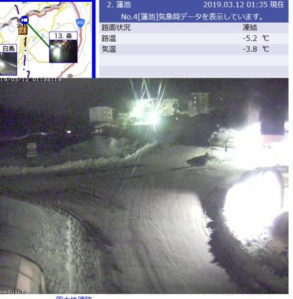

# どうやら月曜の志賀高原スキー場の天気は，壊滅的な雨にならずに済んだようで…そして，日曜の志賀高原レポートはまた明日に！

📅 投稿日時: 2019-03-12 02:33:31

志賀高原でも，思いっきり雨だと

思っていた，本日月曜日．

…一の瀬や焼額などの標高が高い

スキー場は，ウェアがびしょ濡れになるような，

かなり重い雪だったようですが．

なんとか液体にならず．

雪だったようです…！

そして，雨で雪が解けてしまう予想だったのが．

予想とは逆に，朝に20cmほどの積雪が

あったほどみたいで．

…いや．

ここで雪が解けて減るのと，

積雪があって増えるのでは．

えらい大きな違いです！！

もう，GWまで雪がもつかどうかに，

大きく影響するところ．

いやーーー．

良かった…

で．

午後からはそこそこ冷え込み．

夜にかけて，乾いた雪になって

いったようですが．

深夜1時半現在，もう雪が止んでますね…

（[北信建設事務所HP](http://hokushin-camera.org/)より）

しかし．

直前の日曜日の午前中まで．

「月曜，絶対どしゃ降りだよね…（涙）」

と思う天気図だったのに．

まさか，雨にならずに済んでくれたなんて…

ありえないっ！！

…おそらく．

これは，スキーヤーの皆さんの熱い願いによって．

奇跡が起きたに違いありません！！←予想を完全に外したことを正当化しようとしている

そうです．

私の．

そして，読者の皆さんの，

冷え冷え踊りが激烈に効いた

に違いないのです…っ！！←だから，違いありまくりだから

冷え冷え踊りを踊ってくれた，

全国5億2000万人の読者のみなさん，

ありがとう…！！←そんな日本人口を超えるほどの読者いないから

…はっきり言って．

日本全国のスキーヤーは．

この月曜に奇跡を起こした，

このBlogの読者の皆さんに

感謝せねばなりませんね…←だから，冷え冷え踊りが効いたわけじゃないから

ってなことで．

月曜は夜までに，多少の積雪が

あったようですが．

これから明日12日火曜までは，

雪が積もらなさそうですね…

でも．

13日朝から14日にかけて．

また真冬並みの寒気がやってきて．

志賀高原山頂では-10℃を下回る冷え込みになり．

そして，雪が降りそうです…

うーむ．

西風の予想なので，志賀では

それほど積もらなさそうだけど…

積もってくれるといいなぁ…

14日までに雪が積もってくれれば．

私の情熱的な冷え冷え踊りが

まだまだ効果を発揮し続けているようで．

この一週間，異常に気温が上がるという

一か月予想に反し，週末まで気温が

冷えつづけてくれそうなので．

今週末もいいコンディションになって

くれるはず…！！

ってな感じで．

いいニュースのあとは，

日曜の志賀高原，詳細レポートを行きたい

ところなのですが．

…明日，いつもより早くに仕事に

行かねばならず．

さらに昨日も，朝6時に早朝スキーの

ために起きたにもかかわらず．

帰宅後寝たのが朝4時過ぎという，

行動時間22時間を超えた一日となり．

…今日は寝ないと死にそうなので．

すみません．

日曜詳細レポートは，また明日…！←ってか，日曜レポート書いてないにも関わらず，普通の記事ぐらいの長さの文章を書いちゃってるんですけど…

## 💬 コメント一覧

### 💬 コメント by (地元民)
**タイトル**: 志賀はガスの中でした
**投稿日**: 2019-03-12 03:29:35

今日は里からみると、標高1300ｍ位から上はガスの中でした。おそらく雪だったと思われます。1250ｍの菅平は雨だった可能性濃厚。

1325mの河原小屋とか微妙ですね・・・。あと奥志賀のベースはぎりぎり雪かな・・・・。でも、河原小屋方面は行かないですものね。奥志賀どうでしょうね？

### 💬 コメント by (若杉勲71)
**タイトル**: Unknown
**投稿日**: 2019-03-12 11:08:14

志賀高原情報

今日火曜日ははっきり言って、最高です。朝一オリンピックはかみかみでまずまず。GSはまさに天国。GS非圧雪はこぶに飛んだ雪が埋まって滑りやすい。

奥志賀エキスパートが夢の世界。杉山列車が両側に出現するまでは大回りが楽しかったんですが。

午後は一ノ瀬、たかまに向かいます。

以上、仕事してる人には酷なリポートでした。

### 💬 コメント by (kiteholic)
**タイトル**: Unknown
**投稿日**: 2019-03-12 12:38:05

こんにちは。

日曜日の夜に上信越道でS様と並走したかもしれません。

軽井沢手前あたりでシルバーのVMに黒のボックス載せて走っているSナンバーの車を発見！

もしかしてと思いましたがＳ様でしょうか？

私はBS9の城に白のボックス乗せてトロトロ走ってました〜

ただし疑問が…S様かどうか不明ですが、Sナンバーで何故上信越を走っているのだろう？と…

仮に志賀から帰宅するのであれば中央道回った方が早いのでは？？

私は関越の渋滞が嫌なので、白馬からの帰りでも松本まで出て中央道で帰るので不思議に思いました。

全然違う方だったらコメ汚し失礼しました。

### 💬 コメント by (若杉勲71)
**タイトル**: Unknown
**投稿日**: 2019-03-12 17:40:20

志賀高原情報

午後はファミリー二本、かみかみで最高。たかまの非圧雪を三本。転んでも怖くない硬さで、老人向きでした。

ミドルも老人向き。がらがらで終日（といってもレインボーまで）楽しめました。

こんな日が続いたら四月になっても帰れなくなっちゃう。

幸せな悩みを抱えるレインボークラブ員Aでした。

### 💬 コメント by (Skier_S)
**タイトル**: 最高の日曜だったよ！
**投稿日**: 2019-03-13 08:14:24

＞地元民さま

志賀高原も，サンバレーは微妙だったみたいですが．

一の瀬，奥志賀，焼額はそこそこの積雪になるほどの

雪だったようで．

ちょいと雪は重めながらも，ゲレンデにとっては

救いの積雪になったようです…

今週はまた真冬の寒気がやってくるので．

今週末はいい感じで滑れそうです…！

＞若杉さま

…火曜日，良かったみたいですね…

天気も良くて，うらやましすぎる…

これから数日間結構冷え込んで，

いい感じの日が続きますよ…

ぜひ，4月以降も志賀高原に滞在してください(笑)．

＞kiteholicさま

私はいつも，上信越⇒関越⇒圏央道ルートなんです…

そして，この週末は都内の人間をピックアップして

行ったので．

関越練馬利用でした．

で．

白いBSアウトバック…

確か，軽井沢手前の登りトンネルが続くあたりで

見かけた気もします(笑)．

もしかしたら，そのVMは，私だったかもしれません…

