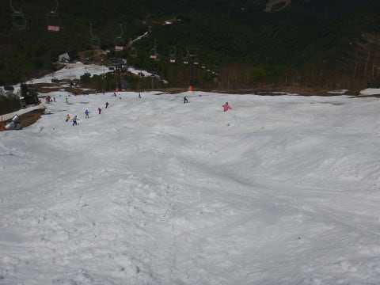

# 5月20日，日曜のかぐらスキー場詳細レポート！…朝は寒め，午後は気温が上がって晴天に！ゲレンデはすごい人口密度

📅 投稿日時: 2018-05-22 06:14:20

🏷️ カテゴリ: [2018スキー滑走日記](c11b88dc181f34079ab41db74a3587646.md)

ってなわけで．

昨日速報した，日曜のかぐらスキー場の状況ですが．

本日は写真たくさんで，詳細レポートです！

えー．

まず，いつも通り7:30営業開始の朝イチ

ロープウェーに並ぶわけですが．

…本日，天気が回復する予報なのに．

ロープウェー営業開始直前でもこの程度しか

並んでませんでした…

で．

ロープウェー山頂駅では．

板のキャリーサービスのトラックが

お出迎え．

Pislabマットを滑るのが嫌な私は

板を預けたので．

こんな感じで徒歩でリフト乗り場へ向かいます．

…完全にみつまたは積雪0になりましたね

雪の影も形もないです…

みつまたリフトの乗り場・降り場はPislabマットが

敷き詰められているので．

板を履いても乗ることができます．

で．板を履いている人はここからゴンドラまで，

滑って降りられるわけですが．

一部の人は．

ゴンドラ乗り場までのPislab上を歩いて行きます…

ちなみに，私はこんな感じのPislabマットの

左端を歩きました．

ゴンドラまで，徒歩6-7分くらいですかね．

ゴンドラ乗り場には，ロープウェーを降りた時に

預けた板が，もう並べて置いてあります．

ブーツを預ける人が，意外と多いようで．

ブーツもこんな風に置いてあります．

ちなみに，ブーツを預けて，ここまで

普通の靴で歩いてきた人は．

ゴンドラ乗り場の中に，履き替えた靴を

置いておく靴置き場がちゃんと準備してあります…

うーむ．

気が利く！

で．

先週まで滑れたとはとても思えない

ゴンドラコースを眺めつつ，ゴンドラを

かぐらへ上がりますが…

かぐらに到着すると．

さらに雪が減ってますね（涙）

和田小屋からリフト乗り場までも，

廊下になってますし．

メインバーンも…

うげげ．

狭くなったなぁ…（涙）

上の方は，まだそこそこ幅があるものの．

リフトをくぐるあたりも，もうこんな幅になってます．

リフトの降り場も…

廊下ですね（泣）

そして．

結構気温が低く，山頂で0℃をちょいと上回る

程度だったこの朝．

明け方は雪が降ったようで…

うっすら雪が積もってますよ！

だもんで．

ゲレンデも…

うっすら新雪に圧雪がかかった状態！

…でも．

この時期の新雪．

ただ，板が滑らなくなるだけなので．

あんまり有り難くないですが…

そして．

朝イチはうっすらガスが残るものの．

誰もいないバーンを滑れます！

そして．

朝9時過ぎには．

雲がゲレンデから離れていき…

時折雲が流れてくるものの．

青空が見えてきました！

ゲレンデは多少緩み始めたけど．

硫安をガンガン撒き続けているので．

それほどひどくは緩んでませんね…

でも…

すっきり晴れると．

ゲレンデが狭くなったのが良く分かります…（涙）

そして．

朝10時を過ぎてくると…

うむ？？

あらら…

かなり混んできました（涙）

リフト待ちはピークでこれくらいで

済んでますが．

コース幅が狭いので．コース上に

かなり人があふれてきます…（泣）

ちょっと快適に滑れる人口密度ではない

ですね…（涙）

だもんで．

これだけの人間に掘削作業が続けられている

ゲレンデは．

昼前には，結構荒れ始め…

昼ごろには，すごいことに…

そして．

午後1時ごろには．

大変残念なことに．

コブ溝の底が抜け始めてきました…（涙）

まぁ，これだけの人数がコブ掘削作業を

続けているのですから，こうなりますわな…

リフト乗り場前の雪も，

もう汚れがかなり浮いて．

コーヒーアイスみたいになってます（泣）

午後2時を過ぎるころには，かなり土が出ている部分が

ふえてきて…

うーむ．

ダメだ．

これはヤバい…！

コースの上半分．

このあたりはまともに見えますが．

コブ溝は所々土が出ちゃってます…

リフト営業終了に近いころになると．

もう，このあたり．

左側幅数m以外，コブ溝はすべて土が…（泣）

下から見ても．

この写真でコースの左側．

結構土が出始めてて．

右側数mだけに人が集まってます…

まぁ．

とはいえ．

雪が少なかった今シーズン．

最後の落ち込み部分もまだこれだけ雪が

残ってるので．

GWの志賀高原の悲惨さを考えれば，

良く雪が残ったというべきでしょう…

ってな感じで．

ゲレンデ状況がどうあっても，リフトストップまで

滑ってしまう私．

午後4時のかぐら高速リフト終了まで滑ったあとは，

ゴンドラで下山です…

ゴンドラを降りると…

また，スキーキャリーサービスが待っているので．

Pislabを滑らない私は，板とブーツをまた

預けます．

そして，リフト乗り場まで歩いていき…

みつまた行きのリフトに乗りますが．

Pislabを滑る人は板を履いたままリフトに

乗れます．

そして，リフト降り場からはPislabを

滑ってロープウェーまで行けますが．

歩いていく人は，この道を下りリフト乗り場

まで歩いていきます…

去年までは，泥の上にカーペット敷きだったけど．

今シーズンは，ちゃんと舗装路になっているところが

いいですね．

そして下りリフトに乗車して…

Pislabを滑っている人を横目に…

リフトで下山して…

リフトを降りて…

ゴンドラ乗り場まで100mほど

歩くと…

そこには，キャリーサービスで運ばれた

板とブーツが置いてあります．

いや，この無料キャリーサービス．

すごい便利．

こんなのをちゃんとタダで提供してくれるのが

素晴らしい！

ってな感じで，最後はロープウェーで下山ですが．

大量に硫安を撒きまくってあるゲレンデを滑った板．

エッジが錆び始めているんので，

しっかり板を洗っておきましょう…

という感じの，日曜のかぐらでしたが．

うーむ．

本日もまだ，クワッドリフトでメインバーンが

滑れるみたいですね…

今週末まで，クワッドリフトが滑れるのかな…

日曜午後の状況を考えると，とても今週末まで

クワッドはもたなさそうだけど…

とりあえず．

今週末のゲレンデ．

滑って

「あー楽しい！」

というより．

「あー滑れる！雪がある！」

という程度だと覚悟していった方が良いかと．

しかし．

よく5月のこの時期までクワッドが滑れるよう，

コースを維持したものだ…

かぐら，すごいな…！
