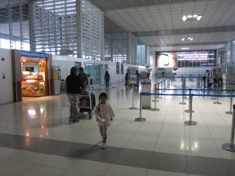
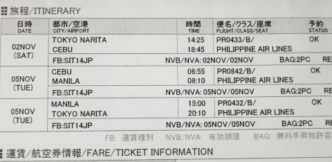
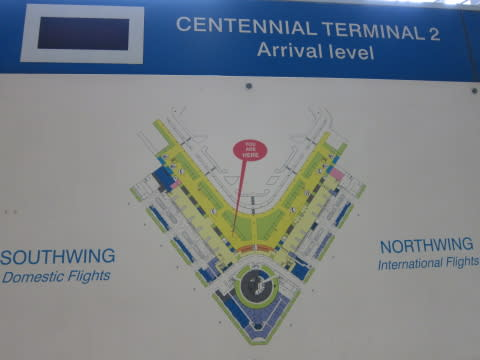

# 2013年11月　フィリピン・オスロブ　子連れでジンベエを見るぞっ！　その25

📅 投稿日時: 2014-08-08 01:31:09

というわけで．

早朝（深夜？）2時半にホテルを出て．

朝8時過ぎ，乗り継ぎのマニラ空港へ

到着したわけですが…．

今回の旅行で，出発前から一番気になっていたのが，

この，マニラ乗り継ぎだったのだ．

…いったい，何がそんな問題なのかというと．

セブーマニラ乗り継ぎ待ち時間が，

異常に長いのだ！

なんと．

マニラ到着が8:10なのに，

成田行きのマニラ出発時間が15:00という…

実に，待ち時間7時間っ！！！！

…ホントは，セブーマニラ間の飛行機が，もう少し

遅い便だったら，待ち時間も短く，

朝ものんびり出てこられたんですけど…

朝イチの便だけ，ぎりぎり空いていたのだ．

そう，振り返ってみると．予約の時…

妻「帰りの出発，ホテルど早朝発で，空港待ち時間

　7時間に耐えれれば，飛行機が開いてるんだけど…」

私「なに？

　　帰りは朝2時半ホテル発，5時半セブ空港着，

　　6:55セブー8:10マニラ，

　　15:00マニラー20:10成田！？？？

　　何だ，この異常な空港での待ち時間の長さと，

　　ド早朝発の深夜帰宅パターンはっ！？」

妻「これしか空いてなくて．でも，これがOKなら

　　今からでもジンベエ見に行けるんだけど…」

私「朝2時半発もヘビーだし，

　　空港で7時間待ちも辛いし…

　　さらにそのあと，成田からうちまで3時間以上，

　　深夜に車運転して帰らなきゃなら

　　ないんだけど…？？」

妻「いつもあなたが行くスキーよりは楽でしょ」

私（う…ひ，否定できない…）

妻「このプランならジンベエ見に行ける…

　　ジンベエ…ジンベエ…」

私（…

　　…

　　…か，家庭の平和のためには，やむを得えん…）

ということで．

かなりの無理を覚悟で予約した今回のプラン．

トランジットの7時間，マニラの街中で観光に出ようかと

考えたけど．

マニラ市街には魅力的な行先もなく，

マニラの治安も考えると．

早朝2時半発ってこともあるし，移動もしんどいので．

空港の椅子に座ってのんびり休むのが吉…

と，7時間，空港で過ごすことにして…

これから，最後の山場（？）

マニラ空港での長い待ち時間が，

スタートです．

大人だけならまだしも．

幼稚園児を連れて，海外の空港での7時間待ち．

耐えられるのかっ！？？
