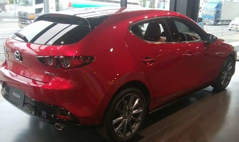
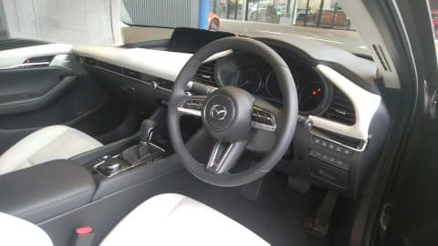

# MAZDA3に乗ってみた…久しぶりの車の試乗インプレッション！

📅 投稿日時: 2019-06-19 01:03:07

ってな感じで．

スキーシーズンも終盤に向かい．

毎週スキーに行かなくなってきたので．

…週末にちょっとした時間が開くときが

あるわけで．

そーゆー時間があるときに．

…最近かなり気になっている，

MAZDA3を試乗しに行って

きました～！

どうやらこのMAZDA3．

異常に人気があるらしく．

ディーラーさん曰く．

「これまで，こんなに試乗にお客さんが

　来ることはなかったです…」

というほど，試乗のお客さんが次々

やってきているようで．

「それも，マツダ車ユーザー以外の方がかなり

　試乗に来られてます」

ということでした…

うむ．

スバル車ユーザーの私も，その一例だな…

ということで．

試乗したのは，MAZDA3のセダン，

1.8Lディーゼルのモデルです．

まぁ，一番気になるのはSKYACTIVE-Xエンジンですが．

このモデルが出るのは10月以降なので．

それ以前に気になる，1.8 Lディーゼル

エンジンのモデルに乗ってみました．

まず，運転席に乗ってみますが…

なんだこれは．

これがCセグの車か？？

…いろいろ装備を付けると，300万円超える

高い車ってのもあるけど．

予想より内装のクオリティは高いよ…！

インパネも全面ソフトパッド仕上げだし，

あまりプラスチックっぽくなく，

見た目も，タッチ＆フィールも，

結構高級なレベルのフィニッシュです．

そして．

動き出すと．

うーむ．

1.8Lのエンジン．

ちょっとピックアップが鈍い感じ．

ターボラグなのか，2.2Lディーゼルの時の

トルク45kg-mの強烈インパクトと

比較してしまうせいなのか．

トルク27kg-mの1.8Lディーゼルエンジン．

数字上は，2.5Lガソリンに負けないトルクですが．

それほど強烈なトルクで引っ張っていく

印象は無かったですね…

ただ．

ちゃんとアクセルを踏めば，ブーストが上がって

かなりのトルク感で引っ張っていきます．

ある意味，アクセルの微小領域で無駄な

非線形性をもたせてなくて．

わずかなアクセルワークでは，

ちゃんとわずかなだけ加速するように

なってるという感じかな…．

アクセルペダルの非線形性が大きく，

ちょっと踏んだだけでドカーンとスロットルが開く，

「トルクがあるように感じさせる」

味付けになっている車と違って．

微小アクセルワークでの車のコントロールは

やりやすいです．

ぴったり狙った速度に車をキープできる，

ジェントルなアクセル設定になってます．

…ただ．

やっぱり2.2Lディーゼルとは別物なので．

あの化け物トルクと比較しない方がいいかな．

感覚的には，必要十分＋αくらいの

エンジンパワーですね…

（Skier_Sがトルク40kg-m越えのFA20に慣れて

　しまっている説もあり） 

でも，ATは2.2Lのディーゼル同様，

トルコンでほとんどトルク増加させて

無いようで．

かなり早くロックアップさせていく

プログラムですね．

アクセルを踏み込んでも，トルコンスリップ

感はほとんどないです．

ってな感じで．

パワーユニットにはそんなに驚きは

なかったけど．

…驚いたのは，この車の足回り．

これは…

Cセグ車で，ここまでやるか！？？？

という感じ．

驚くべき完成度の高さ．

電動パワステの出来も，このクラスとして

やりすぎでは？

と思えるレベル．

うーむ．

このクラスでは，インプレッサの出来が

突出していると思ったけど．

MAZDA3，やるじゃないか…←だから，なんでそんなに上から目線？

まぁ，4WDを選ぶと300万くらいになっちゃうので，

インプレッサより60万ほど高い車と考えると，

差がつくのは仕方がない気もするけど…

もし，この車の小ささが気にならないなら．

この車は，そんじょそこらの高級車に

負けない仕上がり．

…なんというか．

足回りが締まっているとか，そんなんじゃないです．

バネレートは低く，ブッシュもそんなに硬くないです．

それに，おそらくタイヤも縦バネをかなり柔らかめに

作ってあります．

全体的に，優しい感じの足回りです．

でも．

柔らかいのに，時間遅れやタプタプ感，

収束の悪さなどが無く．

「違和感のなさ」

「動きの自然さ」

があります．

これは，MAZDA3に乗った瞬間は分からないです．

違和感がない…

ということは，普段は感じない．

乗っていて，

「をを！すごい！」

とインパクトがあるわけでは無いんですよ．

でも，

道路の継ぎ目を乗り越えた時とか．

横Gがかかったところで，段差があって

サスがストロークしたときとか，

減速Gから横Gを繋げて出したとこの

繋がり感とか．

そういうところの違和感をほとんど

感じなかったことに，

試乗した後，他の車に乗ったら感じると思います．

なんか，ボディ剛性を高めて，

バネレートを高めて，共振周波数を上げて．

各種ブッシュを締め上げて，動きの

クイックさを出したとかでもなく．

ブッシュや各部のコンプライアンスをバッチリ

チューニングして，フラット感のある

乗り心地を達成したとか．

そんな感じではなく．

なんというか．

各部が柔らかいのに，

時間遅れが無いので．

想定外の揺り戻しや，

ダンピング収束遅れが無く．

「柔らかいのにすっと収まる」

とでも表現しようか…

新しい高級感．

大体，柔らかくすると収束は悪くなり，

揺り戻しや「タプタプ」した感じが

出るけど．

柔らかいのにすっと収まる．

あまりにも自然すぎて，おそらく試乗している

間は分からないと思います．

私も，乗っている間に正しく実力を

見抜ききれず．

その後，何車種か試乗して，

「MAZDA3，やっぱすごかったわ…」

と思いました．

なんでバネレートやブッシュを締め上げてないのに．

こんなに素直に走るんだろう．

そして．

ステアリングも．

センタリングトルクは自然だし．

妙に強いアシスト感もないのに．

きちんとまっすぐ走り．

狙ったラインに車を持っていきやすいです…

これは良くできている．

…いや．繰り返しますが．

乗った瞬間に

「をを！すごい！！」

と，一瞬で分かる分かりやすさではないです．

コーナーを攻めた時とか，そんな

普段使わない領域で初めて分かる違いがある

とかいうわけでも無いです．

分かりやすい，目立った特徴があるわけでないです．

いや．

ホントに．

試乗している間は，期待外れと思うほど

何か分かりやすい特徴があるわけでなく．

スプリングもブッシュも優しく緩めに

感じるし．

「ふーん．普通じゃん」

って思いますが．

…その後，高級車に乗ってみると．

高級車でも，サスに大きな入力が

入ったあとの収束や，横Gが

かかったところでの段差乗り越えなどに，

やはり少なからずの不満感，

違和感があることが分かり．

あとで，

「MAZDA3，すごいのでは…？」

と分かってきます．

ってか，このあとにCX-8にも乗ってみたけど．

MAZDA3の方が高級車なのでは？？

と思うほど．

…でも，お値段がかなりアップしていて．

1.8Lディーゼルを買おうと思うと．

スバルなら，LEVORGの1.6GTあたりがガチンコ勝負の価格帯．

トヨタなら，ハリアーやらマークXやらの安いグレードの

価格帯にまで突っ込んできます．

かなりの高級車だけど．

でも，それ以上の出来の良さがある…

MAZDA車，他の車もこれと同じ仕上げに

してきたら，かなりすごい気がする…

うーん．

同じ大きさの，インプレッサや

カローラスポーツなどと比べると，

お高い車に感じますが．

それ以上のお値段の車と十分張り合える，

すごい車を作ってきたなぁ…

後はエンジンにもう少しトルク感があって．

トランクや後ろ座席が広ければ．

かなり無敵な車になりそう…

## 💬 コメント一覧

### 💬 コメント by (名無し)
**タイトル**: Unknown
**投稿日**: 2019-06-19 23:39:46

なぜ句読点メチャクチャにするのですか？

### 💬 コメント by (Skier_S)
**タイトル**: Unknown
**投稿日**: 2019-06-20 09:03:45

>名無しさま

本来読点が自然な所をを句点にしているのは、

なるべく短いセンテンスできりたいなぁ…

と思ってです。

本来句点にすべき所を読点にしている所があったら…

私が日本語をよく分かっていないだけです(笑)

厳密には、横書きなので読点はカンマ、句点はピリオドで書いてますが…

### 💬 コメント by (Goku)
**タイトル**: Unknown
**投稿日**: 2019-06-20 21:28:28

＞厳密には、横書きなので読点はカンマ、句点はピリオドで書いてますが…

凄い！

私はそんなこと考えたことも無いです(笑)

Ｓさんのブログはとても読みやすいですよ。

### 💬 コメント by (ほっぽ)
**タイトル**: Unknown
**投稿日**: 2019-06-20 23:40:16

私もコメント入れるときは、一行の文字数が長くならないように

調整して書いているつもりです。

どこで改行するか、難しいですが。(^^;

Ｓさんのblog記事は１行の文字数が長くなくて

読みやすいと思いますが、やはり意図があったのですね。

流石です。(^^)

### 💬 コメント by (Skier_S)
**タイトル**: 文法上は間違ってると思う
**投稿日**: 2019-06-21 03:45:33

＞Gokuさま

ホントは横書きでも，日本語なら読点（、）＆句点（。）が正しいのですが．

私は２バイト文字のコンマ（，）＆ピリオド（．）で書いちゃいます．

読みやすいと言ってもらえるとありがたいのですが…

ちなみに，読点と句点ですが．

「彼が生きていれば，いい人生を送れただろう．」

と書くのと，

「彼が生きていれば．

…いい人生を送れただろう．」

と書くのでは，前者は事実のみを述べた冷たい文に感じますが．

後者では，誰かがしゃべっている言葉のように感じるかと．

私のBlogの文章は，しゃべり言葉のように感じさせたいので，

あえて細かな改行と読点を多用しています…

いや，文法上は明らかに間違ってて，本や雑誌の原稿だと，

間違いなく校正で突っ込まれるんですが（笑）．

＞ほっぽさま

私のBlogの文章ですが，

「で．」とか，「しかし．」とか，接続詞だけで

一行使ったりとか．

「えー．」とか，文章に書く必要は全く無い音節を入れて，

数文字の短さで高頻度にピリオドを入れることで，

長い文章を短く感じさせて，するする読める感じにしています．

…いや．

ホントにこのBlogの文章，ハンパなく長いので…

### 💬 コメント by (NorthFox)
**タイトル**: Unknown
**投稿日**: 2019-06-21 07:38:03

MAZDA3 はかなり出来が良さそうですね。 気になります。

マツダ車って本当に 運転が楽しいんですよね。決して刺激的なドライブフィールではないのですが。 

マツダには虫谷さんという操安性の名物？エンジニアがいて、 MAZDA3 は現段階における集大成なのかも知れないですね。

 

1.8 のディーゼルエンジンについても私も同じ感想です。 私の CX-3 も 1.8D、AWD、そして MT なんです。MT の出来も良いですよ～ 

 

不満はやはり価格の高さ、それとラゲッジの狭さですね。ボディサイズに対して狭過ぎ。もっと広くできそうなのに。 CX-3 もラゲッジの狭さを見て買うの止めた人多いと思います。 ストックを横置きできないのは驚きました。（そのため“やむなく”伸縮式のストックを購入しました ^^;）

### 💬 コメント by (Skier_S)
**タイトル**: ＞NorthFoxさま
**投稿日**: 2019-06-22 00:31:10

いや…

MAZDA３，恐ろしい車でした．

いや，乗っている間は良く分からなかったんですが．

MAZDA３のあとに他の車に乗って，すごさが分かりました．

次のMAZDA６とか，ラゲッジが広い車が出てくると

すごそうですが．

でも，かなり高い車になりそうな予感…

### 💬 コメント by (NorthFox)
**タイトル**: Unknown
**投稿日**: 2019-07-07 00:37:59

本日、ようやくマツダ3を試乗してきました。

試乗したのは1.5GのMTモデル。

いや、良かったですね～。これがマツダの新しいSKYACTIV TECHNOLOGYなんですね。

何と表現すれば良いか....ドライブフィールに雑味が無いとでもいえば良いでしょうか。

エンジンも十分なパワー。ただ試乗車はFFだったので4WDではどうかな？と思います。

あと素晴らしかったのがマニュアルミッション。スポーツカーと言って良い位の仕上がりでシフトが楽しいです。シートも素晴らしかった。

これなら志賀高原までとか長距離でも楽に気持ち良くドライブできそうです。

まさかこんなにレベルアップしているとは。帰り道、自分のクルマがガサツに感じて困りました。(^^;

### 💬 コメント by (Skier_S)
**タイトル**: >NorthFoxさま
**投稿日**: 2019-07-07 03:08:00

そうなんですよ～．

よくできてるんですよ，この車．

乗っている時よりも，その後他の車に乗った時に，

「凄い車だったんだな…」

ということを認識させられる車です．

ガソリンエンジン，良かったんですか．

マニュアルもいいんですね．

一度，マニュアル車も試乗しに行こうかなぁ…

### 💬 コメント by (Unknown)
**タイトル**: Unknown
**投稿日**: 2019-09-01 23:17:01

細かな振動についてのコメントがないが一度気付いたら気になって仕方ない。

### 💬 コメント by (Skier_S)
**タイトル**: ＞unknownさま
**投稿日**: 2019-09-02 01:44:32

すいません．私は鈍いのか，残念ながら細かな振動には気づきませんでした…

エンジン振動の伝搬なのか，

足回りからの特定周波数の突き抜けなのか，

あるいはどこかの共振なのか…

どのような振動があったのでしょうか？

チャンスがあればもう一回試乗したいと思っている

車なので，教えていただければ次回試乗時に

チェックしてみたいと思います．

