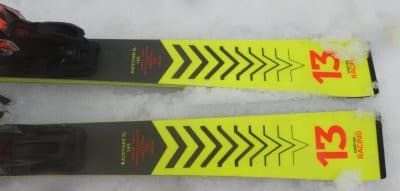

# 2022シーズンモデルのスキー板，試乗レポートその21…VOLKL RACETIGER SL

📅 投稿日時: 2021-07-15 02:36:36

🏷️ カテゴリ: [スキー板試乗](c0bd8048615710cee890e403a36cc9a2b.md)

そういえば．

昨日の記事にも書いたように，

日曜は久しぶりに山道を歩いてきた

わけですが．

土曜は何をやっていたのか？

…というと．

一日寝てました

それも，夜10時近くまで，食事も採らず

20時間近く，ずっと寝てました…

丸一日寝て過ごすつもりはなかったんだけど，

うーむ．

最近よっぽど疲れてるのか…

でも，土曜に死ぬほど寝たおかげで，

日曜に出かける元気が復活しました～！

ってなことで．

本日も2022シーズンスキー板の試乗レポート．

今回も昨日に続いてフォルクル編です．

では，どうぞ～！

○VOLKL RACETIGER SL 165cm

基礎小回り

前回のRACETIGER SL MASTERの

記事にも書きましたが．

この板は，RACETIGER SLと

SLモデルっぽい名前ながらも，

WCがつかないこいつは，

トップロッカーの基礎小回り

板になりますが．

このモデルは，2021シーズンからの

完全キャリーオーバーです．

来シーズン新たに

RACETIGER SL MASTERがこの上位

モデルとして追加されたので，

基礎用としてはトップから2番目の

モデルになります…

で．

前回のSL MASTERはしっかりした

プレートがついてましたが，

この板はプレート無しで，

rMotion 12ビンディングが直付けですね．

履いてみた感じ…

トップロッカーなだけあって，ターン

始動がかなりオートマチック！

何もしなくても板のトップが勝手に

回り始める，今となってはなつかしさを

感じる，ロッカー板独特の動きです．

切替でトップを抑えたり，板を自分で

動かしてたわみを作ったりする必要が

なく，板が勝手に小回りの谷回りに

入って行ってくれます．

そして，マキシマムに向かって自動で

板が回っていってくれ，山回りで板が

しっかりグリップして，山回りの最後まで

板が切れて回っていってくれます．

板の返りはそこまで強くないけど，

軽い感じの早めの返りがあるので，

切替も自然に切り替えていけて，

そしてまた自動でカービング小回りの

谷回りが始まっていく…

という，かなり簡単にカービング

小回りに入って行ける板です．

板自体もかなり軽く感じられ，

取り回しは楽だし，コブとか荒れた

斜面でも苦も無く滑って行けそう．

…ただし，ホントのトップスピードを出すと

板がちょっとたわみすぎるかな…

自動で食いついて，板がたわんで

回り込むので，中回りにもっていくのは

難しいかな…

小回り強制マシーンになります．

あと，硬い急斜面でガンガントップ

スピードを出すと，ちょっとグリップが

負けちゃうかも…

でも，UVOがついているからか，板自体の

安定感はかなり高いです．

荒れた斜面でそこそこのスピードを

出してもキョロキョロしたり，

不安定になったりしないです．

20000mクラブな方々のトップスピードだと，

ちょっと物足りなさが出るかもしれませんが，

普通の人がゲレンデで滑るスピードなら

ほとんど不満は出ないと思います．

来シーズンも，VOLKLのRACETIGER SL

シリーズは，完成度が高いおススメ板ですが．

そこそこのスピードで，オートマチックな

小回りを楽しみたいならおススメ．

ガンガントップスピードを出すなら，

RACETIGER SL MASTERの方が

おススメです！
