# Amazfit GTRスマートウォッチを買ってみた，その8…スキーモードを使ってみた！使えなくはないけど，もう少し改善が欲しいかな．

📅 投稿日時: 2019-10-30 00:22:58

（11/1に，ちょっと記事を書き換えました）

これまで，Amazfit GTRのレポートを．

その1．[購入レポート，](e07b216ec3b426f7a5a1462a3b6fd1c02.md)

その2．[開封＆試してみた感じ，](edd1205f6bd9cd6dadb50e4fc6316b747.md)

その3．[アクティビティーログ](ecd7317c7980728b41dae1a21fe835803.md)

その4．[スマホアプリのインストール＆設定](eb88e9293dae421d12f27fe8b5b363344.md)

その5．[スマホアプリを使ってみた](e031a6cc94592b655560de20fc58cacf1.md)

番外．[常時点灯機能追加！](ec221351f854b20de445e565d66acdf55.md)

その6．[GPS精度が低いのが欠点](eef49f5206ed798087941af71eebf0dee.md)

その7．[GPS精度，ちょっと改善したかも](e9f927972612f60570f5a704fb48030f8.md)

…と，書いてきましたが．

今回，Yetiに行って．

こいつを買った最大の目的，

スキーモードを試してきました～！

いや～．

Amazfit GTRを買ったのは，SunntoのAltimaxの

代わりになるものが欲しかったという

理由なので．

早く試したかったスキーモード．

今シーズンの初滑りで，ようやく試せます…

とりあえず．

スキー場についたら，

アクティビティーログのスキーモード，On!

…するのですが．

ログ開始と同時に，バイブレーターが震えて．

あれ？？

Pauseしちゃいましたよ？

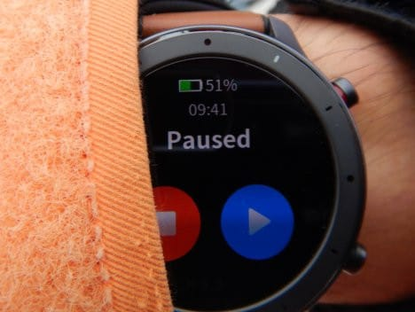

なんでスタート直後にログ取得

一時停止しちゃったのかな？

間違ってボタンが押されちゃったのかな？

と，滑る前にPause解除して滑って．

そして，リフト乗り場で止まると…

またバイブレーターが震えて，

Pauseしちゃいました…

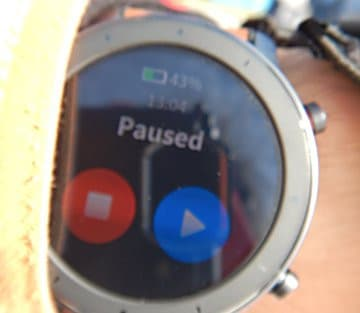

そして，滑り始めると，自動で

一時停止が解除されます…

どうやら，Skiモードには，[Auto pauseの
設定](ecaea2fdb61a097849dac0632fedf1d45.md)があり．

気づかぬうちに，このAuto pauseが

Onになっていたようです…

Auto pauseがOnになっていた場合．

速度がある程度を下回ると，

「滑ってない」と判断して，

自動で一時停止するようです．

…ただ，歩くより遅い程度のスピードで

滑っていると，滑っていると判断されないようで．

一時停止解除されないので，注意が必要です…

ってな感じで．

Auto pauseがOnだったので，途中で

勝手に一時停止することにちょっと

戸惑いましたが．

スキーモード中は，こんな感じの

画面がホーム画面になります…

この画面には，

開始からの時間，

最大速度（km/h)，

今の1本での滑走距離（m），

記録開始からの総滑走距離（m）が

表示されてます．

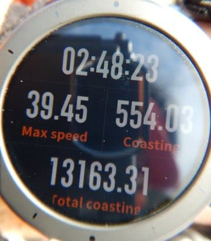

ふーむ．

この日のこれまでの最大速度は

時速39kmですか…

そして，直前の1本（滑り始めてから止まるまで）

の滑走距離は554m．

…Yetiは最長滑走距離1kmと言ってますが．

リフトの長さは570mほど．

滑り始めは，ある程度のスピードが出ないと

一時停止が解除されないので，

リフト乗り場・降り場近辺は滑走距離と

認識しない…ということを考えると，

まぁまぁ正確に距離が測れてますね…

そして，この日は，この時点までで

滑走距離が13168ｍってことは．

13kmほどの距離を滑ったんですね…

…ってことが，滑っている間に分かります．

そして，この画面を上にスワイプすると，

滑走本数，積算標高差，最大斜度が

見れます．

（ここから先の画面は，滑ってる時に撮影するのを

忘れたので．家で撮った写真ですが…）

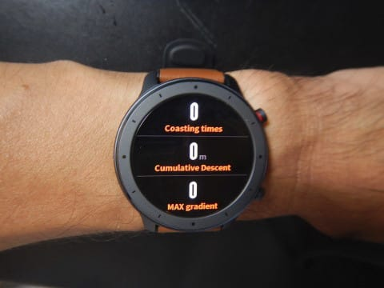

さらに画面をスワイプすると，

心拍数，現在高度，消費カロリー．

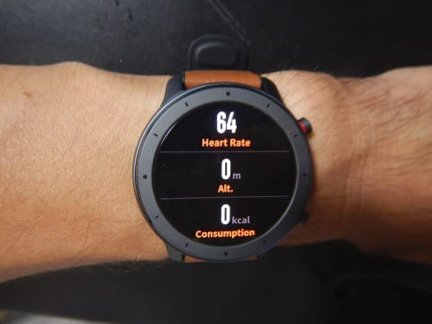

そして，こいつが最後の画面，

速度グラフになります．

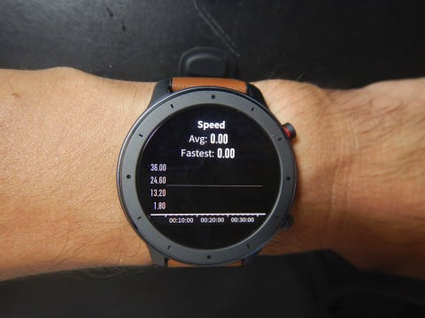

…ってな感じで．

滑っている時にいろんなデータが見れて

面白いのですが．

Auto pauseがOnになっていると，

滑っている時に，いちいち立ち止まると

ログが止まり．

リフトに乗っているスピードだと微妙な感じで，

ログが動いたり止まったり…

何度も何度もバイブレータが震えるので，

電池が結構消耗して．

朝8時から夜7時までの11時間で，大体バッテリーが

50%ちょい減りました…

うーん．

登山だと，6～7時間使っても

電池は20％も減らず，

むちゃくちゃ電池もちが

良いと感じたのですが．

スキーモードで，朝から夜まで滑ると，

ギリギリ2日もつかもたないか…という

感じですね…←いや，普通の人は朝8時から夜7時まで滑らないから

それでも，普通のスマートウォッチの，

GPS連続動作させると10時間ちょいで

電池切れってのに比べれば，

まだかなりマシなんですね…

そして．

一日の終了後に

スキーモードを終わらせて．

記録されたログを確認してみます…

ログ確認画面を開くと．

まずはGPS軌跡が表示されて…

（地図が無いと，軌跡を表示しても，

　あんまり意味がない気が…）

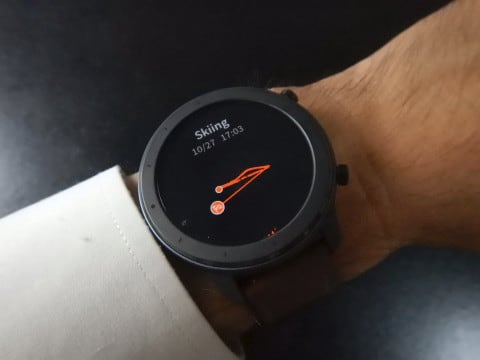

そこから画面をスワイプすると．

ログ記録時間（一時停止時間が抜かれているので，

実質滑った時間になるはずだけど…

リフトに乗っている時も動いたり止まったりなので，

純粋に滑ってる時間とは言えないのが微妙），

滑った総滑走距離，

滑った本数．

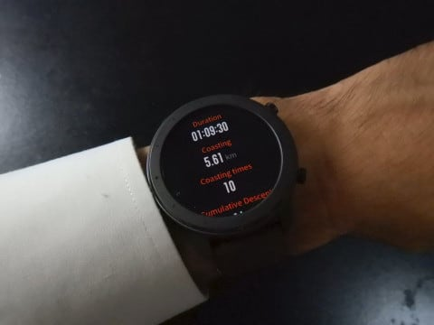

次の画面では，

総滑走標高差，

平均速度（これも純粋に滑った時の速度じゃなく，

リフトに乗っている時の速度も含まれてると

思う…）

最大速度，

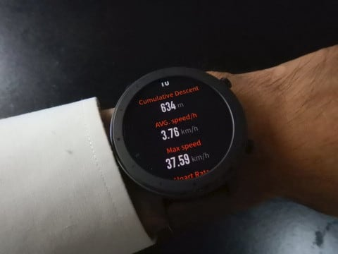

その次の画面では，

平均心拍数，平均斜度，

最大斜度．

…平均斜度は，さすがにおそらく

下り移動の時だけの平均だと思います…

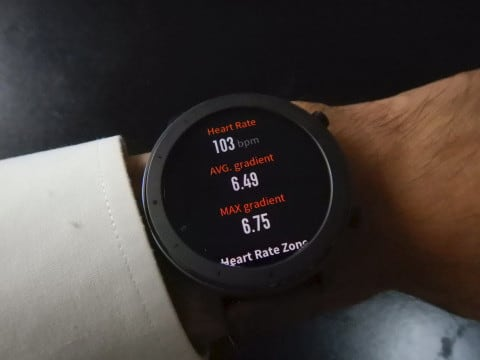

そこからさらに画面をめくると，

いつもの心拍数がどのエリアに入っていたかの

バーグラフ，

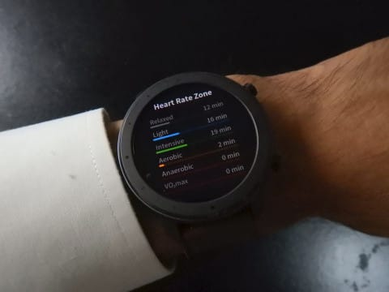

そして次は，滑走スピードのグラフ．

ナイターで10本滑った時の10本分の

記録なのですが．

見事にグラフが10本立ってます．

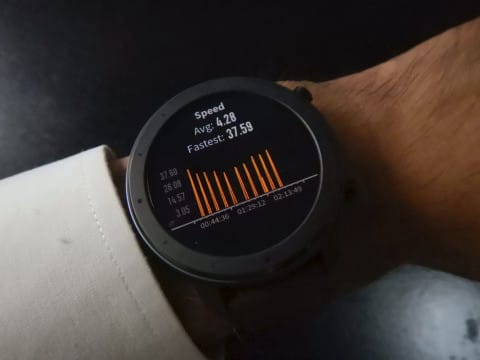

最後に，標高グラフが出ますが．

…これ，グラフの一番下がスキー場の

ボトムの1350mじゃなく，0mからのグラフに

なってるので．

上り下りがよく分からないグラフになって

るのが，残念…

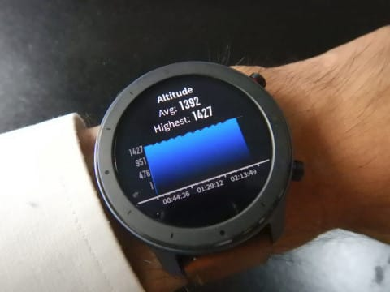

ってことで．

見られるデータは面白いのですが．

[20000ｍクラブ](ea8a953c4b60b5eec845669ca5ba7bf0f.md)の[メンバー](eac250c3fbd4798e341314e16f0d35883.md)には重要な肝心な標高差．

こいつが，実際に滑った標高差より

少な目に出ます…

実際，Yetiのリフトの標高差は75～6mほど．

10本滑ったら，760mのはずで．

…一緒に持っていたAltimaxでは，

大体760mを指しているのですが．

うーむ．

このAmazfit GTRだと634mと，

120mほど少ない値になってますね…

しかし，これは．

Auto pauseがonだったので，

ある程度以上の速度にならないと

一時停止が解除されず．

ゆっくり滑っていたリフト降り場・

乗り場近辺では，滑っていると

みなされないため，滑走標高差とみなして

くれなかったようです…

ちょっと残念．

Auto pauseの設定がOn/Offできることが

分かったので．

次回はAuto pauseをOffにして，

またどうだったか見てみます…

ってな感じで．

いろんな機能があって，

滑っている間にいろんな情報が

見られるのは面白いけど．

滑走標高差が低めに出るのと，

一日で電池を半分くらい消費してしまう，

ちょっと惜しいところもありました．

でも．

Auto pauseをoffにすると，これらの問題は

ちょっと改善されると思いますし．

滑ってる間も，LINEの着信とかが通知されて

便利だし．

滑走標高差と滑走本数しか見れないAltimaxより

安くて多機能だし．

結構便利かも．

…とりあえず．

次回，Auto pause OFFでどうなるか

見てみます…

## 💬 コメント一覧

### 💬 コメント by (ヒロ19)
**タイトル**: Unknown
**投稿日**: 2019-10-30 18:49:33

去年の3月以来の浮上です。（お車関係とスキー関係はちゃんと全部見てます！

大学で色々あってロングの板が必要になってしまいました(><)。自分はまだまだサイボー…一般スキーヤーの為、ガチガチのGSの板ではなく、基礎スキー要素の持った板を探してます。

今迷ってるのはatomicのレッドスターG9i,G9（どちらもFISではないです）、ノルディカのDOBERMAN GSRです。ちなみに中古美品でフォルクル レースタイガーGS マスターズがあってそれも候補です。

フォルクルの板の硬さ（自分が挙げた板と比べて）が知りたいです。また、板の感想頂けると嬉しいです。

S様が以前、競技をやってたと何かの機会に拝見したような気がしたので（間違ってたらすみません！）ご教示願います。

長文失礼しました＜(_ _)＞

### 💬 コメント by (naoちゃんねる)
**タイトル**: Unknown
**投稿日**: 2019-10-30 20:24:31

これは…pause状態にしない為には、ゲレンデの途中で止まってはいけないという事ですな…。

20000mクラブ会員にはピッタリの機能ですね(笑)

### 💬 コメント by (プチ)
**タイトル**: Unknown
**投稿日**: 2019-10-30 23:42:25

Sさん初めまして。初コメント失礼します。

2年ほど前から毎日楽しく拝見させていただいています。2年も読者を続けているとSさんの影響を受けてamazfit GTAを買ってしまいました。

さらにさらに影響を受けたのか、月曜日にはイエティへ午前中だけですが滑りに行きました。その際にアクティビティーログの動作チェックをしましたので参考程度ではありますが以下に記載させていただきます。

まず、Pauseについてですが、リフト前で並ぶことやトイレ休憩、写真撮影をコース上で行うなど歩行スピード以下の時は頻繁にありましたが私のamazfit GTAは止まることがありませんでした。滑り始めから滑り終わりまで常にログを取り続けていたためどのような条件下でPauseが出てしまうのか気になるところです。

また、リフト途中でGPSをキャッチし、最後のリフト途中でログ取得を停止したため正確ではありませんがこんな記録が取れたんだと参考程度にしていただけると嬉しいです。

滑走距離　9.17km

リフト本数　15本

積算標高差　1044m

平均速度　2.89km（半分はプルークで滑りました）

最大速度 48.66（直滑降しました）

平均斜度　6.53

最大斜度　9.35

主にPauseの有無、最大斜度の差が気になるところではあります。

ぜひ次回以降のイエティで比較してみてください。

長文失礼しました。

### 💬 コメント by (Skier_S)
**タイトル**: ＞プチさま
**投稿日**: 2019-10-31 08:29:00

始めまして～！

コメントありがとうございます．

そんなに影響を受けちゃいましたか（笑）．

そちらではPauseしなかったんですね…

私のは頻繁にPauseして，かなりうっとうしかったんですが…

設定か何かなのでしょうか？？

ちなみに，15本であれば，実際の標高差は1150ｍ程度なので，

100mほど少な目に出ている気がします…

平均斜度は私の記録と同じくらいですね！

スマホアプリの画面見てもらえばわかるように，ホントに

頻繁にPauseしているので，なぜpauseするのか，もう少し探ってみます…

