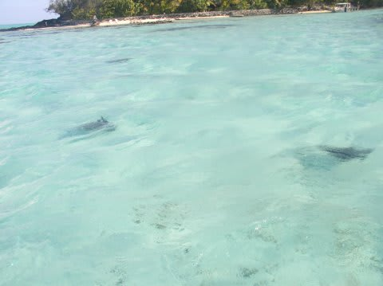

# 2009年　初の海外子連れダイビング旅行記　12　Excellent day

📅 投稿日時: 2012-09-08 00:01:44

で．

まだまだ，チャータークルーズは続きます．

1時間近く走って，島の2/3周ほどめぐったところで，船は停止．

ここは「モツ」と呼ばれる，本島を囲むように発達したサンゴ礁の小島．

誰もいない海岸の浅瀬です．

貸切ビーチ！

こんなにきれいな貸切ビーチっ！

誰もいない！！

ボートキャプテンが，ビールを手渡してくれます．

ああああ．

こんなきれいな海に浸りながら，ビールを飲めるなんて…

幸せ．

腰ぐらいの水深の遠浅の海で，また娘を海に浮かべてやります．

あぁ．

こんなビーチを貸切で楽しめるとは．

まさかこんなに早く，家族3人で，こんな

きれいな海を見ながらゆっくり過ごすときが来るとは思わなかったよ…．

しばしの幸せタイムの後．

また船は出発します．

後は帰るだけかな，と思っていたら．

船は浅瀬でスピードを落としました．

あれ？何かあるのかな…

と思ったら，ボートキャプテンが海を指差します．

をを！トビエイだ！

1枚，2枚．

ボートはトビエイを回り込むようにして，

じっくりと見せてくれます．

結構な時間，ぐるぐるとエイを追いかけて回ってました…

後は島の一周を終えて，ホテルへ戻ります．

いやーーー．

たっぷり2時間以上，

盛りだくさんのボートチャーター．

楽しめた～っ！！

娘も楽しかったみたいだし．

満足，満足．

ホテルに戻ってシャワーを浴びると夕食タイム．

今日は，レストラン「マティラ・ビーチ」へ．

海が見える，落ち着いた感じのレストランです．

ここも，結構美味い．

デザートもかなりのレベルで，娘も満足．

でも，お値段も高い…

やはり一人3000円～5000円コース(涙)．

…お値段と分量から考えると，昨日のカイナ・ハットのほうがいいかな．

でも，十分味のレベルは高いですが…

というわけで．

初めて子供を他人に預ける，という経験をした本日でしたが．

多少泣いたものの，その後のチャーターボートの楽しい思い出があったからか，

預けられたことをあとまで引きずって泣くようなこともなく．

おかげで今日も夫婦で潜ることができ．

今日も一日，夫婦ダイビング→貸切クルージング→おいしいフレンチと，

たっぷり楽しんだのでした．
