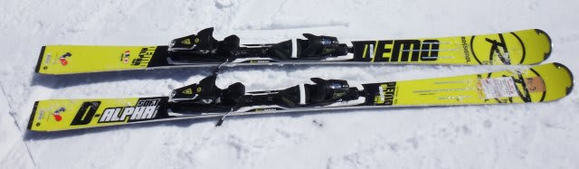
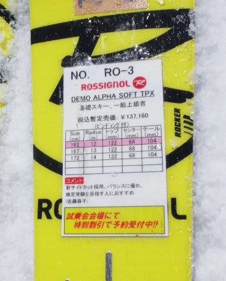
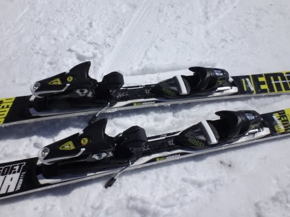
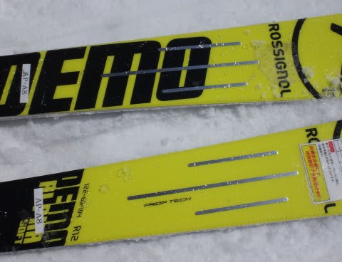

# まだ終わってないよ！2015シーズンモデルのスキー試乗レポート17…ROSIGNOL編その2

📅 投稿日時: 2014-05-10 22:42:47

ということで．

今日はスキーに行きそびれたSkier_Sですが．

うーむ．

今日のかぐらは混んだみたいですね…

強風で朝はかぐら高速が動かなかったみたいですが．

…明日は穏やかな暖かいいい天気になりそうかな～．

…でも．

混むだろうなぁ…

＃熊の湯の方がましかな～？

とりあえず．

まだ終わっていなかった試乗レポート，

もう夜も遅く．

あと5時間で出発ですので．

今日は1機種のみです．

では，どうぞ～！

----

ROSSIGNOL DEMO ALPHA SOFT TPX 162cm

基礎小回り．

これ，結構いいですね～．

[普通のDEMO ALPHA](efa0c2078ee1e76907744471916d8d0df.md)はしっかり硬いR20プレートですが．

こちらはソフトなTPXプレートを積んだソフトモデルです．

踏み込んでいくと，がっちりした通常版DEMO ALPHAと違い，

ネットリとした，ウェットなフレックス．

きれいにたわんでしっかりエッジグリップして，

小さい半径でくくくっと曲がります．

回った後，トップからテールにきれいに加重が抜けていくし．

踏み込みでたわみ量をコントロールすれば，自由に半径を作って

いけるので，比較的エッジグリップがしっかりした板なのに，

操作性は高い感じ．

板を外に押していく量で半径を作ることができ，かなり

小さい半径までしっかりグリップさせたカービングで

回ってこれます．

R20プレートよりやわらかく軽いので，板も動かしやすい

感じがしますね～．

コブも行けそうな感じ．

162cmって，ちょっと短いかな～，って思ったけど．

165cmの板と言われてもわからない安定感で．

安定感も十分．

うむ．

そこそこグリップさせて滑りたくて，かつ過激じゃない

小回り板を求める人にはいいのではないでしょうか？

結構気に入りました．

＃この3本のスリットがミソらしい…

## 💬 コメント一覧

### 💬 コメント by (skireport)
**タイトル**: Unknown
**投稿日**: 2014-05-11 19:12:58

お邪魔いたします。

タイトルがSALOMONになってますよー

ここ数年ロシも評価を取り戻しつつありますね。

DEMO ALPHA/BETAは、スペックは小回り専ながら

大きめも行けるターン調整のしやすさと、乗り味は好みなのですが、

黄色すぎて食指が動きません(笑；

### 💬 コメント by (Skier_S)
**タイトル**: skireportさま
**投稿日**: 2014-05-11 22:18:02

えっ？

あの「スキー試乗レポートまとめ」サイトの

方ですかっ！？？

ご指摘ありがとうございました…

さっそく直しておきました．

しかし．

こんなところにコメントを残してくださるってことは，

あのまとめサイト，やっぱり人力で情報収集

してるんですね…．

あれだけのページの情報，よく集めるなぁ，と

いつも驚いていたんですが…

DEMO ALPHA R20は私には手ごわすぎますが，

DEMO ALPHA SOFT TPXはいい感じでしたね～．

…私はデザインは気にしない人なので，黄色でも

青でも赤でも気にしません（笑）．

### 💬 コメント by (マルハバ)
**タイトル**: ROSSIGNOL・・・
**投稿日**: 2014-05-11 22:42:53

今を去る○十年前の学生時代・・・

ロシニョールは最高に高性能でオシャレな板だった・・・

SL系・・・ST-650

GS・DH系・・・SWISS-EQUIPE

フラッグシプモデルはフランスを象徴する

トリコロールカラーで最高にかっこ良かった・・・

○十年を経てスキーの世界に戻ってみると

そこにあるROSSIGNOLは試乗する気も起きない

ガッカリなデザインだった・・・

### 💬 コメント by (Skier_S)
**タイトル**: マルハバさま
**投稿日**: 2014-05-11 22:58:19

私にとって，ロシニョールと言えば．

子供のころにゲレンデでよく見た，

グリーンの4Sや4Gだったりします…

記載の板は，それ以前の板ですよね…おそらく

残念ながら，どんなデザインの板か

分かりませんが…（涙）．

でも．

私にとっては，メタリックグリーンの4Sは

かっこよかったですね～．

…最近のロシの板は，

「もそっとデザイン何とかならんか」

と思うのは，確かに間違いないかと…

