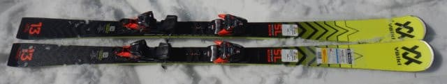
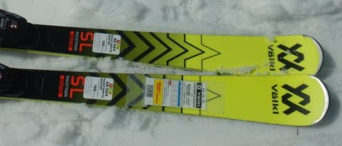
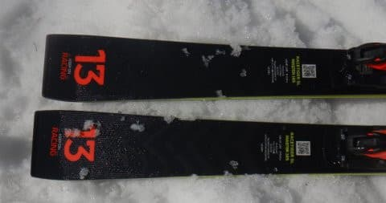
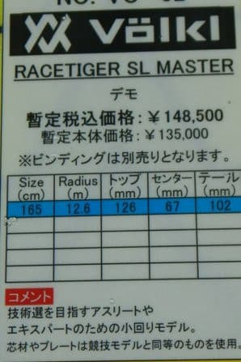
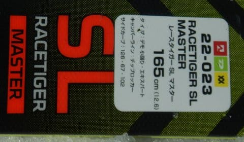
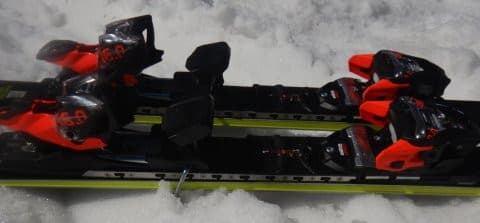

# 2023シーズンモデルのスキー板，試乗レポートその24 VOLKL RACETIGER SL MASTER

📅 投稿日時: 2022-07-07 03:48:24

🏷️ カテゴリ: [スキー板試乗](c0bd8048615710cee890e403a36cc9a2b.md)

最近．

早い時間に外が明るくなる，夏のこの時期．

外が明るくなる前に寝たい…

と思う，Skier_Sです．

今日ももうこんな時間…（涙）

それなのに，ちゃんとBlogを更新する

自分，偉い！

ということで．

夏真っ盛りにもかかわらず，

今日も2023シーズンモデルのスキー板

試乗レポート．

今回はフォルクル編．

去年もいい感じだったSL MASTERです．

では，どうぞ～！

○VOLKL RACETIGER SL MASTER 165cm

基礎小回り用

VOLKLの基礎小回り用は，

RACETIGER SL MASTERと

RACETIGER SL

の2種類あり，

このほか，競技用のプレートを抜いた

RACETIGER SL WC D

も基礎小回りとして使えますが…

この3種類の中で，このSL MASTERが

お値段的にも一番高く，トップモデル

的な扱いとなってます．

結構ガッツリしたPCプレートが

入っていて，実質ほぼSL競技用と

同じなのですが…

昨年からキャリーオーバーで，

ほぼ変更なしみたいです．

昨年はかなり好印象だったこの板．

履いてみると…

やっぱり面白い板ですね！

滑ってみてしっとり感…

というか，「ヌルヌルした」ような，

粘りとなめらかさを感じます．

多分，振動吸収性がかなり強く，

足元にビリビリした高周波の振動が

伝わらないのでそう感じるのかな？

荒れた斜面でも，板がバタバタ叩かれたり

せず，まるでなめらかな斜面であるかの

如くヌルヌルと凸凹を乗り越え，

足元に振動が伝わらずスーッと滑って

行けます．

ハイスピードでのグリップが強く，

トップロッカーが効いているのか，

トップを抑えなくても谷回りで

オートマチックにターンに入って

くれるので，横から横に踏んで行くだけで

強烈なグリップでしっかり雪の壁を

作りながらターンして行ってくれる感じ．

…これ，昔のATOMICのSXに近い感覚！

ちょっと懐かしの，谷回りで何も

しなくていい，勝手にまわって行ってくれる，

トップロッカーらしいオートマチック板

ですね…

でも，張りが強く，簡単に板がたわみ

きっちゃわないので強制小回り板には

ならないです．

自然に板なりに滑って行けば中回りくらい．

ただ，返りは早いので反動を上手く使って

板を抑えて行けば結構深い小回りを

作って行けます．

…が．

板が強いので，カービング小回りをすると

結構体力を使います…

板の強さもあり，体力がある人向けかな．

あと，ズレの操作もできなくはないですが…

あんまり面白くない．

やっぱりスピードを出して，キレキレに

切って滑って行って楽しい板．

板の重さもあり，コブ斜面とかは辛いかな．

でも，ちょっと荒れたくらいの斜面なら，

振動吸収性と足元のどっしり感で

かなり安定してハイスピードでかっ飛べます．

小回り板としては安定感がバツグンに高く，

スピード耐性はすごい強いし．

オートマチックなキレキレターンで

中回りから大きめの小回りカービングで

ロングコースを高速でかっ飛ばしていく…

ってのに向いた板です．

小回りスペシャルというより，

ターン弧がちょいと小さめの

ハイスピードクルーズ板と言って

いいかも．

ちょいと荒れてきたヤケビの

ロングコースを攻めるような，

小回りベースの板として

「買ってもいいな…」

と思わせる板でした．
